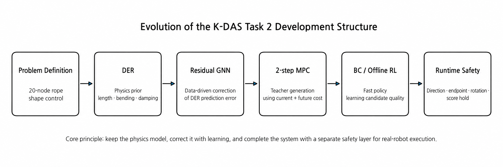

<p align="center">
  
</p>

# RGMC 2026 · K-DAS Cloud Robotics System

**Kookmin University · Team K-DAS · IEEE ICRA 2026 Cloud Robotics Competition**

K-DAS solved two fundamentally different manipulation tasks in the remote CloudGripper environment from a unified systems perspective. In **Task 1**, rigid objects were aligned to target poses using pushing only. In **Task 2**, the full shape of a rope-like object with one fixed endpoint was controlled. A robot-specific visual mapping module served as a shared foundation for both tasks.

This repository is not merely a collection of final code. It documents which problems we encountered first, which assumptions failed on the real robot, and how those failures shaped the next model and execution architecture.

> **“Rather than finding one perfect algorithm, can we design a system that continues to make correct decisions under imperfect observations and model mismatch?”**

This question became the common starting point that connected Task 1, Task 2, and Mapping.

---

## Quick Navigation

| Section | What it contains | Documentation |
|---|---|---|
| **Task 1** | Model-based closed-loop planar pushing | [`task1/README.md`](task1/README.md) |
| **Task 2** | Physics-informed deformable-rope manipulation | [`task2/README.md`](task2/README.md) |
| **Mapping** | Robot-specific pixel-to-workspace calibration | [`mapping/README.md`](mapping/README.md) |

---

## System in Action

<table>
  <tr>
    <td align="center" width="50%">
      <a href="task1/README.md">
        
      </a><br>
      <b><a href="task1/README.md">Task 1 · Model-Based Planar Pushing</a></b>
    </td>
    <td align="center" width="50%">
      <a href="task2/README.md">
        
      </a><br>
      <b><a href="task2/README.md">Task 2 · Deformable Rope Manipulation</a></b>
    </td>
  </tr>
</table>

Although the two tasks involve fundamentally different object properties, both were developed around the same closed-loop principle: **observation → workspace representation → action selection → real execution → re-observation**.

---

## 1. The Result

| Competition Result | K-DAS |
|---|---:|
| **Overall** | **65.7 · 1st place** |
| **Task 1 · Planar Pushing** | **49.69 · 1st place** |
| **Task 2 · Rope Manipulation** | **81.64 · 2nd place** |
| **Task 2 Mid-term Evaluation** | **76.90 / 100 · 1st place** |

<p align="center">
  
</p>

The overall 1st-place result was not achieved by focusing on only one task. K-DAS delivered competitive performance on both rigid-object and deformable-object manipulation while integrating them on top of shared mapping and closed-loop execution principles. Task 1 finished 1st overall, while Task 2 achieved **92.61** on the original rope and **87.73** on the longer rope, for a final score of **81.64**.

The result we valued most was not the score itself. We confirmed that when physics models, learned models, planning, and runtime correction are connected coherently, repeatable performance can be achieved even on a remote real robot.

---

## 2. What We Wanted to Build

When we first analyzed the CloudGripper competition, Task 1 and Task 2 appeared to be completely different problems.

- Task 1 required matching the position and orientation of a rigid object through pushing.
- Task 2 required changing the full shape of a rope that cannot be represented by a single pose.

Once implementation began, however, both tasks converged to the same set of questions.

1. How should positions observed in the camera image be converted into coordinates understood by the robot?
2. How can we predict the next state after executing the current action?
3. Which action among many candidates will actually move the system closer to the goal?
4. Will an action that looks good computationally remain safe and executable inside the real robot cell?
5. If the prediction is wrong, how should the system recover at the next step?

<p align="center">
  
</p>

What we ultimately built was not two independent notebooks, but a shared system structure.

```text
Observe
→ convert image information into workspace geometry
→ predict or evaluate candidate actions
→ execute one action on the remote robot
→ observe the real result again
→ plan from the measured state
```

This structure prevented model error from accumulating over many steps and allowed robot-specific calibration and contact uncertainty to be corrected repeatedly using new observations.

---

## 3. Why the Competition Was Difficult

In a cloud robotics environment, the robot cannot be adjusted directly in front of us. The problem must be solved using camera images, API commands, and delayed state queries, while the camera pose and valid workspace can change when the assigned robot cell changes.

Under these conditions, improving perception accuracy or dynamics accuracy alone was not sufficient.

- Small pixel-coordinate errors changed the effective contact point.
- A short contact offset could cause a large rotation error for the T-shape.
- The same rotation command behaved differently near a rope endpoint than in the central region.
- Even if the model selected a good action, it could not be executed when no valid approach path existed.
- A high score could still collapse if the shape changed during release.

K-DAS therefore decomposed the system into mapping, geometry, dynamics, planning, policy, and runtime components, but did not optimize them independently. We continuously asked whether **the output of each module remained trustworthy when consumed by the next stage**, and revised the full loop accordingly.

---

## 4. [Shared Mapping](mapping/README.md) — Before Control, We Needed Reliable Coordinates

> **“Can we tell the robot where a point observed in the camera actually lies in its workspace?”**

The object center and vertices in Task 1, and the 20 rope nodes in Task 2, are first observed as camera pixel coordinates `(u, v)`. CloudGripper commands, however, use normalized workspace coordinates `(x, y)`. A reliable pixel-to-workspace conversion was therefore required before perception results could be used for planning and control.

<p align="center">
  
</p>

During the testing period, we generated a separate map for each robot by moving the gripper over a **33 × 33 workspace grid** and recording the correspondence between the commanded `(x, y)` position and the observed gripper center `(u, v)`. HSV-based detection was initially used, but its instability under lighting and reflections led us to replace it with **YOLOv8-based gripper detection**.

The final mapping pipeline consisted of:

- robot-specific **33 × 33 pixel–workspace maps**
- YOLOv8-based gripper-center detection
- multiple-frame measurements and median aggregation
- **Clough–Tocher 2D interpolation** for continuous pixel-to-workspace conversion
- **automatic robot-map matching** from the first camera observation at competition startup
- off-grid validation at positions not used for calibration
- **Homography-based extended coordinates** for object corners or rope nodes outside the measured workspace

At competition time, the assigned robot ID was unknown. Instead of performing a new calibration, the system detected the gripper in the first camera frame, selected the best-matching pre-generated robot map, and immediately used it for runtime coordinate conversion.

For robot control, coordinates were restricted to the measured and reachable workspace. Homography was used separately to represent object or rope states that extended beyond this region.

Full documentation: [`mapping/README.md`](mapping/README.md)


---


## 5. [Task 1](task1/README.md) — Predict Before Pushing

> **“We know the object must be pushed, but where, in which direction, and by how much?”**

Task 1 appeared simple at first, but was fundamentally an underactuated manipulation problem. The robot could not grasp an object and place it directly at a desired pose; a single contact simultaneously produced translation and rotation. The same push could also generate different outcomes depending on mass distribution, contact point, and friction.

<p align="center">
  
</p>

### 5.1 [Geometry](task1/geometry/README.md) — From Shape Detection to a Planning State

Instead of treating circles, squares, and T-shapes with separate hard-coded commands, we represented them using contours, poses, polygons, keypoints, and IoU. Symmetry and orientation ambiguity were then handled explicitly on top of this shared representation.

For T-shapes, the detector and planner initially used coordinate bases offset by approximately 90°, and aligning only the center point did not stabilize orientation. We applied the same basis correction to both the current and target shapes and performed rigid alignment using all eight vertices. For squares, cyclic vertex permutation prevented arbitrary differences in starting vertex index from producing unnecessary rotations.

### 5.2 [Dynamics](task1/dynamics/README.md) + [Planning](task1/planning/README.md) — From “Move Toward the Goal” to Candidate-Wise Prediction

At first, pushing toward the target center seemed sufficient. For asymmetric objects, however, the center could move closer while orientation became worse, and long pushes were fast but prone to overshoot and workspace violations.

We therefore developed the following structure.

1. Generate a minimum-jerk reference path between the current and target poses.
2. Sample contact points on the object surface.
3. Combine normal pushes, bidirectional spin candidates, and multiple stroke lengths.
4. Roll out each candidate using 1-step rigid-body dynamics.
5. Score candidates using progress, direction agreement, overshoot, boundary margin, and approach cost.
6. Send only executable candidates to the real robot.

<p align="center">
  
</p>

### 5.3 [Planning](task1/planning/README.md) + [Runtime](task1/runtime/README.md) — A Good Action Still Needs a Path

A physically good push is meaningless if the gripper cannot reach the contact point. In real tests, many candidates were generated successfully but all were rejected because of the safety margin, leaving zero executable actions.

To address this, the approach planner was organized as:

```text
Direct → L-shape → U-shape → Short A*
```

The simplest and shortest paths were attempted first, while more complex search was used only when necessary. After each push, the robot retreated from the object, re-observed the scene, and restarted planning from the measured state.

### 5.4 What Task 1 Achieved

- Final **49.69 points · 1st place in Task 1**
- **11 / 11 square validation runs with final IoU ≥ 0.8**
- One shared pipeline for Circle, Square, T, T-long, and unseen Plus and Organic shapes

The key contribution of Task 1 was not a single perfect physics model. Short-horizon prediction of relative candidate quality, combined with re-observation after every real action, kept model mismatch within a manageable range.

Full overview: [`task1/README.md`](task1/README.md)

| Module | Core question | Documentation |
|---|---|---|
| Geometry | How can different shapes be aligned using a common representation? | [`task1/geometry/`](task1/geometry/README.md) |
| Dynamics | How does one push change the next pose? | [`task1/dynamics/`](task1/dynamics/README.md) |
| Planning | Which candidate produces real progress? | [`task1/planning/`](task1/planning/README.md) |
| Runtime | How can a planned push be executed repeatedly and reliably on the real robot? | [`task1/runtime/`](task1/runtime/README.md) |

---

## 6. [Task 2](task2/README.md) — Model What Cannot Be Reduced to a Pose

> **“How should we represent and control a rope whose state cannot be reduced to a center position and orientation?”**

Task 2 required matching the full shape of a deformable linear object with one fixed endpoint to a target. Unlike a rigid body, the rope cannot be represented by `x, y, θ`, and moving one point propagates deformation through neighboring segments and toward the endpoint.

<p align="center">
  
</p>

We represented the rope using **20 ordered nodes** and reformulated the task as a closed-loop control problem that moves the current node array toward the target node array.

### 6.1 [DER Dynamics](task2/dynamics/der/README.md) — Start from Physics, Not from a Black Box

The first approach was a planar DER model inspired by Discrete Elastic Rods. Fixed-end constraints, bending, damping, and edge-length preservation were used to capture the rope’s basic deformation behavior.

DER provided an important physical prior, but accurately identifying real rope material properties, table friction, gripper contact, and release dynamics remained difficult. At this point, we did not discard physics and switch to pure learning.

Instead, we reframed the problem:

> **“Can we preserve the part explained by physics and learn only the remaining systematic error?”**

### 6.2 [Residual GNN](task2/dynamics/residual_gnn/README.md) — Correcting, Not Replacing, Physics

The difference between the DER prediction and the actual next state was defined as a residual target, and a GNN over the 20-node chain graph predicted a correction for each node.

- DER validation RMSE: **7.67 mm**
- Residual GNN validation RMSE: **2.41 mm**

Later, we found that reducing position error alone could allow edges to stretch or shrink unrealistically. Target-edge loss and edge projection were introduced to address this issue. Projection was not applied as strongly as possible; instead, we experimentally selected an intermediate strength that balanced shape tracking and edge consistency.

### 6.3 [MPC](task2/planning/mpc/README.md) — How to Create Good Actions

A dynamics model does not immediately provide a good policy. From the current rope state, the system must generate grasp-node, direction, and stroke candidates and predict the resulting next state using the hybrid dynamics model.

The initial 1-step MPC achieved **76.90 / 100 · 1st place** in the mid-term evaluation. However, it still suffered from near-goal failures and high computational cost.

We therefore extended the planner to **2-step MPC**, which evaluates not only the first action but also the next possible action.

- success rate: **4 / 5 → 5 / 5**
- average steps to success: **15.50 → 9.33**
- final mean error: **4.408 mm → 3.685 mm**

### 6.4 [Candidate-aware BC / Offline RL](task2/policy/candidate_aware_rl/README.md) — From a Slow Teacher to a Fast Policy

MPC generated strong actions, but required many candidate rollouts at every step. Rather than forcing MPC to remain the final online controller, we reinterpreted it as a **teacher generator**.

- Behavior Cloning approximated high-quality teacher actions with fast inference
- Candidate-aware offline RL learned not only the selected action but also the relative quality of unselected candidates
- qsafe stabilization suppressed critic divergence through Q-target clipping and scale adjustment

This was not “RL replacing MPC,” but rather **a policy that executes MPC’s decision criteria more efficiently**.

### 6.5 [Runtime Safety](task2/runtime/README.md) — The Last Gap Was Physical Execution

Actions that looked good in simulation and rollout did not always transfer directly to the real robot.

- rotation commands could act in the opposite direction from expectation
- command-response consistency weakened near endpoints
- large rotations could conflict with the servo range
- the rope could relax after release and reduce the score

We therefore added directed tangent analysis, rotation probes, geometry risk, endpoint-specific correction, initial push, and score hold. In particular, pre-release score hold kept the gripper closed when the score after a drag was sufficiently high, preventing release-induced shape loss.

Among 18 analyzable real-robot actions, **14 reduced the average node error**, and the mean error decreased from **173.69 mm → 106.23 mm**. These logs showed that the complete execution pipeline, including runtime correction, generally moved the rope toward the target shape.

<p align="center">
  
</p>

### 6.6 What Task 2 Achieved

- Final **81.64 points · 2nd place in Task 2**
- Original rope: **92.61**
- Longer rope: **87.73**
- Thicker red rope: **64.59**
- Mid-term evaluation: **76.90 / 100 · 1st place**
- End-to-end pipeline: DER → Residual GNN → 2-step MPC → BC/RL → Runtime Safety

The central achievement of Task 2 was not one neural policy. It was the integration of physics, learned correction, future-aware planning, fast policy inference, and geometry-aware execution so that each layer compensated for weaknesses in the others.

Full overview: [`task2/README.md`](task2/README.md)

| Module | Core question | Documentation |
|---|---|---|
| DER | Can the basic deformation structure of the rope be explained physically? | [`task2/dynamics/der/`](task2/dynamics/der/README.md) |
| Residual GNN | Can systematic error in the physics model be corrected through learning? | [`task2/dynamics/residual_gnn/`](task2/dynamics/residual_gnn/README.md) |
| MPC | How can high-quality teacher actions be generated? | [`task2/planning/mpc/`](task2/planning/mpc/README.md) |
| BC / Offline RL | Can slow MPC decisions be transferred into a fast policy? | [`task2/policy/candidate_aware_rl/`](task2/policy/candidate_aware_rl/README.md) |
| Runtime Safety | How can real robot-specific uncertainty be suppressed during execution? | [`task2/runtime/`](task2/runtime/README.md) |

---

## 7. What Made the System Work

### 7.1 We Used Physics Where It Was Identifiable

Task 1 used force, torque, center of mass, and contact geometry. Task 2 used DER connectivity, bending, and fixed-end priors. These models were not presented as perfect digital twins; they were used to provide just enough structure for short-horizon decision making.

### 7.2 We Learned Only What the Model Could Not Explain

The Task 2 GNN did not replace the entire dynamics model. It learned the residual between the DER prediction and the real transition. This preserved physical structure under limited data while correcting systematic bias from the real environment.

### 7.3 We Treated Failures as Architecture Signals

- HSV center instability → [YOLOv8-seg mapping](mapping/README.md)
- fixed goal scoring → [candidate-specific reference progress](task1/planning/README.md)
- all approach candidates rejected → [contact-aware safety interpretation](task1/planning/README.md)
- 1-step near-goal failure → [2-step MPC](task2/planning/mpc/README.md)
- critic divergence → [qsafe target clipping](task2/policy/candidate_aware_rl/README.md)
- endpoint uncertainty → [endpoint-specific runtime limits](task2/runtime/README.md)
- release-induced score loss → [pre-release score hold](task2/runtime/README.md)

Each failure was used as evidence for changing the system architecture rather than being hidden by parameter tuning.

### 7.4 We Closed the Loop After Every Action

Neither task begins the next action from the previous prediction. The state is reconstructed from the real camera observation, and planning starts again from the measured state. This principle was the most important safeguard that made imperfect models usable in the real system.

---

## 8. Technical Milestones

| Area | Milestone |
|---|---|
| Mapping | Robot-specific 33×33 calibration using YOLOv8-seg and Clough–Tocher interpolation |
| Task 1 | Final IoU ≥ 0.8 in all 11/11 square validation runs |
| Task 1 | Direct → L → U → short A* approach hierarchy with closed-loop replanning |
| Task 2 Dynamics | DER RMSE 7.67 mm → Residual GNN RMSE 2.41 mm |
| Task 2 Planning | Average steps to success reduced from 15.50 → 9.33 with 2-step MPC |
| Task 2 Policy | BC warm-start + candidate-aware offline RL + qsafe stabilization |
| Task 2 Runtime | Average node error decreased in 14 of 18 analyzed actions |
| Competition | Task 1 1st, Task 2 2nd, Overall 1st |

These values serve both as module-level benchmarks and as evidence that the full system functioned within the competition loop.

---

## 9. Repository Structure

```text
RGMC2026-KDAS/
├─ README.md
├─ images/
├─ mapping/
│  └─ README.md
├─ task1/
│  ├─ README.md
│  ├─ geometry/
│  │  └─ README.md
│  ├─ dynamics/
│  │  └─ README.md
│  ├─ planning/
│  │  └─ README.md
│  └─ runtime/
│     └─ README.md
└─ task2/
   ├─ README.md
   ├─ dynamics/
   │  ├─ der/README.md
   │  └─ residual_gnn/README.md
   ├─ planning/
   │  └─ mpc/README.md
   ├─ policy/
   │  └─ candidate_aware_rl/README.md
   └─ runtime/
      └─ README.md
```

The root README explains the overall problem and development story. Each Task README describes the corresponding end-to-end flow, while detailed equations, training settings, and experimental results are documented in the module READMEs. All visual assets are managed centrally in the root-level `images/` directory.

---

## 10. Reproducibility and Public Release

When code and models are released publicly, reproducibility can be improved by including:

- Python, CUDA, PyTorch, and major package versions
- camera-coordinate, workspace-coordinate, and node-ordering conventions
- robot-specific calibration metadata and valid ranges
- dynamics / MPC / policy configurations
- a small sample dataset and offline visualization notebook
- weight download links, checksums, and license information
- evaluation scripts and known limitations

The following should be removed before release:

- CloudGripper tokens and private evaluation URLs
- personal absolute paths and account information
- robot-booking or other private reservation information
- student IDs, signatures, and personal information from internal reports
- unnecessary duplicate checkpoints and raw caches

---

## 11. What This Repository Represents

K-DAS did not approach the problem by copying a paper’s method directly or by combining as many recent models as possible. Each technique was reinterpreted according to the needs of our environment.

- DER was used as a physical prior rather than as a complete rope simulator.
- GNN was used as a residual corrector rather than as a replacement for physics.
- MPC was used as a future-aware teacher rather than as the final online controller.
- RL was used as a fast approximation of candidate quality rather than as an end-to-end policy that ignores the teacher.
- The runtime layer was designed as an independent engineering layer that preserves performance on the real robot, not as miscellaneous exception-handling code.

Together, these choices allowed K-DAS to complete both rigid-object pushing and deformable-object manipulation within one closed-loop system.

> **What we built was not a demo that moves correctly once, but a manipulation system that repeatedly observes, predicts, selects, executes, and decides again.**

Task 1 1st place, Task 2 2nd place, and Overall 1st place demonstrate that this process remained effective in the competition environment.

---

## 12. Takeaway

The K-DAS RGMC 2026 solution combines five core elements.

```text
Robot-specific visual calibration
+ Physics-based state prediction
+ Data-driven residual correction
+ Candidate-aware planning and policy learning
+ Real-robot closed-loop runtime engineering
```

The key was not simply using many different techniques. It was **designing the system so that each layer handled what the previous layer could not explain or guarantee**.

> **From pixels to geometry, from geometry to prediction, and from prediction to reliable robot action.**
