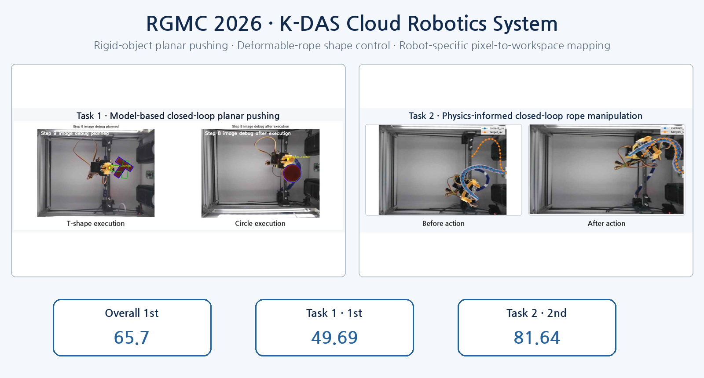
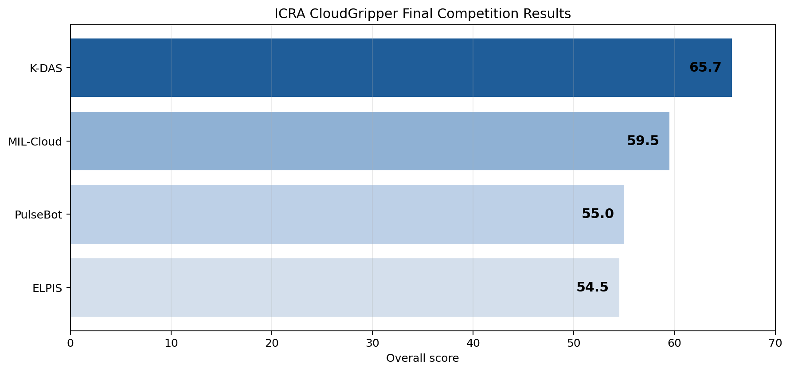
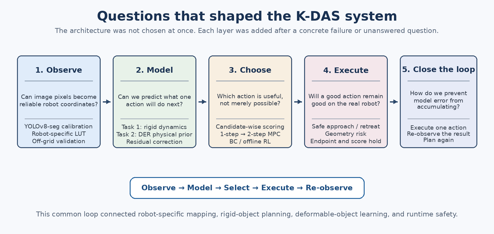
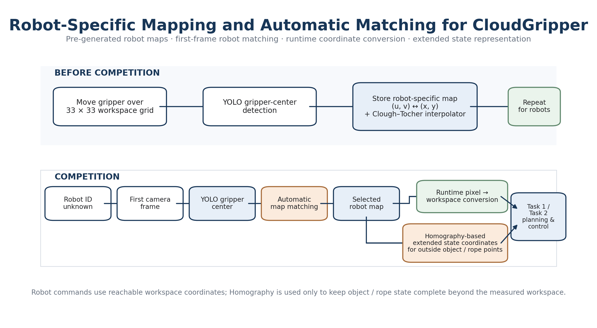
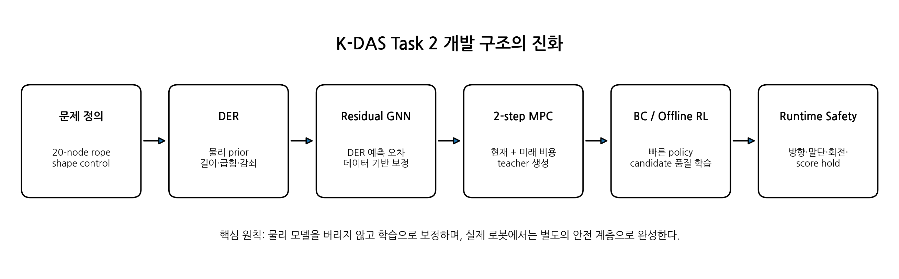

<p align="center">
  
</p>

# RGMC 2026 · K-DAS Cloud Robotics System

**Kookmin University · Team K-DAS · IEEE ICRA 2026 Cloud Robotics Competition**

K-DAS는 원격 CloudGripper 환경에서 서로 성격이 완전히 다른 두 manipulation task를 하나의 시스템 관점으로 해결했다. **Task 1**에서는 강체 물체를 pushing만으로 목표 자세에 정렬했고, **Task 2**에서는 한쪽 끝이 고정된 rope-like object의 전체 형상을 제어했다. 두 task 사이에는 robot-specific visual mapping을 공통 기반으로 두었다.

이 repository는 단순히 최종 코드를 모아 놓은 결과물이 아니다. 우리가 어떤 문제를 먼저 보았고, 어떤 가정이 실제 로봇에서 무너졌으며, 그 실패가 다음 모델과 실행 구조를 어떻게 만들었는지를 기록한다.

> **“좋은 알고리즘 하나를 찾는 것보다, 불완전한 관측과 모델 오차 속에서도 다음 결정을 계속 올바르게 만들 수 있는 시스템을 설계할 수 있을까?”**

이 질문이 K-DAS의 Task 1, Task 2, Mapping을 하나로 묶는 출발점이었다.

---

## Quick Navigation

| Section | What it contains | Documentation |
|---|---|---|
| **Task 1** | Model-based closed-loop planar pushing | [`task1/README.md`](task1/README.md) |
| **Task 2** | Physics-informed deformable-rope manipulation | [`task2/README.md`](task2/README.md) |
| **Mapping** | Robot-specific pixel-to-workspace calibration | [`mapping/README.md`](mapping/README.md) |

---

## 1. The Result

| Competition Result | K-DAS |
|---|---:|
| **Overall** | **65.7 · 1st place** |
| **Task 1 · Planar Pushing** | **49.69 · 1st place** |
| **Task 2 · Rope Manipulation** | **81.64 · 2nd place** |
| **Task 2 Mid-term Evaluation** | **76.90 / 100 · 1st place** |

<p align="center">
  
</p>

Overall 1위는 한 task에만 집중한 결과가 아니었다. K-DAS는 rigid object와 deformable object라는 서로 다른 문제에서 모두 경쟁력 있는 성능을 확보했고, 두 task를 공통 mapping과 closed-loop execution 구조 위에 통합했다. Task 1에서는 최종 1위를 기록했고, Task 2에서는 original rope와 longer rope에서 각각 **92.61**, **87.73**을 기록하며 최종 **81.64점**을 달성했다.

우리가 가장 중요하게 본 성과는 점수 자체만이 아니다. 물리 모델, 학습 모델, planning, runtime 보정을 한 방향으로 연결했을 때 실제 원격 로봇에서도 반복 가능한 결과를 만들 수 있다는 것을 확인했다.

---

## 2. What We Wanted to Build

CloudGripper competition을 처음 분석했을 때, Task 1과 Task 2는 서로 다른 문제처럼 보였다.

- Task 1은 강체의 위치와 방향을 pushing으로 맞추는 문제였다.
- Task 2는 단일 pose로 표현할 수 없는 rope의 전체 형상을 바꾸는 문제였다.

하지만 실제 구현을 시작하자 두 task는 같은 질문으로 수렴했다.

1. 카메라에서 본 위치를 로봇이 이해하는 좌표로 어떻게 바꿀 것인가?
2. 지금 action을 실행했을 때 다음 상태를 어떻게 예상할 것인가?
3. 가능한 action 중 어떤 것을 선택해야 실제 목표에 가까워지는가?
4. 계산상 좋은 action이 실제 robot cell에서도 안전하게 작동하는가?
5. 예측이 틀렸을 때 다음 step에서 어떻게 회복할 것인가?

<p align="center">
  
</p>

결국 우리가 만든 것은 두 개의 독립적인 notebook이 아니라 다음 공통 구조였다.

```text
Observe
→ convert image information into workspace geometry
→ predict or evaluate candidate actions
→ execute one action on the remote robot
→ observe the real result again
→ plan from the measured state
```

이 구조를 통해 모델의 오차가 여러 step 동안 누적되는 것을 막고, robot마다 다른 calibration과 접촉 불확실성을 실제 관측으로 다시 보정할 수 있었다.

---

## 3. Why the Competition Was Difficult

Cloud robotics 환경에서는 실제 로봇을 눈앞에서 직접 조정할 수 없다. 카메라 이미지, API command, delayed state query만으로 문제를 해결해야 하며, robot cell이 바뀌면 camera pose와 유효 workspace도 달라진다.

이 조건에서 단순히 perception 정확도나 dynamics 정확도만 높여서는 충분하지 않았다.

- 픽셀 좌표가 조금만 흔들려도 contact point가 달라졌다.
- 짧은 contact offset이 T-shape에서는 큰 rotation error로 이어졌다.
- rope endpoint에서는 같은 rotation command가 중앙부와 다르게 전달됐다.
- 모델이 좋은 action을 선택해도 실제 접근 경로가 없으면 실행할 수 없었다.
- 한 번 높은 score를 만들었더라도 release 순간 형상이 무너지면 최종 결과가 낮아졌다.

그래서 K-DAS는 문제를 mapping, geometry, dynamics, planning, policy, runtime으로 분해하되, 각 모듈을 따로 최적화하는 데서 멈추지 않았다. **각 모듈의 출력이 다음 단계에서 실제로 신뢰할 수 있는가**를 계속 확인하며 전체 loop를 수정했다.

---

## 4. Shared Mapping — Before Control, We Needed a Common Language

> **“이미지에서 보이는 한 점을 로봇에게 정확히 어디라고 말할 수 있는가?”**

Task 1의 물체 중심과 꼭짓점, Task 2의 20개 rope node는 모두 camera pixel에서 시작한다. 그러나 robot command는 workspace coordinate를 사용한다. 이 둘을 연결하지 못하면 아무리 좋은 dynamics와 planner가 있어도 실제 action으로 이어질 수 없다.

<p align="center">
  
</p>

초기에는 HSV 기반으로 gripper center를 찾았지만, 조명과 색 분포에 따라 중심이 흔들리며 calibration 품질이 낮아졌다. 이를 해결하기 위해 **YOLOv8 segmentation**으로 gripper mask를 검출하고, robot arm을 workspace 전체에 이동시키며 pixel–workspace 대응쌍을 다시 수집했다.

최종 mapping은 단순 nearest-neighbor lookup이 아니다.

- robot별 camera intrinsic과 distortion correction
- **33 × 33 calibration grid**
- point당 multiple-frame detection과 median aggregation
- `x = f_x(u,v)`, `y = f_y(u,v)` 형태의 **Clough–Tocher 2D interpolation**
- calibration point가 아닌 off-grid 위치에서 별도 검증
- robot별 LUT와 유효 범위 분리

이 과정은 Task 1과 Task 2가 같은 좌표 언어를 쓰게 만든 공통 기반이었다. 또한 deep regression을 무조건 적용하기보다, perception error와 mapping error를 분리해 해석할 수 있고 calibration 범위 밖의 위험한 extrapolation을 피할 수 있는 interpolation 방식을 선택했다.

Full documentation: [`mapping/README.md`](mapping/README.md)

---

## 5. Task 1 — Predict Before Pushing

> **“물체를 밀어야 한다는 것은 알겠는데, 어디를 어느 방향으로 얼마나 밀어야 하는가?”**

Task 1은 겉보기에는 단순한 pushing 문제지만, 실제로는 underactuated manipulation 문제였다. 로봇은 물체를 잡아 원하는 pose로 옮길 수 없고, 한 번의 접촉으로 translation과 rotation이 동시에 발생한다. 같은 push도 mass distribution, contact point, friction에 따라 결과가 달라진다.

<p align="center">
  
</p>

### 5.1 From shape detection to a planning state

우리는 circle, square, T-shape를 서로 다른 hard-coded command로 다루는 대신, contour, pose, polygon, keypoint, IoU로 표현했다. 이 공통 representation 위에서 symmetry와 orientation ambiguity를 별도로 처리했다.

특히 T-shape에서는 detector와 planner의 기준축이 약 90° 어긋나는 문제가 있었고, 중심점 하나만 맞추는 방식으로는 자세가 안정적으로 정렬되지 않았다. 현재와 목표 형상 모두에 동일한 basis correction을 적용하고, 8개 꼭짓점 전체를 이용해 rigid alignment를 수행했다. 사각형에는 cyclic vertex permutation을 적용해 꼭짓점 시작 번호 차이가 불필요한 회전으로 이어지는 것을 막았다.

### 5.2 From “move toward the goal” to candidate-wise prediction

처음에는 목표 중심을 향해 밀면 충분할 것처럼 보였다. 그러나 비대칭 물체에서는 중심이 가까워져도 orientation이 악화될 수 있었고, 긴 push는 빠르지만 overshoot와 workspace 이탈 위험이 컸다.

그래서 다음 구조를 만들었다.

1. 현재 pose와 target pose 사이에 minimum-jerk reference path를 생성한다.
2. 물체 표면에서 contact point를 sampling한다.
3. normal push와 양방향 spin candidate, 여러 stroke length를 조합한다.
4. 각 candidate를 1-step rigid-body dynamics로 rollout한다.
5. progress, direction agreement, overshoot, boundary margin, approach cost로 점수를 계산한다.
6. 실행 가능한 후보만 남겨 실제 robot action으로 보낸다.

<p align="center">
  
</p>

### 5.3 A good action still needs a path

물리적으로 좋은 push라도 gripper가 contact point까지 갈 수 없다면 무의미하다. 실제 테스트에서는 candidate가 충분히 생성됐지만 safety margin 때문에 실행 가능한 후보가 0개가 되는 문제가 있었다.

이를 해결하기 위해 접근 경로를 다음 순서로 구성했다.

```text
Direct → L-shape → U-shape → Short A*
```

간단하고 짧은 경로를 먼저 사용하고, 필요한 경우에만 더 복잡한 탐색을 수행했다. Push 이후에는 물체에서 retreat한 뒤 다시 관측하여 다음 planning을 새로 시작했다.

### 5.4 What Task 1 achieved

- 최종 **49.69점 · Task 1 1위**
- 사각형 통합 검증 **11 / 11회 final IoU ≥ 0.8**
- Circle, Square, T, T-long뿐 아니라 unseen Plus와 Organic shape까지 동일 pipeline으로 처리

Task 1의 성과는 완벽한 physics model 하나를 얻은 데 있지 않았다. 짧은 horizon에서 후보의 상대적 품질을 예측하고, 실제 실행 후 다시 관측하는 구조를 통해 model mismatch를 제어 가능한 수준으로 만들었다.

Full overview: [`task1/README.md`](task1/README.md)

| Module | Core question | Documentation |
|---|---|---|
| Geometry | 서로 다른 형상을 같은 기준으로 어떻게 정렬할 것인가? | [`task1/geometry/`](task1/geometry/README.md) |
| Dynamics | 한 번의 push가 다음 pose를 어떻게 바꾸는가? | [`task1/dynamics/`](task1/dynamics/README.md) |
| Planning | 어떤 candidate가 실제 progress를 만드는가? | [`task1/planning/`](task1/planning/README.md) |
| Runtime | 계획된 push를 실제 로봇에서 어떻게 반복 가능하게 실행할 것인가? | [`task1/runtime/`](task1/runtime/README.md) |

---

## 6. Task 2 — Model What Cannot Be Reduced to a Pose

> **“중심과 각도로 표현할 수 없는 로프를, 어떤 상태와 모델로 제어할 것인가?”**

Task 2는 한쪽 끝이 고정된 deformable linear object의 전체 형상을 목표와 가깝게 만드는 문제였다. 로프는 강체처럼 `x, y, θ`로 표현할 수 없으며, 한 지점을 움직였을 때 변형이 인접 구간과 endpoint까지 전달된다.

<p align="center">
  
</p>

우리는 로프를 **20개의 ordered node**로 표현하고, 문제를 현재 node array를 target node array에 가깝게 이동시키는 closed-loop control problem으로 재구성했다.

### 6.1 Start from physics, not from a black box

첫 시도는 Discrete Elastic Rods의 관점을 적용한 planar DER model이었다. Fixed end, bending, damping, edge-length preservation을 통해 로프의 기본 거동을 설명하려 했다.

DER는 중요한 physical prior를 제공했지만 실제 rope material, table friction, gripper contact, release dynamics까지 정확히 식별하기는 어려웠다. 여기서 우리는 물리 모델을 버리고 pure learning으로 전환하지 않았다.

질문을 다음과 같이 바꾸었다.

> **“물리 모델이 설명한 부분은 유지하고, 남은 systematic error만 학습할 수 있는가?”**

### 6.2 Residual GNN — correcting, not replacing, physics

DER prediction과 실제 next state의 차이를 residual target으로 정의하고, 20-node chain graph를 사용하는 GNN이 각 node의 correction을 예측하도록 했다.

- DER validation RMSE: **7.67 mm**
- Residual GNN validation RMSE: **2.41 mm**

이후 위치 오차만 줄이면 edge가 늘어나거나 줄어드는 문제가 나타났다. 이를 해결하기 위해 target-edge loss와 edge projection을 추가했다. Projection도 무조건 강하게 적용하지 않고, shape tracking과 edge consistency 사이의 trade-off를 실험해 중간 강도를 선택했다.

### 6.3 MPC — how to create good actions

Dynamics model이 생겼다고 곧바로 좋은 policy가 생기는 것은 아니었다. 현재 rope state에서 가능한 grasp node, direction, stroke candidate를 생성하고 각각의 다음 상태를 hybrid dynamics로 예측해야 했다.

초기 1-step MPC는 중간평가에서 **76.90 / 100 · 1위**를 기록했다. 그러나 목표 근처에 접근한 뒤 다시 멀어지는 경우와 큰 계산량이 한계로 나타났다.

그래서 first action 이후에 가능한 next action까지 보는 **2-step MPC**로 확장했다.

- success rate: **4 / 5 → 5 / 5**
- average step-to-success: **15.50 → 9.33**
- final mean error: **4.408 mm → 3.685 mm**

### 6.4 From a slow teacher to a fast policy

MPC는 좋은 action을 만들었지만 매 step마다 많은 candidate rollout이 필요했다. 따라서 MPC를 최종 online controller로 고집하지 않고, **teacher generator**로 재해석했다.

- Behavior Cloning으로 high-quality teacher action을 빠르게 근사
- selected action뿐 아니라 unselected candidate의 상대적 품질도 학습하는 candidate-aware offline RL
- Q-target clipping과 scale 조정으로 critic 발산을 억제한 qsafe stabilization

이 구조는 “MPC를 대체하는 RL”이 아니라, **MPC가 만든 판단 기준을 더 빠르게 실행하는 policy**였다.

### 6.5 The last gap was physical execution

Simulation과 rollout에서 좋은 action이 실제 로봇에서도 그대로 작동하지는 않았다.

- rotation command의 실제 방향이 예상과 반대인 경우
- endpoint에서 command–response 관계가 약해지는 경우
- 큰 회전이 servo range와 충돌하는 경우
- release 순간 rope가 되돌아가 score가 감소하는 경우

이를 해결하기 위해 directed tangent, rotation probe, geometry risk, endpoint-specific correction, initial push, score hold를 추가했다. 특히 pre-release score hold는 drag 이후 score가 충분히 높을 때 gripper를 닫은 상태로 유지해 release-induced shape loss를 막았다.

실제 로그에서 분석 가능한 18개 action 중 **14개 action이 평균 node error를 감소**시켰고, 평균 error는 **173.69 mm → 106.23 mm**로 줄었다. 이 결과는 runtime 보정이 포함된 실제 실행 action이 전반적으로 목표 형상에 가까워지는 방향으로 작동했음을 보여준다.

<p align="center">
  
</p>

### 6.6 What Task 2 achieved

- 최종 **81.64점 · Task 2 2위**
- Original rope: **92.61**
- Longer rope: **87.73**
- Thicker red rope: **64.59**
- Mid-term evaluation: **76.90 / 100 · 1위**
- DER → Residual GNN → 2-step MPC → BC/RL → Runtime Safety의 end-to-end pipeline 구축

Task 2의 핵심 성과는 특정 neural policy 하나가 아니었다. Physics, learned correction, future-aware planning, fast policy, geometry-aware execution을 서로의 약점을 보완하도록 연결한 것이었다.

Full overview: [`task2/README.md`](task2/README.md)

| Module | Core question | Documentation |
|---|---|---|
| DER | 로프의 기본 변형 구조를 물리적으로 설명할 수 있는가? | [`task2/dynamics/der/`](task2/dynamics/der/README.md) |
| Residual GNN | 물리 모델의 systematic error를 학습으로 보정할 수 있는가? | [`task2/dynamics/residual_gnn/`](task2/dynamics/residual_gnn/README.md) |
| MPC | 좋은 teacher action을 어떻게 만들 것인가? | [`task2/planning/mpc/`](task2/planning/mpc/README.md) |
| BC / Offline RL | 느린 MPC 판단을 빠른 policy로 옮길 수 있는가? | [`task2/policy/candidate_aware_rl/`](task2/policy/candidate_aware_rl/README.md) |
| Runtime Safety | 실제 robot-specific uncertainty를 어떻게 억제할 것인가? | [`task2/runtime/`](task2/runtime/README.md) |

---

## 7. What Made the System Work

### 7.1 We used physics where it was identifiable

Task 1에서는 force, torque, COM과 접촉 기하를 사용했고, Task 2에서는 DER의 connectivity, bending, fixed-end prior를 사용했다. 모델은 완벽한 digital twin으로 포장하지 않고, short-horizon decision에 필요한 만큼의 구조를 제공하도록 사용했다.

### 7.2 We learned only what the model could not explain

Task 2의 GNN은 전체 dynamics를 처음부터 대체하지 않았다. DER prediction과 실제 transition 사이의 residual을 학습했다. 이 선택은 제한된 dataset에서도 물리적 구조를 유지하면서 실제 환경의 systematic bias를 보정하게 했다.

### 7.3 We treated failures as architecture signals

- HSV center instability → YOLOv8-seg mapping
- fixed goal scoring → candidate-specific reference progress
- approach candidates all rejected → contact-aware safety interpretation
- 1-step near-goal failure → 2-step MPC
- critic divergence → qsafe target clipping
- endpoint uncertainty → endpoint-specific runtime limits
- release-induced score loss → pre-release score hold

각 실패는 단순 parameter tuning으로 덮지 않고, 시스템 구조를 바꾸는 근거로 사용했다.

### 7.4 We closed the loop after every action

두 task 모두 다음 action을 이전 prediction에서 시작하지 않는다. 실제 camera observation으로 state를 다시 만들고, 그 state에서 planning을 새로 수행한다. 이 원칙은 imperfect model을 실전에서 사용할 수 있게 만든 가장 중요한 안전장치였다.

---

## 8. Technical Milestones

| Area | Milestone |
|---|---|
| Mapping | YOLOv8-seg 기반 robot-specific 33×33 calibration과 Clough–Tocher interpolation |
| Task 1 | 11/11 square validation runs에서 final IoU ≥ 0.8 |
| Task 1 | Direct → L → U → short A* 접근 계층과 closed-loop replanning |
| Task 2 Dynamics | DER RMSE 7.67 mm → Residual GNN RMSE 2.41 mm |
| Task 2 Planning | 2-step MPC로 average step-to-success 15.50 → 9.33 |
| Task 2 Policy | BC warm-start + candidate-aware offline RL + qsafe stabilization |
| Task 2 Runtime | 18개 action 중 14개에서 average node error 감소 |
| Competition | Task 1 1위, Task 2 2위, Overall 1위 |

이 수치들은 개별 module의 benchmark이면서 동시에 전체 시스템이 실제 competition loop에서 작동했다는 근거다.

---

## 9. Repository Structure

```text
RGMC2026-KDAS/
├─ README.md
├─ images/
├─ mapping/
│  └─ README.md
├─ task1/
│  ├─ README.md
│  ├─ geometry/
│  │  └─ README.md
│  ├─ dynamics/
│  │  └─ README.md
│  ├─ planning/
│  │  └─ README.md
│  └─ runtime/
│     └─ README.md
└─ task2/
   ├─ README.md
   ├─ dynamics/
   │  ├─ der/README.md
   │  └─ residual_gnn/README.md
   ├─ planning/
   │  └─ mpc/README.md
   ├─ policy/
   │  └─ candidate_aware_rl/README.md
   └─ runtime/
      └─ README.md
```

Root README는 전체 문제와 개발 서사를 설명한다. 각 Task README는 해당 task의 end-to-end 흐름을 설명하며, 세부 수식·학습 설정·실험 결과는 module README에서 다룬다. 모든 시각 자료는 최상위 `images/` 폴더에서 공통 관리한다.

---

## 10. Reproducibility and Public Release

향후 코드와 모델을 함께 공개할 때 다음 항목을 추가하면 재현성을 높일 수 있다.

- Python, CUDA, PyTorch와 주요 package version
- camera coordinate, workspace coordinate, node ordering convention
- robot별 calibration metadata와 유효 범위
- dynamics / MPC / policy configuration
- small sample dataset과 offline visualization notebook
- weight download link, checksum, license
- evaluation script와 known limitations

다음 항목은 제거한다.

- CloudGripper token과 private evaluation URL
- 개인 절대 경로와 계정 정보
- robot booking 또는 비공개 예약 정보
- 학번, 서명, 내부 보고서 개인정보
- 불필요한 duplicate checkpoint와 raw cache

---

## 11. What This Repository Represents

K-DAS는 논문의 method를 그대로 복제하거나, 최신 모델을 가능한 많이 결합하는 방식으로 접근하지 않았다. 각 기술을 우리 환경의 질문에 맞게 다시 해석했다.

- DER는 완전한 rope simulator가 아니라 physical prior로 사용했다.
- GNN은 physics replacement가 아니라 residual corrector로 사용했다.
- MPC는 최종 online controller가 아니라 future-aware teacher로 사용했다.
- RL은 teacher를 무시하는 end-to-end policy가 아니라 candidate quality를 빠르게 근사하는 policy로 사용했다.
- Runtime layer는 예외 처리 코드가 아니라 실제 로봇에서 성능을 지키는 독립적인 engineering layer로 설계했다.

이 선택들이 합쳐져, K-DAS는 rigid-object pushing과 deformable-object manipulation을 모두 하나의 closed-loop system으로 완성할 수 있었다.

> **우리가 만든 것은 “한 번 잘 움직이는 demo”가 아니라, 관측하고 예측하고 선택하고 실행한 뒤 다시 판단하는 과정을 반복할 수 있는 manipulation system이었다.**

Task 1 1위, Task 2 2위, Overall 1위는 그 과정이 competition 환경에서도 유효했음을 보여준 결과다.

---

## 12. Takeaway

K-DAS의 RGMC 2026 solution은 다음 다섯 요소의 결합이다.

```text
Robot-specific visual calibration
+ Physics-based state prediction
+ Data-driven residual correction
+ Candidate-aware planning and policy learning
+ Real-robot closed-loop runtime engineering
```

서로 다른 기술을 많이 사용한 것이 핵심은 아니었다. **각 기술이 설명하지 못하는 부분을 다음 계층이 맡도록 시스템을 설계한 것**이 핵심이었다.

> **From pixels to geometry, from geometry to prediction, and from prediction to reliable robot action.**
