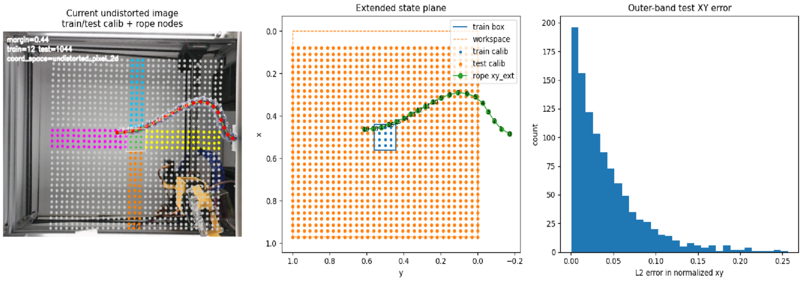
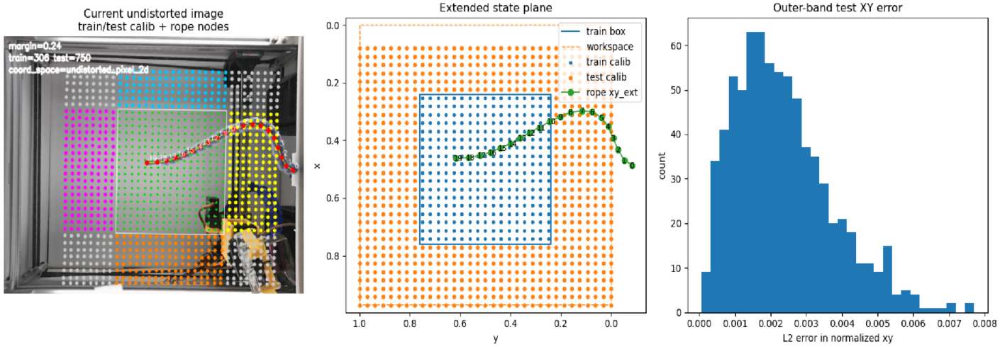
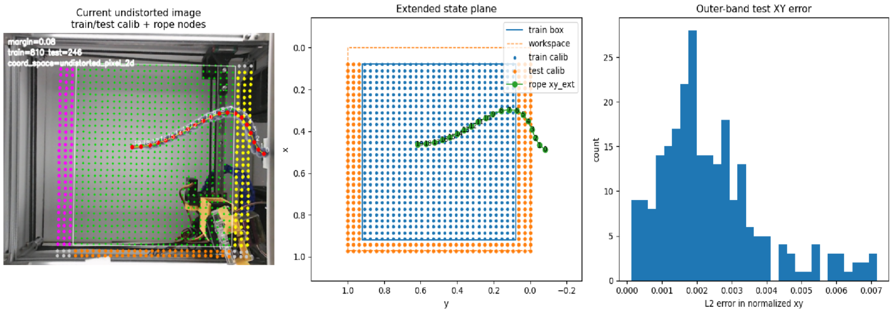

<p align="center">
  
</p>

# Robot-Specific Mapping and Automatic Matching for CloudGripper

**Shared Module · Task 1 and Task 2 · Team K-DAS · RGMC 2026**

Task 1과 Task 2에서 검출되는 object, corner, rope node의 위치는 모두 camera pixel coordinate `(u, v)`로 얻어진다. 반면 CloudGripper는 normalized workspace coordinate `(x, y)`를 기준으로 움직이기 때문에, 실제 계산과 robot command를 위해서는 pixel coordinate를 normalized coordinate로 변환해야 한다.

CloudGripper는 robot마다 camera geometry와 보이는 workspace가 조금씩 달랐고, competition에서는 어느 robot에 연결되는지도 미리 알 수 없었다. K-DAS는 test period 동안 robot별 coordinate map을 미리 생성해 두고, competition 시작 시 첫 camera observation만으로 현재 robot에 맞는 map을 찾아 바로 사용하는 방식으로 이 문제를 해결했다.

> **이 문서에서 `map`은** robot command coordinate `(x, y)`와 camera에서 관측한 gripper pixel `(u, v)`의 대응 관계를 이용해 만든 **robot-specific pixel-to-workspace 변환 정보**를 의미한다.

```text
Before competition
robot identity known
→ build robot-specific maps
→ store maps for prepared robots

Competition
robot identity unknown
→ detect current gripper position
→ find the best-matching robot map
→ convert pixel coordinates during runtime
→ execute Task 1 / Task 2
```

---

## 1. From Camera Pixels to Workspace Coordinates

Camera와 robot은 서로 다른 좌표계를 사용한다.

```text
Camera observation:  pixel coordinate (u, v)
Robot command:       normalized workspace coordinate (x, y)
```

Task 1에서는 object center, corner, contour의 pixel coordinate를 normalized coordinate로 변환한 뒤 object pose와 pushing action을 계산한다.

```text
object pixels
→ normalized coordinates
→ pose / polygon / contact point
→ push planning
```

Task 2에서는 rope segmentation으로 얻은 node들의 pixel coordinate를 normalized coordinate로 변환해 rope state와 다음 action을 계산한다.

```text
rope node pixels
→ normalized coordinates
→ rope state
→ planning / control
```

따라서 두 task 모두에서 **camera에서 측정한 pixel coordinate를 계산에 사용할 normalized workspace coordinate로 변환하는 과정**이 필요했다.

---

## 2. Why Each Robot Needed Its Own Map

CloudGripper의 command coordinate는 공통적으로 normalized `(x, y)`를 사용하지만, 동일한 `(x, y)`가 camera image에서 나타나는 pixel 위치는 robot마다 조금씩 달랐다.

주요 원인은 robot별 camera mounting, distortion, visible workspace 차이였다. 따라서 하나의 변환식을 모든 robot에 공통으로 사용하는 대신, **각 robot에 대해 별도의 map을 생성**했다.

Test period에는 현재 연결된 robot 번호를 알고 있었기 때문에 해당 robot의 map을 미리 생성할 수 있었다. Competition에서는 robot 번호가 주어지지 않았기 때문에, 준비한 map들 중 현재 robot에 맞는 map을 자동으로 찾아야 했다.

<!-- Overview image at the top (map01) should also show that the same normalized workspace appears differently across robot cameras. -->

---

## 3. Gripper Detection: HSV to YOLOv8-Seg

Map을 생성하려면 robot을 특정 `(x, y)`로 이동시킨 뒤, camera image에서 실제 gripper center `(u, v)`를 안정적으로 찾아야 한다.

초기에는 HSV threshold를 이용해 gripper color를 분리했지만 조명, 반사, object와의 겹침에 따라 center 위치가 흔들리거나 detection이 실패하는 경우가 있었다.

최종적으로는 YOLOv8n-seg를 이용해 gripper를 segmentation하고, mask contour의 moment로 gripper center를 계산했다. 약 1,000장의 workspace image를 학습에 사용했다.

| Metric | Box | Mask |
|---|---:|---:|
| Precision | 0.995 | 0.995 |
| Recall | 1.000 | 1.000 |
| mAP50 | 0.995 | 0.995 |
| mAP50-95 | 0.930 | 0.794 |

<p align="center">
  
</p>

YOLO detector는 map 생성뿐 아니라 competition 시작 시 현재 gripper 위치를 검출해 robot map을 matching할 때도 사용했다.

---

## 4. Robot-Specific Map Generation

<p align="center">
  
</p>

<!-- map03: show representative gripper detections at several commanded positions -->

각 robot에 대해 gripper가 이동 가능한 workspace를 **33 × 33 grid**로 나누고, 총 1089개 위치에서 robot coordinate와 gripper pixel coordinate의 대응 관계를 측정했다.

```text
Command robot to (x, y)
→ wait until the gripper settles
→ capture camera images
→ detect gripper center (u, v)
→ save correspondence (u, v) ↔ (x, y)
→ repeat over the 33 × 33 workspace grid
```

한 지점에서는 여러 frame을 측정하고 유효한 detection들의 median center를 사용해 순간적인 detection noise를 줄였다. Camera distortion 보정도 map 생성과 runtime에서 동일하게 적용했다.

<p align="center">
  
</p>

<!-- map06: emphasize the 33×33 measured grid and the (u,v) ↔ (x,y) correspondence -->

결과적으로 각 robot마다 다음과 같은 measured correspondence가 만들어진다.

$$
\mathcal{D}=\{(u_i,v_i,x_i,y_i)\}_{i=1}^{N}
$$

이 correspondence와 변환 model을 저장해 이후 runtime에서 해당 robot의 map으로 불러와 사용했다.

---

## 5. Competition-Time Automatic Robot Matching

Test period와 달리 competition에서는 **현재 어느 robot에 연결되었는지 알 수 없었다.**

Competition 시작 후 robot마다 다시 33 × 33 map을 생성하는 것은 불가능하고, 몇 개의 calibration point를 새로 측정하는 것조차 task 수행 시간을 사용하게 된다.

K-DAS는 competition 시작 시 **gripper를 calibration 목적으로 움직이지 않고 현재 위치 그대로 사용**했다.

<!-- TODO: replace the flow below with ../images/map11.png: first-frame automatic robot/map matching -->

```text
Competition starts
→ robot identity is unknown
→ capture the first camera frame
→ detect the current gripper center with YOLO
→ compare it with prepared robot-specific maps
→ select the most similar robot/map
→ load the selected map
→ start the task immediately
```

즉 competition에서는 새로운 map을 만드는 대신, **미리 생성해 둔 map 중 현재 robot에 해당하는 map을 찾는 과정만 수행했다.**

이 방식으로 별도의 startup calibration 시간을 사용하지 않고 바로 Task 1 또는 Task 2를 시작할 수 있었다.

---

## 6. Runtime Pixel-to-Workspace Conversion

Competition-time matching으로 현재 robot의 map이 선택되면, 이후 Task 1과 Task 2에서는 **선택된 map을 이용해 camera에서 검출한 pixel coordinate를 normalized workspace coordinate로 변환**했다.

하지만 runtime에서 얻는 pixel `(u, v)`가 1089개의 calibration point 중 하나와 정확히 일치하는 경우는 거의 없다. 따라서 가장 가까운 한 점을 그대로 사용하는 대신, 주변 calibration point의 관계를 이용해 연속적인 좌표를 계산했다.

K-DAS는 33 × 33 correspondence로부터 Clough–Tocher 2D interpolation을 구성했다.

$$
x=f_x(u,v), \qquad y=f_y(u,v)
$$

<p align="center">
  
</p>

Runtime에서는 선택된 robot map을 load한 뒤, 측정된 calibration point 사이를 보간해 `(x, y)`를 계산했다.

```text
Detected object / rope pixel (u, v)
→ load selected robot map
→ interpolate between measured calibration points
→ normalized workspace coordinate (x, y)
→ Task 1 / Task 2 calculation
```

Repository에서는 저장된 변환 model을 편의상 `LUT`라고 부르지만, 실제 변환은 단순 nearest-neighbor lookup이 아니라 **측정한 1089개 point 사이를 interpolation하여 연속적인 `(x, y)`를 계산하는 과정**이다.

---

## 7. Extending Coordinates Beyond the Reachable Workspace

33 × 33 map은 gripper가 실제로 이동할 수 있는 영역에서만 측정할 수 있다. 그런데 camera에서 보이는 object나 rope가 항상 그 영역 안에 완전히 들어오는 것은 아니었다.

예를 들어 square object의 네 corner 중 세 점은 mapping 영역 안에 있지만 한 점이 바깥에 있을 수 있다.

```text
object corners:  ●──────●
                 │      │
workspace edge: ─●──────┼────────
                        ●  ← outside measured region
```

이 경우 바깥쪽 corner는 LUT의 측정 범위를 벗어나기 때문에 정상적인 normalized coordinate를 얻을 수 없다. Rope 역시 일부 node가 workspace 밖에 있을 경우 전체 shape을 표현하기 어려워진다.

### 7.1 Homography from the 33 × 33 map

이 문제를 해결하기 위해 기존 33 × 33 map에서 얻은 `(x, y) ↔ (u, v)` correspondence를 이용해 homography를 계산했다.

$$
\mathbf{p}_{uv} \sim H_{xy\rightarrow uv}\mathbf{p}_{xy}
$$

Inverse homography를 이용하면 camera pixel에서 확장된 normalized coordinate를 계산할 수 있다.

$$
\mathbf{p}_{xy}^{ext} \sim H_{uv\rightarrow xy}\mathbf{p}_{uv}
$$

<p align="center">
  
</p>

Homography를 이용하면 gripper가 직접 갈 수 없는 영역에 있는 object corner나 rope node도 하나의 coordinate system으로 표현할 수 있다.

Homography로 계산한 좌표는 **workspace 경계 밖까지 object / rope state를 표현하기 위한 좌표**로 사용했다. 반면 실제 robot command는 gripper가 도달 가능한 workspace 내부에서만 생성했다.

Workspace 바깥에서는 ground truth coordinate를 직접 측정할 수 없기 때문에, homography의 정확도는 Section 8.2에서 **측정 가능한 내부 영역을 이용한 overlap test**로 별도 검증했다.

---

## 8. Validation

### 8.1 Off-grid Mapping Validation

Calibration에 사용한 33 × 33 grid point를 다시 map에 입력하면, 이미 측정에 사용한 점을 얼마나 잘 재현하는지만 확인하게 된다. 실제 runtime에서도 grid 사이의 새로운 위치를 안정적으로 변환할 수 있는지 확인하기 위해 **calibration point와 겹치지 않는 off-grid 위치**에서 별도 검증을 수행했다.

Workspace 내부 `[0.1, 0.9]` 범위에서 25개의 test coordinate를 선택하고, 각 point에서 다음 과정을 반복했다.

```text
Move gripper to an off-grid workspace coordinate
→ detect the gripper center pixel (u, v)
→ convert the pixel using the saved map
→ compare mapped (x, y) with the robot coordinate
```

오차는 robot coordinate와 mapping 결과 사이의 Euclidean distance로 계산했다.

$$
E = \left\|(x_{robot}, y_{robot})-(x_{mapped}, y_{mapped})\right\|_2
$$

| Metric | Result |
|---|---:|
| Valid samples | 25 / 25 |
| Mean error (normalized) | 0.001816 |
| Median error (normalized) | 0.002021 |
| Maximum error (normalized) | 0.003480 |
| Mean error | 0.272 mm |
| Median error | 0.303 mm |
| Maximum error | 0.522 mm |

<p align="center">
  
</p>

약 150 mm 크기의 workspace를 기준으로 대부분의 off-grid error가 sub-millimeter 범위에 있었으며, 이 검증을 통해 **33 × 33 측정점 사이의 새로운 위치에서도 mapping을 사용할 수 있는지** 확인했다.

### 8.2 Homography Overlap Check

Homography는 LUT가 정의되지 않는 workspace 바깥의 object corner나 rope node까지 동일한 좌표계로 표현하기 위해 도입했다. 그러나 gripper는 workspace 바깥으로 이동할 수 없기 때문에, 해당 영역에서는 직접 측정한 ground-truth `(x, y)`를 얻을 수 없다.

따라서 Homography의 정확도는 **측정 가능한 workspace 내부에서 간접적으로 검증**했다. 33 × 33 calibration point를 중앙의 **train region**과 그 바깥의 **outer-band test region**으로 나누고, train point만으로 Homography를 계산한 뒤 학습에 사용하지 않은 test point의 실제 `(x, y)`를 얼마나 정확하게 복원하는지 비교했다.

```text
33 × 33 measured correspondences
→ select center points as train region
→ fit homography using train points
→ keep outer-band points for validation
→ pixel (u, v) → homography → predicted (x, y)
→ compare with measured test (x, y)
```

Train region의 크기를 세 단계로 변경하여, Homography를 계산할 때 포함되는 calibration 범위에 따라 경계 영역의 오차가 어떻게 달라지는지 확인했다.

<p align="center"><b>Small train region (margin = 0.44)</b></p>
<p align="center">
  
</p>

Train 영역이 작을 경우에는 Homography를 계산하는 데 사용되는 대응점의 공간적 범위가 제한되면서, train 영역에서 멀어진 outer-band point에서 비교적 큰 오차가 나타났다.

<p align="center"><b>Medium train region (margin = 0.24)</b></p>
<p align="center">
  
</p>

Train 영역을 넓히자 test 영역에서의 오차가 크게 감소했다. 이 조건에서 측정된 결과는 다음과 같다.

| Metric | Normalized | Approx. physical error (150 mm scale) |
|---|---:|---:|
| RMSE | 0.0027148 | 0.41 mm |
| Mean error | 0.0023446 | 0.35 mm |
| Maximum error | 0.0077049 | 1.16 mm |

<p align="center"><b>Large train region (margin = 0.08)</b></p>
<p align="center">
  
</p>

Train 영역을 workspace 경계 가까이까지 확장했을 때에도 남겨둔 outer-band point에서 비교적 안정적인 좌표 변환이 유지되는 것을 확인했다. 전체적으로 **Homography를 구성할 때 더 넓은 calibration 영역을 포함할수록 경계 영역의 오차가 감소하는 경향**을 보였다.

실제 runtime에서는 일부 point만 사용하는 것이 아니라 **33 × 33 calibration에서 측정한 1089개의 correspondence 전체를 사용해 Homography를 구성**했다.

이 검증이 workspace 바깥에서 생성된 좌표의 정확도를 직접 보장하는 것은 아니다. 다만 실제 좌표를 알고 있는 내부 영역에서 일부 calibration point를 의도적으로 제외한 뒤 이를 다시 예측해 봄으로써, Homography가 calibration 범위를 넘어갈 때 기존 pixel–workspace 관계를 어느 정도 유지하는지 확인하는 기준으로 사용했다.


---


## 9. Use in Task 1 and Task 2

<!-- TODO: add a combined Task 1 / Task 2 application figure (e.g. ../images/map12.png) showing detected pixels → normalized coordinates → planning input -->

### Task 1 — Rigid Object Pushing

```text
camera image
→ object segmentation / contour
→ object pixel coordinates
→ normalized coordinates
→ pose / polygon / contact calculation
→ push planning
```

물체 일부가 measured workspace 밖에 걸치는 경우에는 homography coordinate를 이용해 전체 polygon state를 유지하고, 실제 robot action은 reachable workspace 안에서만 생성했다.

### Task 2 — Rope Manipulation

```text
camera image
→ rope segmentation / skeleton
→ ordered rope-node pixels
→ normalized coordinates
→ rope state
→ DER / Residual GNN / MPC / policy
```

Rope는 전체 node의 배치가 state이기 때문에 일부 node가 workspace 밖으로 나가더라도 삭제하지 않고 homography coordinate로 함께 표현했다.

---

## 10. Summary

K-DAS의 mapping 과정은 다음 세 가지 문제를 해결하기 위해 구성되었다.

1. **Map generation** — robot별 33 × 33 pixel–workspace correspondence를 미리 측정하고 interpolation map을 생성한다.
2. **Automatic map matching** — competition 시작 시 첫 gripper observation을 이용해 현재 robot에 해당하는 map을 찾는다.
3. **Runtime coordinate conversion** — 선택된 map과 homography를 이용해 Task 1 object와 Task 2 rope의 pixel coordinate를 normalized coordinate로 변환한다.

```text
Generate maps before competition
→ identify the connected robot at startup
→ load its map
→ convert camera pixels during runtime
→ use the converted coordinates for Task 1 / Task 2
```
