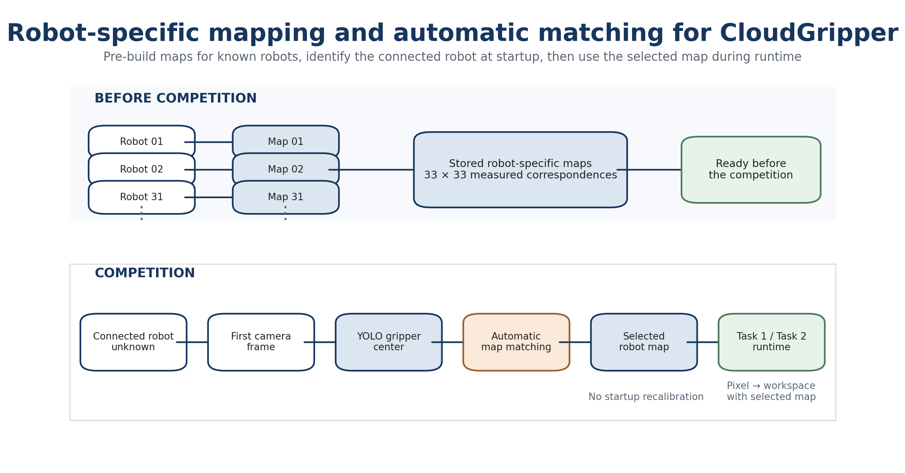
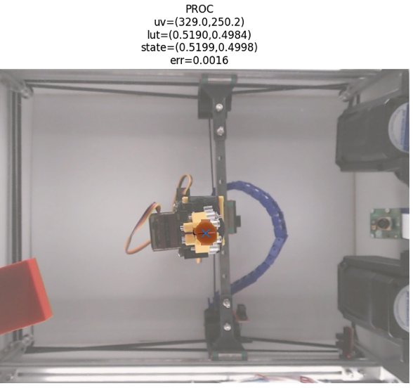
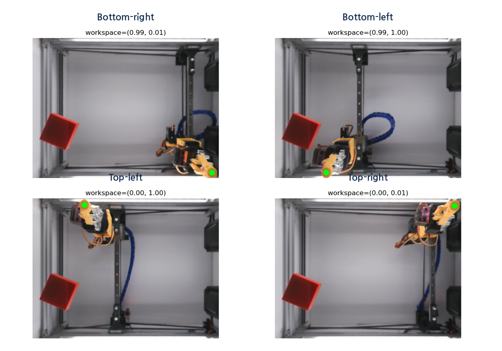
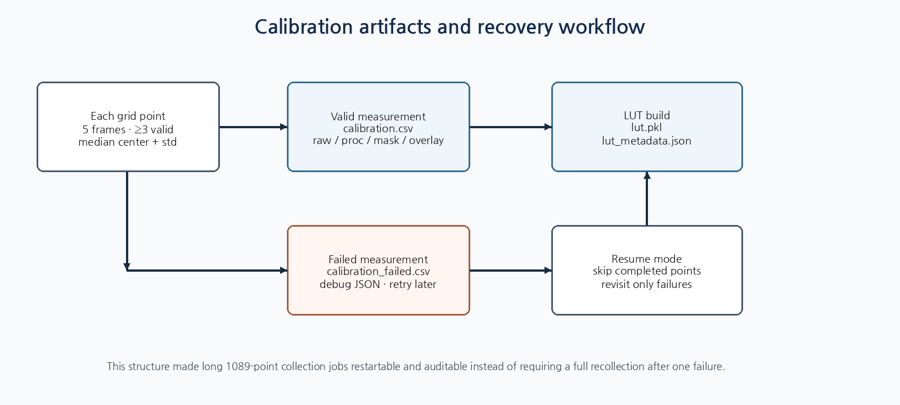
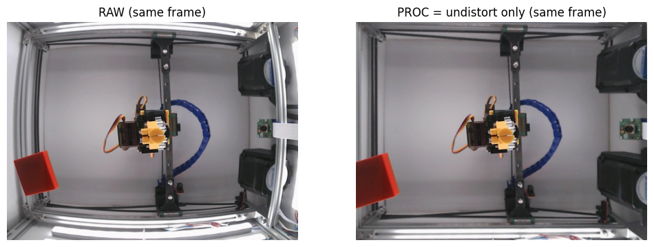
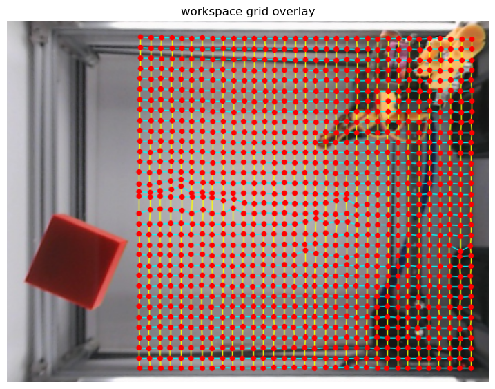
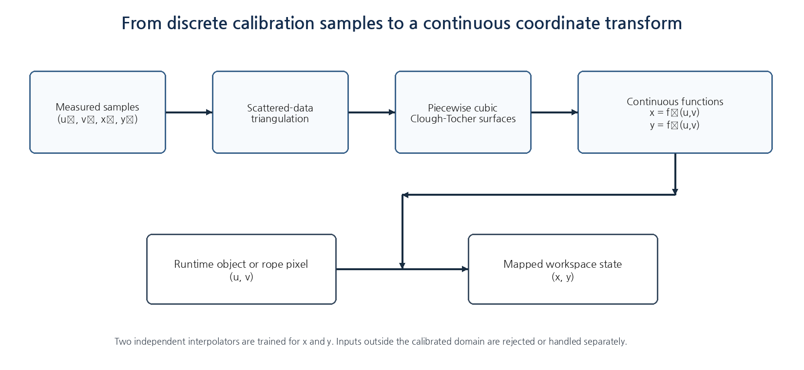
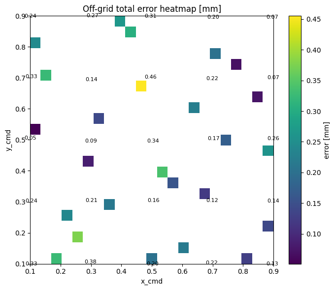
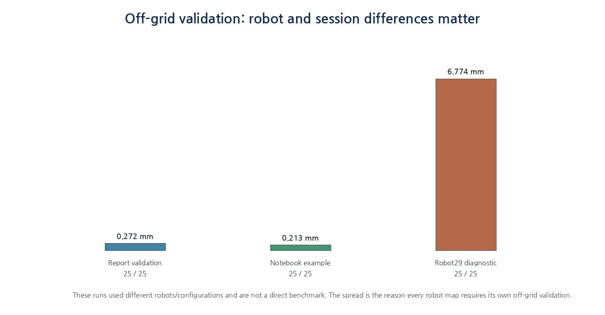
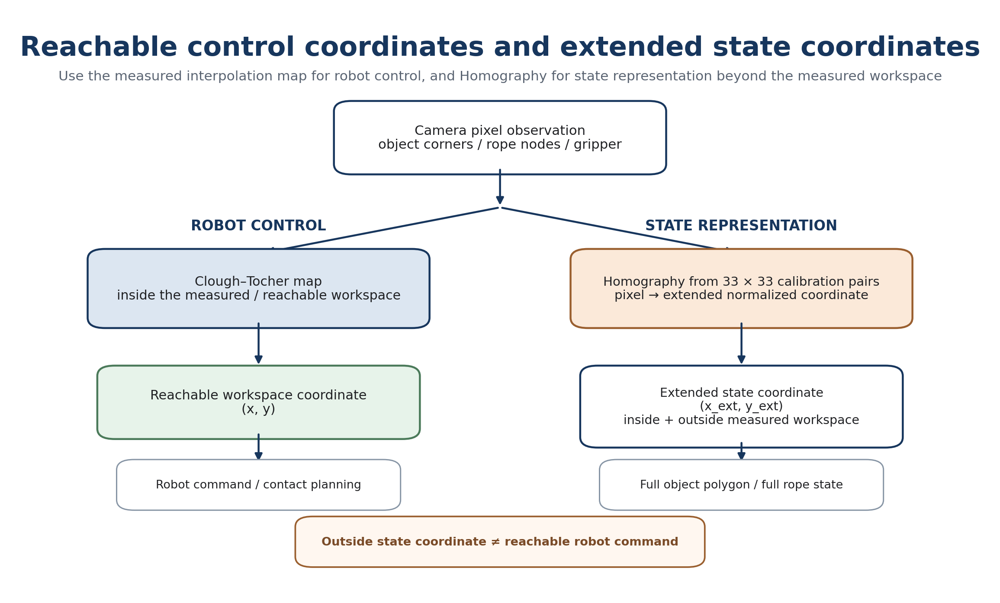

<p align="center">
  
</p>

# Pixel-to-Workspace Mapping for CloudGripperc

**Shared Module · Task 1 and Task 2 · Team K-DAS**

이 모듈은 bottom-view camera에서 검출한 픽셀 좌표 `(u, v)`를 CloudGripper가 사용하는 정규화 workspace 좌표 `(x, y)`로 변환한다. 로봇팔을 실제 작업공간의 조밀한 grid에 이동시키면서 **명령한 robot coordinate와 영상에서 검출한 gripper center pixel의 대응쌍**을 수집하고, 이를 기반으로 연속적인 pixel-to-workspace 변환기를 구축한다.

최종 구조는 단순한 nearest-neighbor lookup이 아니다. 33×33 calibration data로부터 두 개의 Clough-Tocher 보간 함수 `x = f_x(u,v)`, `y = f_y(u,v)`를 만들고, runtime에서 object center, polygon vertex, rope node를 실제 planning 좌표로 변환한다.

> **핵심 질문**  
> “카메라 영상에서 측정한 위치를, 실제 로봇팔이 움직일 수 있는 좌표와 어떻게 안정적으로 연결할 것인가?”

---

## 1. Why Mapping Is a Shared Module

카메라가 반환하는 위치와 로봇 명령이 사용하는 위치는 서로 다른 좌표계다.

```text
Camera observation:  pixel coordinate (u, v)
Robot command:       normalized workspace coordinate (x, y)
```

Task 1에서는 물체의 center, corner, contour를 workspace로 변환해야 rigid-body prediction과 push planning을 수행할 수 있다. Task 2에서는 rope segmentation에서 추출한 20개 ordered node를 workspace state로 변환해야 DER, Residual GNN, MPC와 policy가 사용할 수 있다.

따라서 mapping은 Task 1 또는 Task 2 내부의 부가 기능이 아니라, perception과 planning을 연결하는 공통 coordinate bridge다.

---

## 2. Development Evolution

### 2.1 Initial HSV-based calibration

초기에는 gripper의 색상을 HSV threshold로 분리하여 center pixel을 계산했다. 구조는 단순했지만 다음 문제가 반복되었다.

- 조명과 반사에 따른 mask 변화
- gripper와 물체의 근접 또는 겹침
- 작은 mask에서 중심점이 크게 흔들리는 문제
- 일부 위치에서 검출 실패

Calibration point가 잘못 측정되면 그 오차가 LUT 전체로 전파되기 때문에, mapping 품질은 detector 안정성에 직접 의존했다.

### 2.2 YOLOv8n-seg gripper detector

최종 calibration에서는 gripper를 독립적인 segmentation 대상으로 학습한 YOLOv8n-seg model을 사용했다. 약 1,000장의 다양한 workspace 이미지를 활용했으며, bounding box center가 아니라 segmentation mask contour의 moment로 실제 기하학적 center를 계산했다.

| Metric | Box | Mask |
|---|---:|---:|
| Precision | 0.995 | 0.995 |
| Recall | 1.000 | 1.000 |
| mAP50 | 0.995 | 0.995 |
| mAP50-95 | 0.930 | 0.794 |

<p align="center"></p>

### 2.3 Coordinate convention cleanup

초기 실험에서는 영상과 robot coordinate의 방향을 직관적으로 맞추기 위해 flip과 rotate를 적용했다. 그러나 calibration, runtime perception, evaluation 모두가 같은 변환을 공유해야 해 오류 원인이 복잡해졌다. 최종 구현에서는 flip/rotate를 제거하고 **undistorted original image coordinate**를 공통 기준으로 사용했다.

---

## 3. Robot-specific Calibration Workflow

<p align="center"></p>

### 3.1 Configuration

각 robot은 별도의 YAML configuration을 사용한다. 실제 값은 robot camera와 visibility에 따라 달라지지만, 대표 설정은 다음과 같다.

| Parameter | Example | Role |
|---|---:|---|
| Grid size | 33 × 33 | 1089 workspace samples |
| Frames per point | 5 | repeated image measurements |
| Minimum valid frames | 3 | reject unstable points |
| Settle time | 0.7 s | reduce residual arm motion |
| Inter-frame interval | 0.05 s | avoid duplicate timing |
| Resume | True | skip already completed points |
| Save masks / debug JSON | True | failure diagnosis |

### 3.2 Per-point collection

각 grid point에서 다음 절차를 수행한다.

```text
Move robot to commanded (x, y)
→ wait for settling
→ capture 5 frames
→ undistort each frame
→ YOLOv8-seg gripper detection
→ calculate mask centroid (u, v)
→ accept only if at least 3 frames are valid
→ store median(u), median(v), std_u, std_v
```

Mean 대신 median을 사용해 순간적인 detection outlier와 진동의 영향을 줄였다. Grid는 한 줄씩 왕복하는 방식으로 순회해 장거리 불필요 이동도 줄였다.

<p align="center"></p>

### 3.3 Saved artifacts

```text
data/map/robotXX/
├─ calibration.csv
├─ calibration_failed.csv
├─ lut.pkl
├─ lut_metadata.json
├─ summary.json
└─ images/
   ├─ raw/
   ├─ processed/
   ├─ masks/
   ├─ overlays/
   └─ debug_json/
```

Failed points are separated so that only missing or unstable points can be revisited. `resume=True` allows a 1089-point collection job to continue after interruption.

---

## 4. Camera Undistortion and Same-frame Processing

Each CloudGripper robot has its own camera intrinsic matrix `K` and distortion coefficient `D`. The calibration and runtime pipelines must use the exact same preprocessing order.

```python
img_raw, ts = robot.getImageBase()
img_proc = undistort_image(K, D, img_raw)
pred = detector.predict(img_proc)
```

A key implementation rule is to read the camera once and derive both raw and processed images from the **same frame**. Reading the camera separately for raw and processed views can silently compare different timestamps.

<p align="center"></p>

After undistortion, some edge workspace positions can leave the visible image. For this reason, the valid calibration range is robot-specific; one early map used approximately `[0.05, 0.95] × [0.05, 0.95]`, while later robots used slightly different bounds.

---

## 5. Building the Continuous Lookup Model

<p align="center"></p>

Calibration produces measured correspondences:

$$
\mathcal{D}=\{(u_i,v_i,x_i,y_i)\}_{i=1}^{N}
$$

A runtime pixel rarely coincides exactly with a calibration sample. Therefore, directly selecting the nearest row in the table is insufficient.

<p align="center"></p>

The system constructs two independent 2D interpolators:

$$
x=f_x(u,v), \qquad y=f_y(u,v)
$$

Implementation:

```python
dataset = parse_dataset(calibration_csv, require_ok=True)
lut = build_bidirectional_lookup(dataset, method="clough_tocher")
save_lookup_table(lut, lut_path)
```

Clough-Tocher interpolation was selected because it provides a smooth piecewise-cubic surface over scattered 2D samples. Compared with a learned regression model, it also provides a clearer valid domain and makes detector error easier to distinguish from mapping error.

---

## 6. Runtime Conversion Interface

The saved map is loaded through a small mapper interface.

```python
mapper = PixelToWorkspaceMapper(
    lut_path,
    clamp_to_workspace=False,
    x_min=config.x_min,
    x_max=config.x_max,
    y_min=config.y_min,
    y_max=config.y_max,
)

x, y = mapper.convert_one(u, v)
```

`clamp_to_workspace=False` is important during diagnosis. Silently clipping an invalid pixel to the nearest workspace boundary can hide extrapolation and detection failures.

### Task 1

```text
object center / corners / contour pixels
→ pixel-to-workspace mapper
→ pose and polygon
→ rigid dynamics and push planning
```

### Task 2

```text
rope mask and skeleton pixels
→ 20 ordered pixel nodes
→ pixel-to-workspace mapper
→ DER / Residual GNN / MPC / policy state
```

---

## 7. Validation

### 7.1 Calibration-point consistency

The calibration CSV can be passed back through the LUT to verify serialization and interpolation construction. This error is often near machine precision because the same points were used to build the interpolator. It is a useful integrity check, but **not a generalization test**.

### 7.2 Off-grid validation

The meaningful test uses points that do not overlap the 33×33 grid.

```text
Generate 25 off-grid commands in [0.1, 0.9]
→ move robot
→ detect gripper pixel
→ convert pixel through LUT
→ compare mapped coordinate with commanded / robot-state coordinate
```

$$
e=\sqrt{(x_{mapped}-x_{ref})^2+(y_{mapped}-y_{ref})^2}
$$

A report validation produced the following result.

| Metric | Result |
|---|---:|
| Valid samples | 25 / 25 |
| Mean error | 0.272 mm |
| Median error | 0.303 mm |
| Maximum error | 0.522 mm |

A separate notebook run recorded a mean error of 0.213 mm and a maximum error of 0.455 mm.

<p align="center"></p>

### 7.3 Why validation must be repeated per robot

A Robot29 diagnostic session recorded a much larger mean error of 6.774 mm. This run used a different robot, calibration range and acquisition session and is not directly comparable with the validated result. However, it demonstrates that loading a LUT file is not enough: detector quality, robot-specific camera geometry, timestamp alignment and calibration completeness must be checked every time a map is rebuilt.

<p align="center"></p>

---

## 8. Robot-specific Maps and Automatic Matching

A single LUT cannot be shared safely across all robots because each unit can differ in:

- camera mounting and fisheye distortion
- gripper appearance and center offset
- valid visible workspace range
- image-to-axis orientation

The competition environment could connect the code to an unknown robot. To handle this, multiple LUT candidates and calibration YAML files were preloaded. The gripper was moved to a safe probe point, its pixel center was detected, and each candidate LUT was evaluated against the known commanded workspace point. The LUT with the smallest probe error was selected for the current run.

```text
safe probe command (x, y)
→ observed gripper pixel (u, v)
→ convert with every candidate LUT
→ compare candidate output with commanded point
→ select minimum-error robot map
```

This matching process does not replace full calibration, but it allows a prepared set of robot-specific maps to be selected automatically at startup.

---

## 9. Control Map and Extended State Map

The gripper-based LUT is defined only where the gripper can physically travel. In Task 2, some rope nodes can appear outside this reachable region, especially near the fixed end. Using the LUT outside its calibrated domain would be unsafe extrapolation.

<p align="center"></p>

The final design separates two purposes.

| Map | Method | Purpose |
|---|---|---|
| Control map | Clough-Tocher LUT | Accurate coordinate conversion inside reachable workspace; robot command and contact planning |
| Extended state map | Homography | Represent rope nodes outside the control workspace; state description only |

For the extended homography, central calibration points were used for training and boundary bands for testing. One test condition produced approximately `0.41 mm RMSE`, `0.35 mm mean error`, and `1.16 mm maximum error` when converted using a 150 mm workspace scale.

An extended coordinate can describe an object state, but it must not automatically be treated as a reachable robot target.

---

## 10. Failure Modes and Diagnostics

### Detection failure

- mask missing or too small
- fewer than three valid frames
- center standard deviation too large

**Response:** record the point in `calibration_failed.csv`, save debug artifacts, and revisit it later.

### Preprocessing mismatch

- calibration uses undistorted image but runtime uses raw image
- flip, rotation, crop or resize order differs

**Response:** centralize preprocessing into one shared function and derive raw/proc from the same camera frame.

### Out-of-domain conversion

- pixel is outside the convex hull of calibration samples
- gripper or object lies outside the control workspace

**Response:** reject the command, use an extended state map only for representation, or recalibrate a wider visible region.

### Temporal mismatch

One notebook diagnostic showed a non-negligible difference between image and robot-state timestamps. This has little influence after the arm has fully settled, but can become a significant error source in moving-state validation.

**Response:** log both timestamps and compare only synchronized or settled measurements.

---

## 11. Recommended Repository Structure

```text
mapping/
├─ README.md
├─ src/
│  ├─ gripper_detector.py
│  ├─ calibration_collector.py
│  ├─ lookup_builder.py
│  ├─ pixel_to_workspace.py
│  └─ validation.py
├─ configs/
│  ├─ calibration_robot06.yaml
│  ├─ calibration_robot29.yaml
│  └─ ...
├─ models/
│  └─ README.md              # YOLOv8-seg weight download / checksum
├─ notebooks/
│  ├─ workspace_mapping_workflow.ipynb
│  └─ offgrid_validation.ipynb
├─ data/
│  └─ map/robotXX/           # generated artifacts; publish selectively
└─ docs/
```

Before public release, remove API tokens, private URLs and personal absolute paths. Runtime authentication should be loaded only from environment variables.

---

## 12. Takeaway

K-DAS mapping is a robot-specific calibration system that converts camera detections into continuous robot coordinates. It combines:

1. YOLOv8 segmentation-based gripper centroid detection,
2. 33×33 measured pixel-workspace correspondences,
3. shared fisheye undistortion for calibration and runtime,
4. Clough-Tocher interpolation for continuous conversion,
5. off-grid validation and robot-specific map management, and
6. separation of command-safe control coordinates from extended state-only coordinates.

> **The mapper is the geometric contract between perception and manipulation: every object, rope node and planned contact must cross the same validated coordinate transform before it becomes a robot action.**
