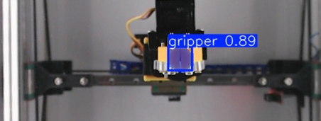
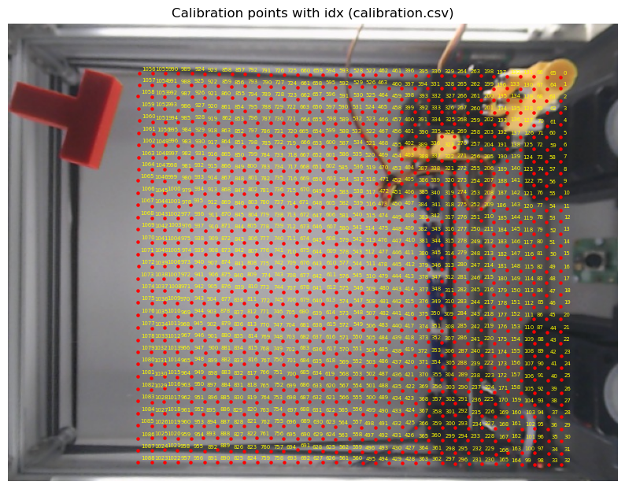

<p align="center">
  
</p>

# Robot-Specific Mapping and Automatic Matching for CloudGripper

**Shared Module · Task 1 and Task 2 · Team K-DAS · RGMC 2026**

The positions of objects, corners, and rope nodes detected in Task 1 and Task 2 are obtained as camera pixel coordinates `(u, v)`. CloudGripper, however, operates using normalized workspace coordinates `(x, y)`, so pixel coordinates must be converted into normalized coordinates before they can be used for computation and robot commands.

The camera geometry and visible workspace differed slightly from robot to robot, and during the competition we did not know in advance which robot we would be connected to. K-DAS addressed this by generating a robot-specific coordinate map for each robot during the testing period, then identifying and loading the appropriate map from the first camera observation at the start of the competition.

> **In this document, a `map` refers to** robot-specific pixel-to-workspace transformation data built from correspondences between robot command coordinates `(x, y)` and the observed gripper pixel coordinates `(u, v)`.

```text
Before competition
robot identity known
→ build robot-specific maps
→ store maps for prepared robots

Competition
robot identity unknown
→ detect current gripper position
→ find the best-matching robot map
→ convert pixel coordinates during runtime
→ execute Task 1 / Task 2
```

---

## 1. From Camera Pixels to Workspace Coordinates

The camera and the robot use different coordinate systems.

```text
Camera observation:  pixel coordinate (u, v)
Robot command:       normalized workspace coordinate (x, y)
```

In Task 1, the pixel coordinates of the object center, corners, and contour are converted into normalized coordinates before computing the object pose and pushing action.

```text
object pixels
→ normalized coordinates
→ pose / polygon / contact point
→ push planning
```

In Task 2, the pixel coordinates of rope nodes obtained from rope segmentation are converted into normalized coordinates and used to represent the rope state and compute the next action.

```text
rope node pixels
→ normalized coordinates
→ rope state
→ planning / control
```

Therefore, both tasks require a process that **converts pixel coordinates measured by the camera into normalized workspace coordinates used for computation**.

---

## 2. Why Each Robot Needed Its Own Map

CloudGripper uses the same normalized command coordinates `(x, y)` across robots, but the pixel location corresponding to the same `(x, y)` differed slightly from one robot to another.

The main causes were differences in camera mounting, distortion, and visible workspace. Instead of applying a single transformation to every robot, we therefore **generated a separate map for each robot**.

During the testing period, the ID of the currently connected robot was known, so its map could be generated in advance. During the competition, however, the robot ID was not provided, so the system had to automatically select the appropriate map from the prepared robot-specific maps.

---

## 3. Gripper Detection: HSV to YOLOv8-Seg

To generate a map, the robot is moved to a specific `(x, y)` coordinate, and the actual gripper center `(u, v)` must then be detected reliably in the camera image.

Initially, we isolated the gripper color using HSV thresholding. However, changes in lighting, reflections, and overlap with objects caused the detected center to fluctuate or the detection to fail.

We therefore switched to YOLOv8n-seg for gripper segmentation and computed the gripper center from the moments of the mask contour. Approximately 1,000 workspace images were used for training.

<table align="center">
  <thead>
    <tr>
      <th>Metric</th>
      <th>Box</th>
      <th>Mask</th>
    </tr>
  </thead>
  <tbody>
    <tr><td>Precision</td><td align="right">0.995</td><td align="right">0.995</td></tr>
    <tr><td>Recall</td><td align="right">1.000</td><td align="right">1.000</td></tr>
    <tr><td>mAP50</td><td align="right">0.995</td><td align="right">0.995</td></tr>
    <tr><td>mAP50-95</td><td align="right">0.930</td><td align="right">0.794</td></tr>
  </tbody>
</table>

<p align="center">
  
</p>

The YOLO detector was used not only during map generation, but also at the start of the competition to detect the current gripper position for robot-map matching.

---

## 4. Robot-Specific Map Generation

<p align="center">
  
</p>

For each robot, the reachable workspace was divided into a **33 × 33 grid**, and correspondences between robot coordinates and gripper pixel coordinates were measured at a total of 1089 positions.

```text
Command robot to (x, y)
→ wait until the gripper settles
→ capture camera images
→ detect gripper center (u, v)
→ save correspondence (u, v) ↔ (x, y)
→ repeat over the 33 × 33 workspace grid
```

At each position, multiple frames were captured, and the median center of the valid detections was used to reduce transient detection noise. Camera distortion correction was applied consistently during both map generation and runtime.

<p align="center">
  
</p>

<p align="center">
  
</p>

<p align="center">
  <sub>Each marker corresponds to one measured pixel–workspace pair stored in calibration.csv.</sub>
</p>

As a result, each robot obtains a set of measured correspondences of the form

$$
\mathcal{D}=\{(u_i,v_i,x_i,y_i)\}_{i=1}^{N}
$$

These correspondences and the resulting transformation model were stored and later loaded as that robot's map during runtime.

---

## 5. Competition-Time Automatic Robot Matching

Unlike during the testing period, **we did not know which robot we were connected to during the competition**.

Regenerating a full 33 × 33 map after the competition started was not feasible, and even measuring a few new calibration points would consume valuable task execution time.

At the start of the competition, K-DAS **used the gripper at its current position without moving it for calibration**.

```text
Competition starts
→ robot identity is unknown
→ capture the first camera frame
→ detect the current gripper center with YOLO
→ compare it with prepared robot-specific maps
→ select the most similar robot/map
→ load the selected map
→ start the task immediately
```

In other words, rather than creating a new map during the competition, the system **only identified which of the pre-generated maps corresponded to the currently connected robot**.

This allowed Task 1 or Task 2 to begin immediately without spending additional time on startup calibration.

---

## 6. Runtime Pixel-to-Workspace Conversion

Once the current robot's map was selected through competition-time matching, Task 1 and Task 2 used **the selected map to convert pixel coordinates detected in the camera image into normalized workspace coordinates**.

However, a runtime pixel `(u, v)` almost never coincides exactly with one of the 1089 calibration points. Instead of using only the nearest measured point, we computed a continuous coordinate from the relationship among surrounding calibration points.

K-DAS constructed a Clough–Tocher 2D interpolation from the 33 × 33 correspondences.

$$
x=f_x(u,v), \qquad y=f_y(u,v)
$$

<p align="center">
  
</p>

At runtime, the selected robot map was loaded and `(x, y)` was computed by interpolating between the measured calibration points.

```text
Detected object / rope pixel (u, v)
→ load selected robot map
→ interpolate between measured calibration points
→ normalized workspace coordinate (x, y)
→ Task 1 / Task 2 calculation
```

For convenience, the stored transformation model is referred to as a `LUT` in the repository. In practice, however, the conversion is not a simple nearest-neighbor lookup; it **computes continuous `(x, y)` coordinates by interpolating between the 1089 measured points**.

---

## 7. Extending Coordinates Beyond the Reachable Workspace

The 33 × 33 map can only be measured within the area the gripper can physically reach. However, an object or rope visible in the camera image does not always lie entirely inside that region.

For example, three corners of a square object may lie inside the mapped region while one corner lies outside it.

```text
object corners:  ●──────●
                 │      │
workspace edge: ─●──────┼────────
                        ●  ← outside measured region
```

In this case, the outside corner lies beyond the measured range of the LUT, so a valid normalized coordinate cannot be obtained using the standard mapping. Similarly, if some rope nodes lie outside the workspace, representing the complete rope shape becomes difficult.

### 7.1 Homography from the 33 × 33 Map

To address this limitation, we computed a homography using the `(x, y) ↔ (u, v)` correspondences obtained from the existing 33 × 33 map.

$$
\mathbf{p}_{uv} \sim H_{xy\rightarrow uv}\mathbf{p}_{xy}
$$

Using the inverse homography, an extended normalized coordinate can be computed from a camera pixel.

$$
\mathbf{p}_{xy}^{ext} \sim H_{uv\rightarrow xy}\mathbf{p}_{uv}
$$

<p align="center">
  
</p>

With the homography, object corners and rope nodes located outside the directly reachable gripper workspace can still be represented in a common coordinate system.

Coordinates computed by the homography were used **to represent object and rope state beyond the workspace boundary**. Actual robot commands, however, were generated only within the gripper-reachable workspace.

Because ground-truth coordinates cannot be directly measured outside the workspace, the homography was evaluated separately in Section 8.2 using an **overlap test within the measurable region**.

---

## 8. Validation

### 8.1 Off-grid Mapping Validation

If the same 33 × 33 grid points used for calibration are fed back into the map, the test only measures how well the model reproduces points it has already seen. To verify whether the mapping also works reliably at new locations between grid points during runtime, we performed a separate validation using **off-grid positions that did not overlap with calibration points**.

Twenty-five test coordinates were selected within the workspace range `[0.1, 0.9]`, and the following process was repeated at each point.

```text
Move gripper to an off-grid workspace coordinate
→ detect the gripper center pixel (u, v)
→ convert the pixel using the saved map
→ compare mapped (x, y) with the robot coordinate
```

The error was calculated as the Euclidean distance between the robot coordinate and the mapped result.

$$
E = \left\|(x_{robot}, y_{robot})-(x_{mapped}, y_{mapped})\right\|_2
$$

<table align="center">
  <thead>
    <tr>
      <th>Metric</th>
      <th>Result</th>
    </tr>
  </thead>
  <tbody>
    <tr><td>Valid samples</td><td align="right">25 / 25</td></tr>
    <tr><td>Mean error (normalized)</td><td align="right">0.001816</td></tr>
    <tr><td>Median error (normalized)</td><td align="right">0.002021</td></tr>
    <tr><td>Maximum error (normalized)</td><td align="right">0.003480</td></tr>
    <tr><td>Mean error</td><td align="right">0.272 mm</td></tr>
    <tr><td>Median error</td><td align="right">0.303 mm</td></tr>
    <tr><td>Maximum error</td><td align="right">0.522 mm</td></tr>
  </tbody>
</table>

<p align="center">
  
</p>

For a workspace of approximately 150 mm, most off-grid errors remained in the sub-millimeter range. This validation confirmed that the mapping could also be used at **new positions between the 33 × 33 measured calibration points**.

### 8.2 Homography Overlap Check

The homography was introduced to represent object corners and rope nodes outside the workspace where the LUT is not defined. However, because the gripper cannot move outside the workspace, there is no directly measured ground-truth `(x, y)` available for those outside coordinates.

Therefore, the accuracy of the homography was **evaluated indirectly within the measurable workspace**. The 33 × 33 calibration points were divided into a central **train region** and an **outer-band test region**. The homography was fitted using only the train points, and we then measured how accurately it reconstructed the known `(x, y)` coordinates of test points that were not used for fitting.

```text
33 × 33 measured correspondences
→ select center points as train region
→ fit homography using train points
→ keep outer-band points for validation
→ pixel (u, v) → homography → predicted (x, y)
→ compare with measured test (x, y)
```

The train-region size was varied across three settings to examine how the calibration coverage used to fit the homography affected error near the workspace boundary.

<p align="center"><b>Small train region (margin = 0.44)</b></p>
<p align="center">
  
</p>

When the train region was small, the spatial coverage of the correspondences used to estimate the homography was limited, resulting in relatively large errors at outer-band points farther from the train region.

<p align="center"><b>Medium train region (margin = 0.24)</b></p>
<p align="center">
  
</p>

Expanding the train region substantially reduced the error in the test region. The results for this setting were as follows.

<table align="center">
  <thead>
    <tr>
      <th>Metric</th>
      <th>Normalized</th>
      <th>Approx. physical error (150 mm scale)</th>
    </tr>
  </thead>
  <tbody>
    <tr><td>RMSE</td><td align="right">0.0027148</td><td align="right">0.41 mm</td></tr>
    <tr><td>Mean error</td><td align="right">0.0023446</td><td align="right">0.35 mm</td></tr>
    <tr><td>Maximum error</td><td align="right">0.0077049</td><td align="right">1.16 mm</td></tr>
  </tbody>
</table>

<p align="center"><b>Large train region (margin = 0.08)</b></p>
<p align="center">
  
</p>

When the train region was expanded close to the workspace boundary, the remaining outer-band points still showed relatively stable coordinate conversion. Overall, **including a wider calibration region when estimating the homography tended to reduce the boundary-region error**.

In the actual runtime system, the homography was not estimated from only a subset of the points. Instead, **all 1089 correspondences measured in the 33 × 33 calibration were used**.

This validation does not directly guarantee the accuracy of coordinates generated outside the workspace. Instead, by deliberately withholding some calibration points within the region where true coordinates are known and then predicting them, it provided a practical check of how well the homography preserves the existing pixel-to-workspace relationship as it approaches and extends beyond the calibrated region.

---

## 9. Use in Task 1 and Task 2

### Task 1 — Rigid Object Pushing

```text
camera image
→ object segmentation / contour
→ object pixel coordinates
→ normalized coordinates
→ pose / polygon / contact calculation
→ push planning
```

When part of an object extended beyond the measured workspace, homography-based coordinates were used to preserve the complete polygon state, while actual robot actions were generated only within the reachable workspace.

### Task 2 — Rope Manipulation

```text
camera image
→ rope segmentation / skeleton
→ ordered rope-node pixels
→ normalized coordinates
→ rope state
→ DER / Residual GNN / MPC / policy
```

Because the arrangement of all rope nodes defines the rope state, nodes outside the workspace were not discarded; they were represented together with the remaining nodes using homography-based coordinates.

---

## 10. Summary

The K-DAS mapping pipeline was designed to address three main problems.

1. **Map generation** — measure a 33 × 33 pixel-to-workspace correspondence set for each robot in advance and build an interpolation map.
2. **Automatic map matching** — use the first gripper observation at the start of the competition to identify the map corresponding to the currently connected robot.
3. **Runtime coordinate conversion** — use the selected map and homography to convert Task 1 object pixels and Task 2 rope pixels into normalized coordinates.

```text
Generate maps before competition
→ identify the connected robot at startup
→ load its map
→ convert camera pixels during runtime
→ use the converted coordinates for Task 1 / Task 2
```
