<p align="center">
  
</p>

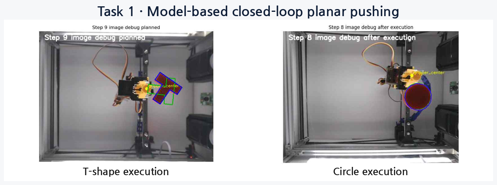

# Task 1 — Model-Based Closed-Loop Planar Pushing

**IEEE ICRA 2026 Cloud Robotics Competition · Team K-DAS · Kookmin University**

The goal of Task 1 is to move an object on a planar surface to a target position and orientation using only a robotic pusher. Because the object cannot be grasped or lifted, the system must decide at every step **where to make contact, in which direction to push, and how far to push**.

K-DAS developed a planar pushing system that represents the object using its center position, orientation, and contour/keypoints, and combines a **minimum-jerk reference path**, **candidate-wise 1-step physics prediction**, **progress-aware scoring**, **Direct–L–U–A\* safe approach planning**, and **closed-loop replanning based on re-observation after execution**.

> This README provides a high-level overview of the Task 1 problem, development process, final system, and results. Details of the physics model, candidate generation, approach planning, shape-specific alignment, and runtime optimization are described separately in the corresponding module documentation.

---

## 1. Competition Result

| Item | K-DAS Result |
|---|---:|
| Task 1 Final Score | **49.69** |
| Task 1 Ranking | **1st place** |
| Evaluation Objects | **6 objects** |
| Surprise / Unseen Shapes | **3 objects** |
| Final Competition | **Overall 1st place** |

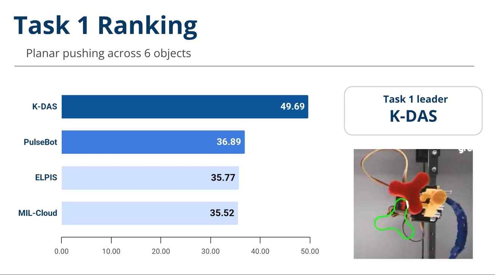

The final evaluation included Circle, Square, T, and T-long, as well as the surprise shapes Plus and Organic. Five runs were performed for each object, and the average of the best three runs was used for scoring. K-DAS achieved a Task 1 score of **49.69**, placing **1st in Task 1**. Combined with a strong result in Task 2, this led to **1st place overall** in the competition.

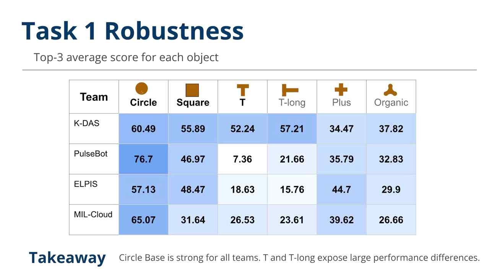

| Object | Top-3 Average Score |
|---|---:|
| Circle | **60.49** |
| Square | **55.89** |
| T | **52.24** |
| T-long | **57.21** |
| Plus | **34.47** |
| Organic | **37.82** |

T and T-long are asymmetric shapes, which makes orientation alignment more difficult, but relatively strong performance was maintained after applying basis-axis correction and 8-point alignment. In contrast, Plus and Organic are concave or irregular surprise shapes, where the limitations of contact sampling and rigid-template alignment became more significant.

---

## 2. System at a Glance

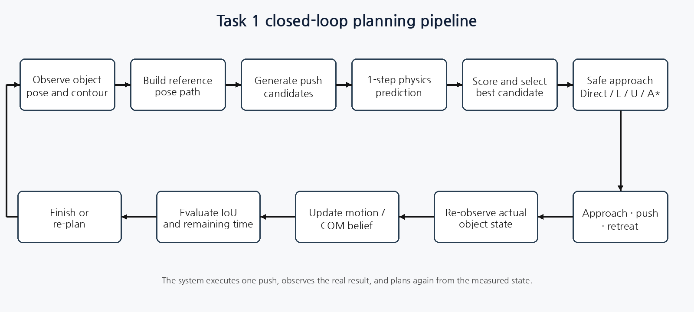

```text
Observe object pose and contour
        ↓
Generate a smooth reference pose path
        ↓
Sample contact point, direction, and stroke candidates
        ↓
Predict each candidate with a 1-step rigid pushing model
        ↓
Score expected progress, direction, overshoot, and path cost
        ↓
Plan a collision-free approach path
        ↓
Approach → push → retreat
        ↓
Re-observe the actual pose and update the next plan
```

Task 1 is not handled as an open-loop problem where one large push is expected to reach the target. After each action, the system observes the actual object state again and generates a new set of candidates from the updated observation. This **closed-loop replanning** structure reduces the accumulation of model error over long horizons, even when a single-step physics prediction is not exact.

---

## 3. Why Planar Pushing Is Difficult

Planar pushing is more than a simple 2D position-control problem.

- The robot **cannot grasp or lift the object** and can only apply pushes through contact.
- Small changes in contact location can significantly change the balance between translation and rotation.
- The center of mass, friction, moment of inertia, and exact contact location are difficult to know precisely.
- Long strokes can move the object quickly toward the target, but can also cause overshoot or push the object outside the workspace.
- Asymmetric or concave shapes such as T, Plus, and Organic make pose and keypoint alignment more difficult.
- Camera and calibration conditions vary between remote robot cells, and server latency also affects performance under a time limit.

K-DAS addressed the problem as a repeated cycle of **observation → candidate generation → physics prediction → evaluation → safe execution → re-observation**.

---

## 4. Development Story

### 4.1 What should represent the object state?

> “Is matching only the center position enough to consider the target shape reached?”

The object state is represented by its center position and orientation.

$$
q=[x,\ y,\ \theta]
$$

However, success should not be determined only from the numerical pose error. It should also reflect how much the current contour overlaps the target contour in the workspace. Squares and T-shapes were represented using keypoint polygons, while circles were represented using sampled contour polygons.

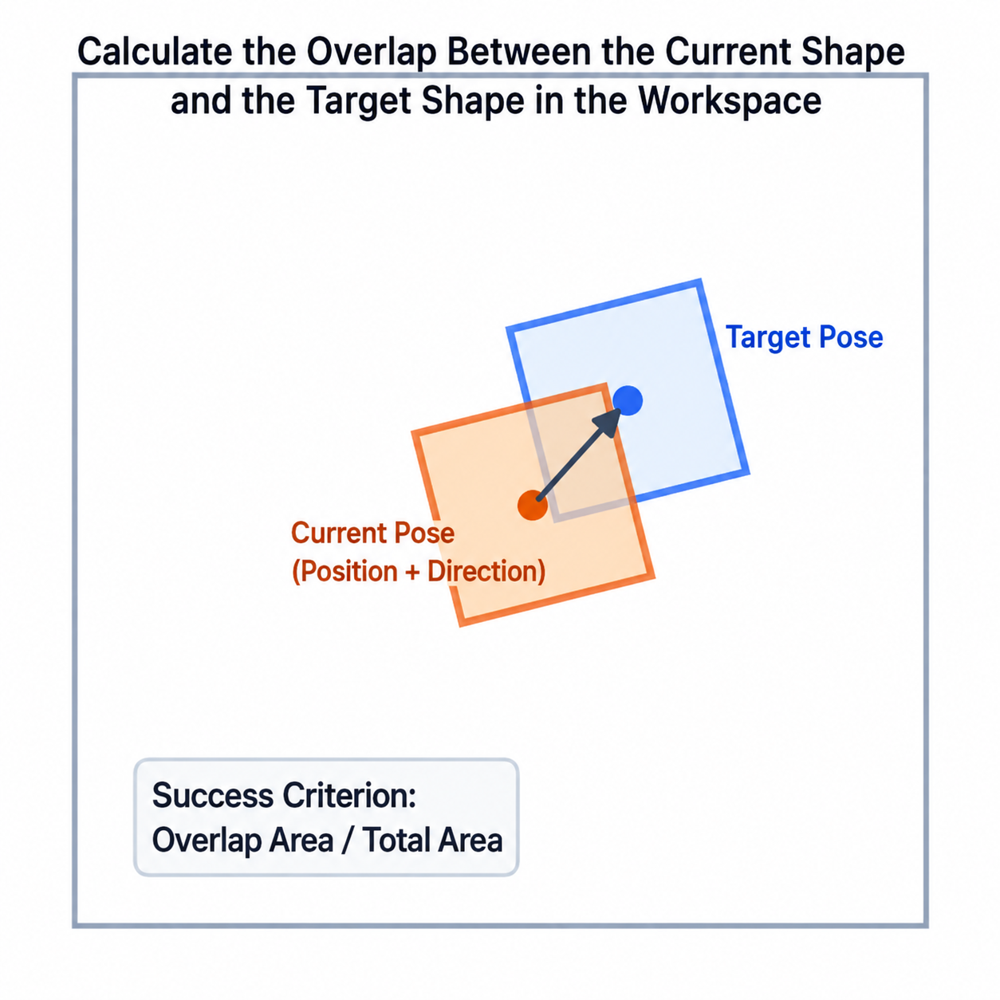

$$
\mathrm{IoU}=\frac{\mathrm{Area}(S_{current}\cap S_{target})}{\mathrm{Area}(S_{current}\cup S_{target})}
$$

IoU was used as a primary success metric because it captures both position and orientation error through the actual overlap between the current and target shapes.

Detailed documentation: [`geometry/README.md`](geometry/README.md)

---

### 4.2 Should every push aim directly at the final target?

> “A single large push is faster, but what happens if it overshoots the target?”

A minimum-jerk reference path was generated between the current pose and the target pose.

$$
s(t)=10t^3-15t^4+6t^5
$$

$$
q_{ref}(t)=q_{current}+s(t)(q_{target}-q_{current})
$$

This path changes smoothly near the start and end and provides an intermediate target for the current stage instead of always evaluating actions only against the final target.

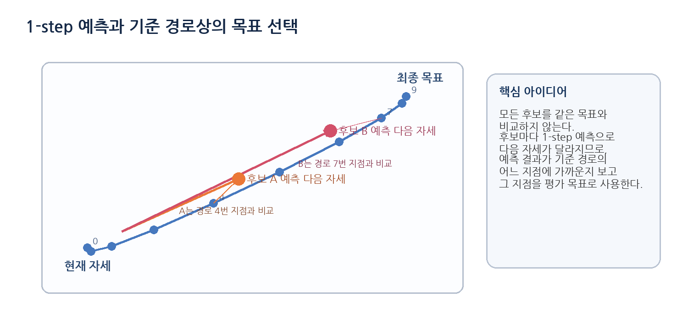

An important improvement was to avoid comparing every candidate against the same intermediate target. For each candidate, the planner found the point on the reference path that best matched the candidate's predicted next pose and used that point as the candidate-specific evaluation target. This reduced the bias that appeared when short and long strokes were evaluated against the same reference point.

Detailed documentation: [`planning/README.md`](planning/README.md)

---

### 4.3 Where, in which direction, and how far should the object be pushed?

Contact points were sampled from object faces or contours, and candidate actions were generated by combining surface-normal directions with different stroke lengths.

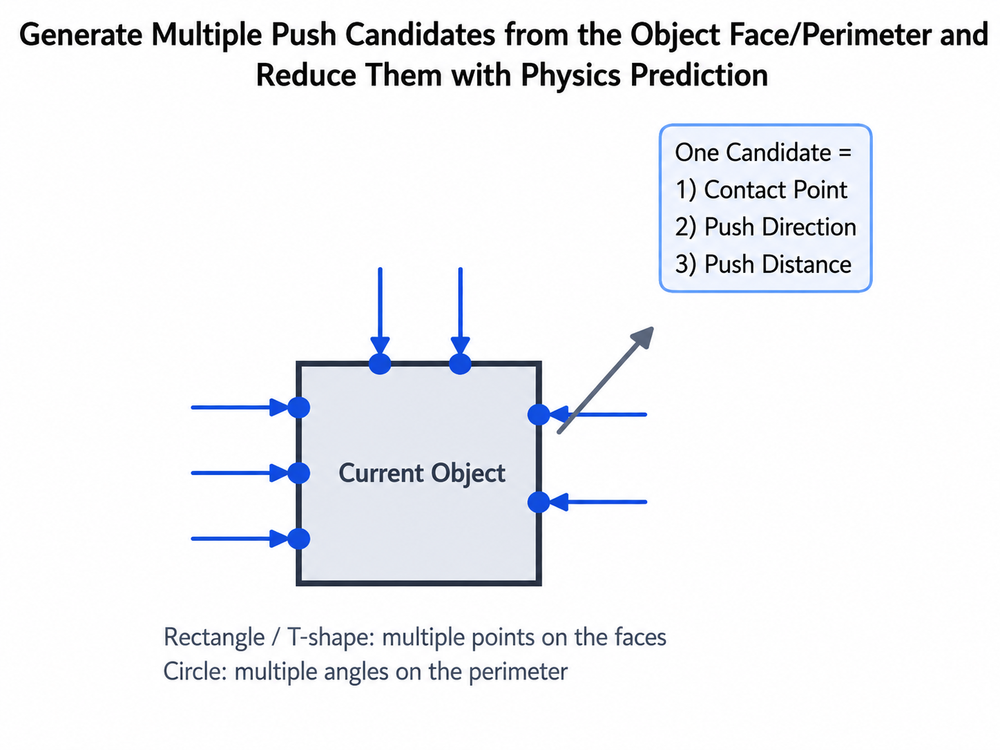

Each candidate contains the following elements:

- contact point on object boundary
- pusher center start point
- inward push direction
- stroke length
- approach and retreat positions

Because the pusher has a finite radius, its center should not be placed directly on the object surface. The start point was therefore offset outward from the contact point by the pusher radius. Longer strokes were preferred when the object was far from the target, while shorter correction strokes were used near the target.

Detailed documentation: [`planning/README.md`](planning/README.md)

---

### 4.4 Can the result of a push be predicted before execution?

> “If this contact point is pushed, how far will the object translate and rotate?”

Each candidate is evaluated with a one-step rigid pushing model before being executed on the real robot.

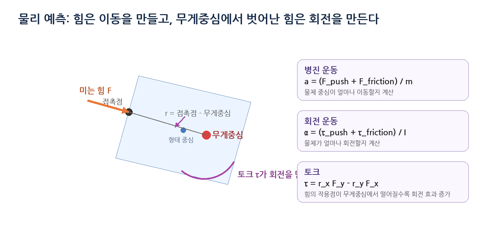

The prediction model uses simplified relationships between:

- applied force and translational acceleration
- contact lever arm and torque
- object mass and moment of inertia
- friction and COM belief
- push duration and stroke distance

On the real robot, the pose difference before and after each push was recorded to obtain the observed translation and rotation. The loop was then extended so that the COM belief and prediction–observation difference could be reflected in subsequent planning.

Detailed documentation: [`dynamics/README.md`](dynamics/README.md)

---

### 4.5 Which candidate is actually better?

Comparing only the final distance to the target can favor an excessively long stroke or a push that rotates the object in the wrong direction. The candidate score therefore considers several factors together.

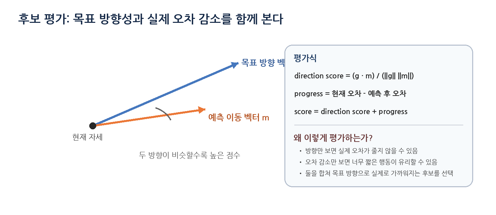

- reference path progress
- translation and orientation error
- motion direction consistency
- overshoot risk
- workspace boundary margin
- approach path cost

Conceptually, the score can be written as:

$$
J = w_e E_{pose} - w_p P_{progress} + w_o R_{overshoot} + w_c C_{path}
$$

Even if a candidate has the lowest cost, it is removed from the executable set if the robot cannot approach its start point safely.

---

### 4.6 Can the robot safely reach the start point of a good push?

> “A candidate may look good, but can the robot reach its contact start point without colliding with the object?”

Approach paths were searched progressively to balance computation and execution time.

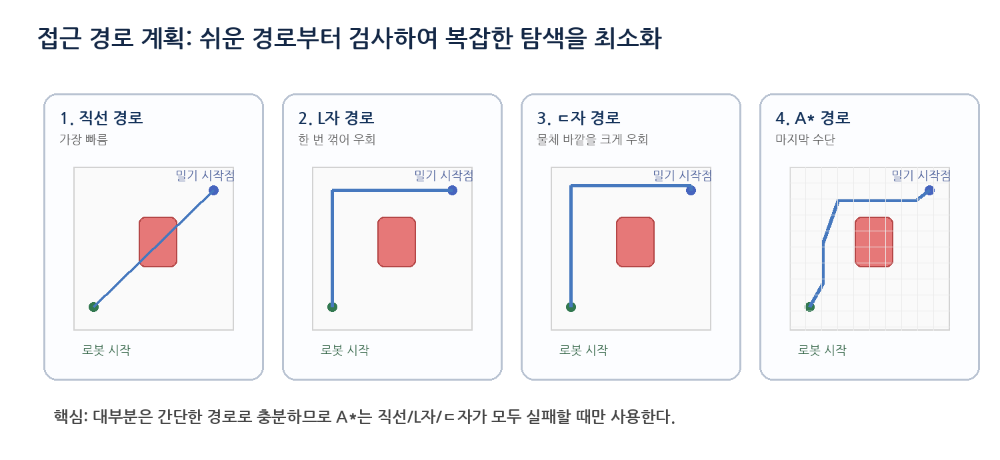

```text
Direct path
    ↓ failure
L-shaped path
    ↓ failure
U-shaped path
    ↓ failure
Short A* path
```

The initial planner used Direct → L-shape → A\*. However, when the L-shaped path failed, the planner often generated a long A\* route immediately, which increased execution time significantly. To reduce this, a U-shaped option was added, and the A\* waypoint limit was relaxed progressively as `5 → 7 → 9 → 12`. This allowed the planner to try shorter paths first while still retaining a feasible fallback when necessary.

Detailed documentation: [`planning/README.md`](planning/README.md)

---

### 4.7 What if the model prediction and real execution do not match?

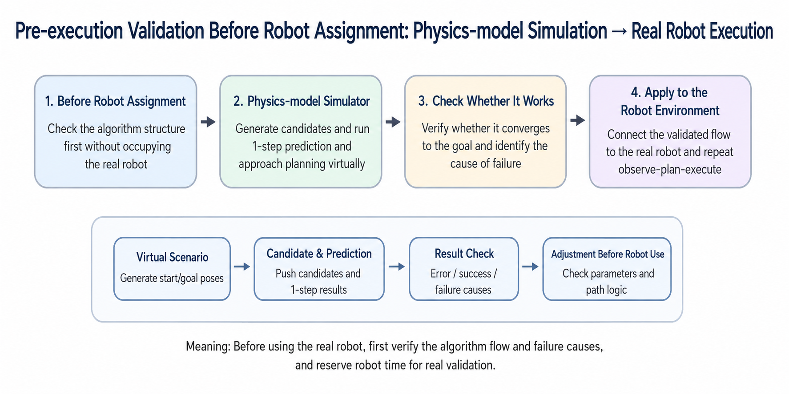

The initial physics simulation was used to validate the logic of candidate generation, scoring, and iterative planning. The same planner was then connected to real robot observations, and the following process was repeated after every push:

1. Re-detect the object and gripper.
2. Convert pixel coordinates to workspace coordinates.
3. Compare the predicted pose with the observed pose.
4. Record the actual translation and rotation response.
5. Retreat and compute a new plan from the updated state.

Instead of assuming that the physics simulation is exact, this structure uses the **new real observation as the initial state for the next planning step**.

---

### 4.8 Can asymmetric and symmetric shapes be aligned in the same way?

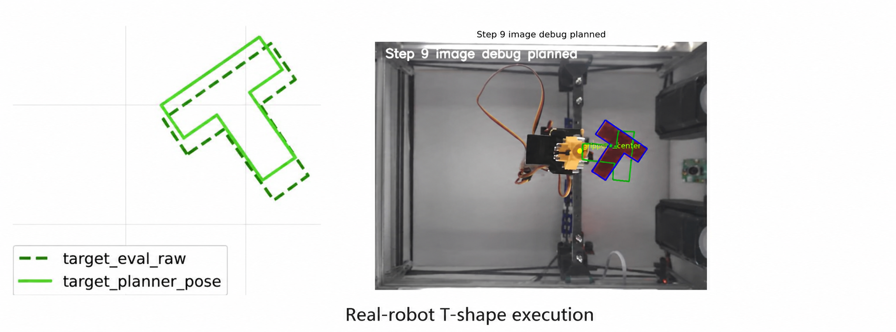

#### T-shape

For the T-shape, the detected stem direction and the planner's canonical shape axis were offset by approximately 90°. The same basis correction was applied to both the current and target shapes, and the target pose was computed using **rigid alignment over all eight vertices** rather than relying on a single center point.

#### Square

A square has 90° rotational symmetry, so the vertex indices can change depending on which corner the contour detector returns first, even when the physical pose is effectively the same. To handle this, all four cyclic vertex permutations were compared and the one with the minimum shape error was used.

This correction reduced unnecessary rotations of squares that were already aligned with the target.

Detailed documentation: [`geometry/README.md`](geometry/README.md)

---

### 4.9 Can more useful pushes be executed within the time limit?

Analysis of intermediate evaluation logs showed that the largest time bottlenecks were not the planner computation itself, but server response time, fixed sleep at waypoints, and execution of long approach paths.

The following improvements were applied:

- reduced fixed sleep time at each waypoint
- prioritized Direct/L/U paths
- limited A\* waypoint count and simplified paths
- increased stroke length based on target distance
- optimized retreat distance after a push
- rejected failed paths earlier and switched to the next candidate faster

Long strokes were useful for approaching the target quickly, but they also increased overshoot and workspace-exit risk. Therefore, stroke selection had to consider not only the remaining target distance but also the available workspace margin.

---

## 5. Final Closed-Loop Execution

```python
while time_remaining:
    observation = capture_bottom_view()
    current_shape = detect_object(observation)
    robot_xy = detect_or_read_pusher_state(observation)

    current_pose = estimate_pose_and_keypoints(current_shape)
    target_on_path = build_reference_path(current_pose, target_pose)

    candidates = generate_push_candidates(current_shape, target_on_path)
    predicted = [predict_one_step(current_pose, action) for action in candidates]
    selected = score_and_select(candidates, predicted, target_on_path)

    approach = plan_safe_approach(
        robot_xy,
        selected.start,
        obstacle=current_shape,
        methods=["direct", "L", "U", "A_star"],
    )

    execute_approach_push_retreat(approach, selected)
    observed_next = reobserve_object()
    update_motion_and_com_belief(current_pose, selected, observed_next)

    if evaluator_iou(observed_next, target_shape) >= success_threshold:
        break
```

The key idea is to use the model prediction to select an action, but always return to the real observation after execution.

---

## 6. Module Documentation

| Module | Role | Documentation |
|---|---|---|
| Geometry & Shape Alignment | pose, polygon, IoU, symmetry and target alignment | [`geometry/`](geometry/README.md) |
| Rigid Pushing Dynamics | force/torque-based 1-step prediction and COM belief | [`dynamics/`](dynamics/README.md) |
| Planning & Candidate Selection | reference path, contact sampling, scoring, Direct/L/U/A* approach planning | [`planning/`](planning/README.md) |
| Runtime Execution | approach, push, retreat, latency and recovery handling | [`runtime/`](runtime/README.md) |

### Shared Mapping Dependency

Task 1 and Task 2 share a common Mapping module that converts camera pixel coordinates into real CloudGripper workspace coordinates. Robot-specific calibration, LUT construction, safe probing, and coordinate conversion are not duplicated inside the Task 1 documentation and are instead described separately in the repository-level [`mapping/README.md`](../mapping/README.md).

---

## 7. Development Validation

The following results were observed during iterative testing before the final competition.

| Validation | Result |
|---|---:|
| Square tests reaching final IoU ≥ 0.8 | **11 / 11** |
| Best square final IoU | **0.90** |
| Best square score | **132.40** |
| Square average steps | **4.0** |
| Square average time per step | **24.41 s** |
| Circle tests reaching IoU ≥ 0.8 | **5 / 8** |
| Best circle Max IoU | **0.96** |
| Fastest successful circle run | **49.86 s** |

After adding cyclic vertex matching for the square and improving the approach planner, all 11 square tests reached an IoU of at least 0.8. For the circle, long strokes enabled faster movement toward the target, but some runs left the workspace or overshot the target, resulting in a 5/8 success rate.

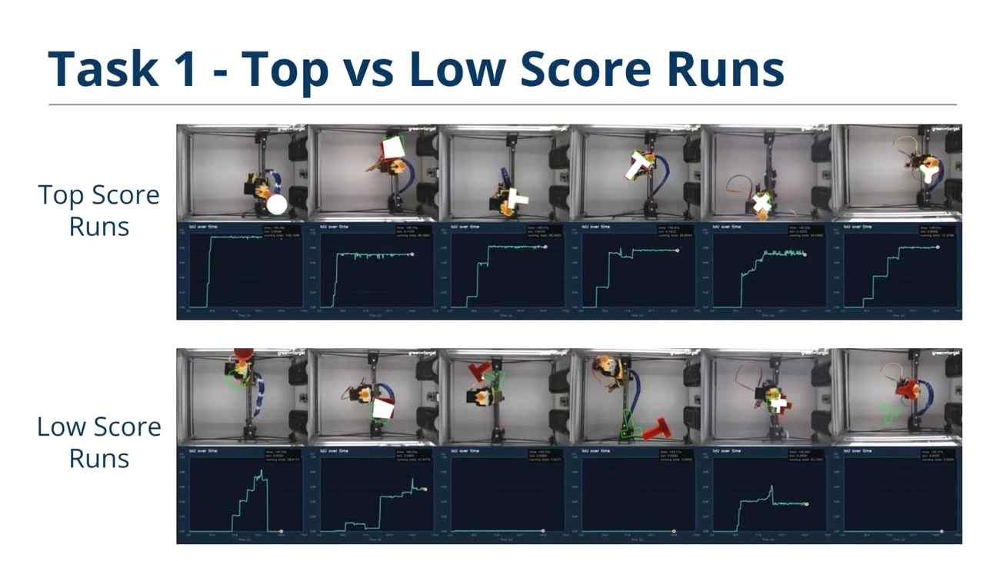

---

## 8. Failure Cases and Lessons

| Failure mode | Cause | Mitigation / lesson |
|---|---|---|
| Overshoot and workspace exit | stroke too long near the boundary | distance-aware stroke + boundary margin |
| Unnecessary rotation of square | inconsistent vertex start index | cyclic vertex permutation matching |
| T-shape orientation mismatch | detection and canonical axes differed by about 90° | shared basis correction + 8-point alignment |
| Excessive execution time | long A\* path and waypoint sleep | Direct/L/U priority + progressive A\* limit |
| Candidate exists but no approach path | safety margin rejected contact-near poses | distinguish object collision from necessary contact approach |
| Prediction–execution mismatch | friction, COM, contact and robot errors | re-observation, COM belief update and replanning |
| Low Plus / Organic performance | concavity and ambiguous keypoints | contour-level matching and richer contact dynamics are needed |

---

## 9. Task 1 Directory

```text
task1/
├── README.md
├── geometry/
│   └── README.md
├── dynamics/
│   └── README.md
├── planning/
│   └── README.md
└── runtime/
    └── README.md
```

The Mapping module is kept outside the Task 1 directory as a repository-level module shared by both Task 1 and Task 2.

---

## 10. Takeaway

K-DAS Task 1 is not a rule-based system that simply pushes the object repeatedly toward the target. It is a **model-based closed-loop planar pushing system** that observes the object's pose and contour, generates push candidates along a smooth reference path, predicts each candidate with a physics model, and executes the selected action through a safe approach path.

In the final evaluation, including both seen objects and surprise shapes, this system achieved a **Task 1 score of 49.69 and 1st place**. At the same time, the lower results on Plus and Organic showed a remaining limitation: rigid pose representations and sparse keypoints are not sufficient to fully handle complex concave shapes.
