<p align="center">
  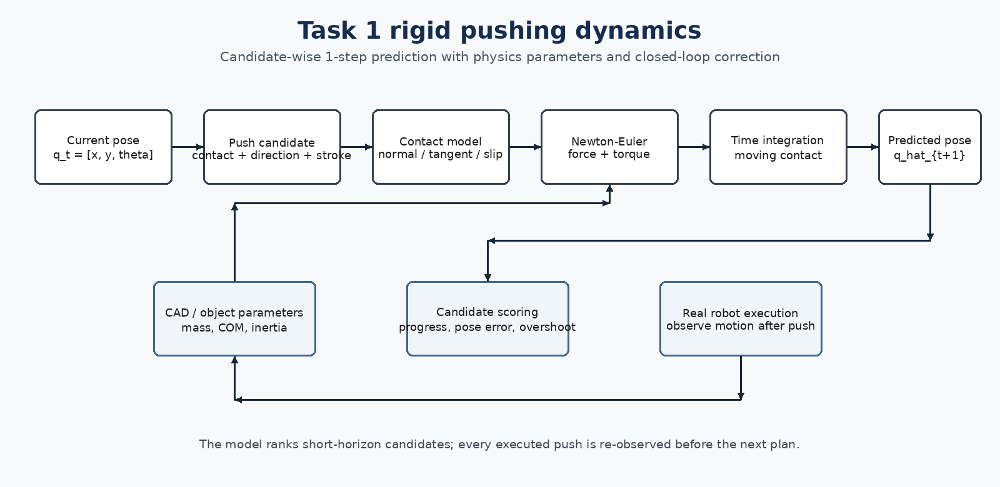
</p>

# Rigid-Body Dynamics for Planar Pushing

**Task 1 · Model-Based Closed-Loop Planar Pushing · Team K-DAS**

이 모듈은 하나의 push candidate를 실제 로봇에서 실행하기 전에, 물체가 **얼마나 병진하고 얼마나 회전할지** 짧은 horizon에서 예측한다. 물체의 질량, 편향된 질량중심, 관성모멘트, 접촉 위치, 접촉 마찰과 바닥 마찰을 단순화된 Newton-Euler 모델에 반영하고, 푸셔가 이동하는 동안 상태를 시간 적분하여 다음 pose를 계산한다.

> 이 모델의 목적은 실제 접촉 현상을 완벽하게 재현하는 것이 아니라, 같은 상태에서 생성된 여러 push candidate의 상대적 품질을 빠르게 비교하는 것이다. 실행된 action의 결과는 매 step 다시 관측되므로, 모델 오차가 장시간 open-loop로 누적되지 않는다.

---

## 1. Role in the Task 1 System

```text
Perception / Geometry
        │
        ▼
Current object pose and boundary
        │
        ▼
Push candidate generation
        │
        ▼
Rigid-body dynamics rollout  ←  object parameter database / COM belief
        │
        ▼
Predicted next pose and polygon
        │
        ▼
Candidate scoring and safe-path feasibility
        │
        ▼
Real push → re-observation → model-belief update
```

Dynamics는 최종 action을 단독으로 결정하지 않는다. 이 모듈은 각 candidate의 predicted next state를 제공하며, planner는 이를 reference-path progress, pose error, overshoot risk, workspace margin과 함께 평가한다.

관련 문서:

- Task 1 overview: [`../README.md`](../README.md)
- Geometry and shape alignment: [`../geometry/README.md`](../geometry/README.md)
- Candidate selection: [`../planning/README.md`](../planning/README.md)

---

## 2. Problem Formulation

물체의 planar state는 중심 위치, 방향, 선속도와 각속도로 표현한다.

$$
q_t=[x_t,y_t,\theta_t], \qquad \dot q_t=[v_{x,t},v_{y,t},\omega_t]
$$

하나의 push action은 다음 정보로 구성된다.

- contact point 또는 object boundary상의 접촉 비율
- pusher-center start point
- push direction
- stroke length
- nominal pusher speed

Dynamics module은 다음 transition을 근사한다.

$$
\hat s_{t+1}=f_{\mathrm{rigid}}(s_t,a_t,\phi)
$$

여기서 $\phi$는 물체 질량, 질량중심, 관성모멘트, 마찰 계수와 effective radius를 포함하는 parameter set이다.

---

## 3. Modeling Assumptions

실시간 candidate evaluation을 위해 다음과 같이 범위를 제한하였다.

- 물체는 변형되지 않는 planar rigid body로 가정한다.
- 로봇은 Z축 조작이나 grasp 없이 pusher의 2D 이동으로 물체를 민다.
- pusher-object 접촉은 local normal/tangent를 갖는 point contact로 근사한다.
- 접촉과 바닥 저항은 Coulomb-friction 기반의 단순 모델로 표현한다.
- 한 번의 push는 짧은 시간 구간으로 나누어 forward integration한다.
- 장시간 정확도보다 **candidate ranking에 필요한 short-horizon trend**를 우선한다.

이 모델은 full limit-surface identification이나 고해상도 contact mechanics를 구현한 것이 아니다. 원격 로봇 환경에서 반복적으로 수십 개 후보를 평가하기 위한 계산 효율과 물리적 방향성을 우선한 grey-box simulator이다.

---

## 4. Object Mass, Center of Mass, and Inertia

<p align="center">
  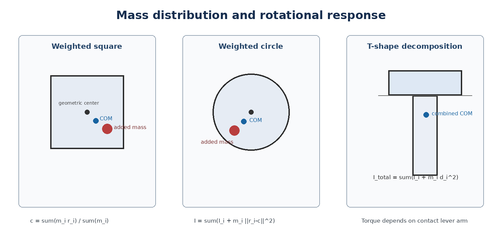
</p>

Weighted Square와 Weighted Circle은 내부 하중 배치에 따라 geometric center와 center of mass가 달라질 수 있다. 총 질량과 COM은 다음과 같이 계산한다.

$$
M=\sum_i m_i, \qquad c=\frac{\sum_i m_i r_i}{\sum_i m_i}
$$

새 COM 기준 관성모멘트는 평행축 정리를 사용한다.

$$
I=\sum_i\left(I_i+m_i\lVert r_i-c\rVert^2\right)
$$

T-shape는 상단 bar와 stem을 별도의 직사각형으로 분해한 뒤 각 부분의 질량, 중심과 관성모멘트를 합산한다.

### Why COM matters

접촉점에서 COM까지의 lever arm이 달라지면 같은 force라도 torque가 달라진다.

$$
r=p_{contact}-c
$$

$$
\tau_{push}=r_xF_y-r_yF_x
$$

따라서 geometric center만 사용하면 비대칭 하중을 가진 물체의 회전 방향과 크기를 올바르게 비교하기 어렵다.

---

## 5. Contact Force and Slip Approximation

<p align="center">
  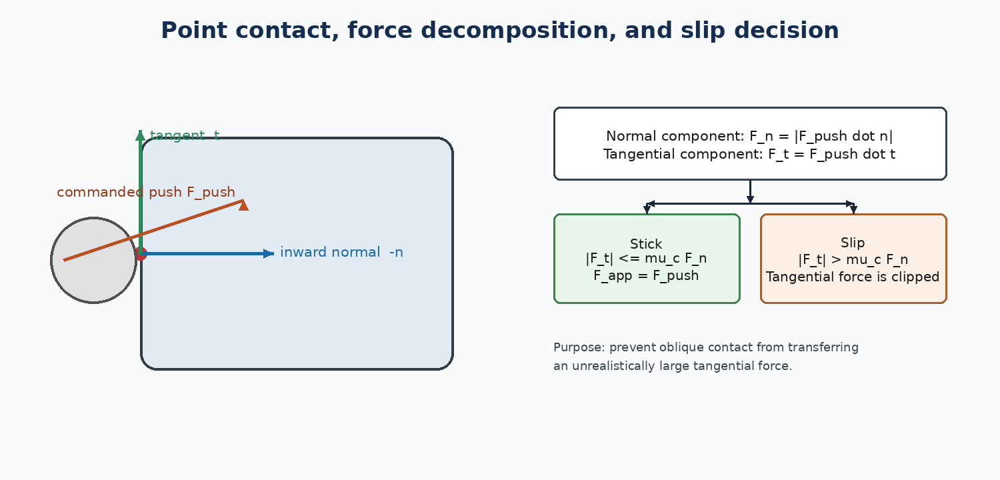
</p>

접촉면의 outward normal $\hat n$과 tangent $\hat t$를 기준으로 push force를 분해한다.

$$
F_n=|F_{push}\cdot\hat n|, \qquad F_t=F_{push}\cdot\hat t
$$

접선 성분이 접촉 마찰 한계보다 작으면 sticking으로 간주해 command force를 전달한다.

$$
|F_t|\le\mu_cF_n \quad\Rightarrow\quad F_{app}=F_{push}
$$

한계를 초과하면 tangential component를 friction limit까지 제한한다.

$$
|F_t|>\mu_cF_n
$$

이 분기 처리는 pusher가 물체를 비스듬히 스치는 candidate가 실제보다 과도하게 큰 힘을 전달한다고 예측되는 것을 줄이기 위해 사용하였다.

---

## 6. Ground Friction and Newton-Euler Equations

물체의 현재 선속도 반대 방향으로 translational friction을 적용한다.

$$
F_{fric}=-\frac{v}{\lVert v\rVert}\mu_gmg
$$

회전에는 effective friction radius $R_{eff}$를 사용하는 저항 토크를 적용한다.

$$
\tau_{fric}=-\operatorname{sgn}(\omega)\mu_gmgR_{eff}
$$

최종 선가속도와 각가속도는 다음과 같다.

$$
a=\frac{F_{app}+F_{fric}}{m}
$$

$$
\alpha=\frac{\tau_{push}+\tau_{fric}}{I}
$$

이 구조는 contact point가 COM을 통과하면 회전이 작아지고, COM에서 멀어질수록 회전 효과가 커지는 기본적인 물리 경향을 직접 반영한다.

---

## 7. Time Integration and Moving Contact

<p align="center">
  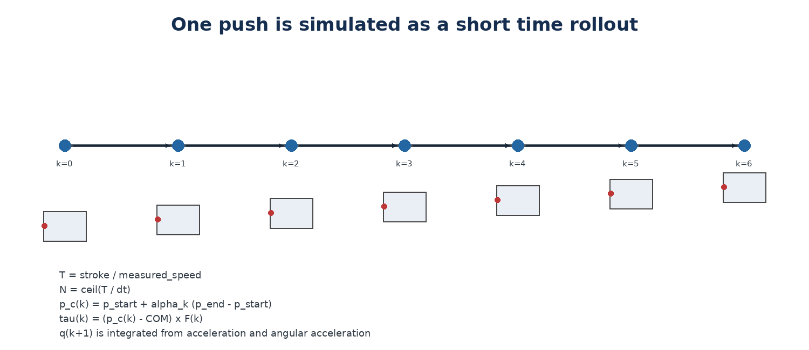
</p>

초기 모델은 stroke를 고정 거리 단위로 나누고 contact point도 고정된 것으로 가정했다. 실제 로봇에서는 pusher가 일정 속도로 start에서 end까지 이동하므로, 최종 모델은 push duration과 contact point를 시간에 따라 갱신한다.

### 7.1 Measured robot speed

실제 로봇에서 0.09 m 이동을 15회 측정한 결과 최종 평균 pushing speed는 약 **0.0933 m/s**였다.

<p align="center">
  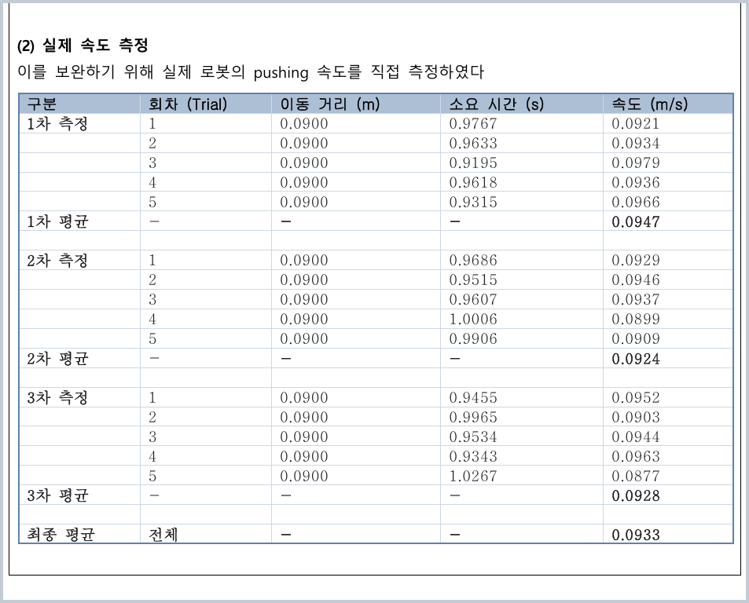
</p>

$$
T=\frac{L}{v_{push}}, \qquad N=\left\lceil\frac{T}{\Delta t}\right\rceil
$$

### 7.2 Moving contact point

적분 step $k$에서의 접촉점은 push line을 따라 이동한다.

$$
\alpha_k=\frac{k+1}{N}
$$

$$
p_c(k)=p_s+\alpha_k(p_e-p_s)
$$

이에 따라 lever arm과 torque도 매 step 다시 계산된다.

$$
r(k)=p_c(k)-c, \qquad \tau(k)=r(k)\times F(k)
$$

### 7.3 State update

$$
v_{k+1}=v_k+a_k\Delta t
$$

$$
\omega_{k+1}=\omega_k+\alpha_k\Delta t
$$

$$
q_{k+1}=q_k+[v_{k+1,x},v_{k+1,y},\omega_{k+1}]\Delta t
$$

---

## 8. Pusher Radius and the True Start Condition

초기 candidate generation에서는 pusher center의 start point를 object surface 위에 두었다. 그러나 실제 푸셔는 유한한 반지름을 가지므로, 해당 위치로 접근하는 동안 이미 물체를 밀게 된다.

이를 다음과 같이 수정하였다.

$$
p_{start}=p_{surface}+R_{pusher}\hat n
$$

<p align="center">
  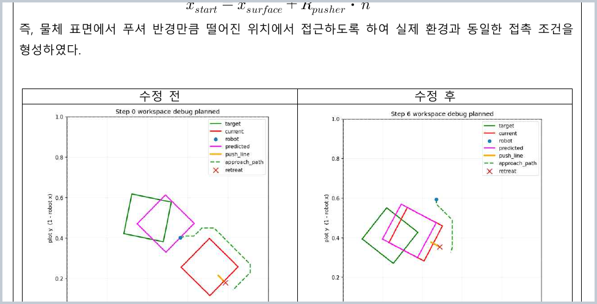
</p>

이 보정은 simulator와 real robot이 동일한 접촉 시작 조건을 사용하도록 만드는 sim-to-real correction이다.

---

## 9. Shape-Specific Contact Geometry

### Circle

원의 local normal은 geometric center에서 contact point로 향하는 radial direction을 사용한다.

$$
\hat n=\frac{p_c-p_{geo}}{R}
$$

COM이 편향되어 있어도 surface normal은 물체 외곽의 기하학적 중심을 기준으로 계산한다.

### Polygonal objects

Square와 T-shape는 현재 polygon edge에서 tangent를 계산하고, 그에 수직인 outward normal을 사용한다.

$$
\hat t=\frac{p_2-p_1}{\lVert p_2-p_1\rVert}, \qquad
\hat n=[t_y,-t_x]
$$

초기 prototype에서는 axis-aligned local normal을 case별로 정의했지만, integrated planner에서는 현재 검출된 boundary와 orientation을 이용해 contact geometry를 구성하는 방식으로 확장하였다.

---

## 10. Candidate-Wise 1-Step Prediction

각 candidate는 동일한 dynamics function을 통해 predicted next pose를 생성한다.

```python
for candidate in candidates:
    state = current_state.copy()
    duration = candidate.stroke / measured_push_speed
    steps = ceil(duration / dt)

    for k in range(steps):
        contact = interpolate(candidate.contact_start,
                              candidate.contact_end,
                              (k + 1) / steps)
        force = resolve_contact_force(candidate.force,
                                      candidate.normal,
                                      candidate.tangent)
        acceleration, angular_acceleration = newton_euler(
            state, force, contact, object_parameters
        )
        state = integrate(state, acceleration,
                          angular_acceleration, dt)

    candidate.predicted_pose = state.pose
```

Dynamics output은 다음 정보를 제공한다.

- predicted center and orientation
- predicted polygon / keypoints
- translation and rotation magnitude
- predicted progress toward a reference pose
- diagnostics such as applied torque and slip state

Planner는 이 output을 candidate score에 사용한다.

---

## 11. CAD Candidate Cases and Online COM Belief

실제 물체 내부 하중 위치는 사전에 직접 관측할 수 없었다. 따라서 CAD에서 가능한 nut configuration별로 mass, inertia와 COM candidate를 미리 계산해 database로 구성하였다.

한 번의 real push 이후 관측된 병진·회전 응답과 각 candidate model의 prediction을 비교한다.

$$
e_j=\lVert\Delta p_{obs}-\Delta p_j\rVert
+w_\theta|\Delta\theta_{obs}-\Delta\theta_j|
$$

오차가 작은 case의 belief를 높이거나 best-match case를 다음 planning의 parameter로 사용한다.

<p align="center">
  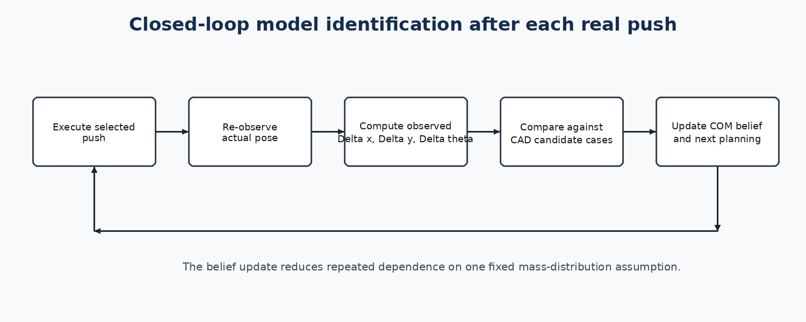
</p>

이 구조의 핵심은 물체의 mass distribution을 한 번 정한 뒤 고정하는 것이 아니라, **실제 push response를 다음 model selection에 반영**하는 것이다.

---

## 12. Physics Validation

### 12.1 Symmetric vs. asymmetric mass distribution

<p align="center">
  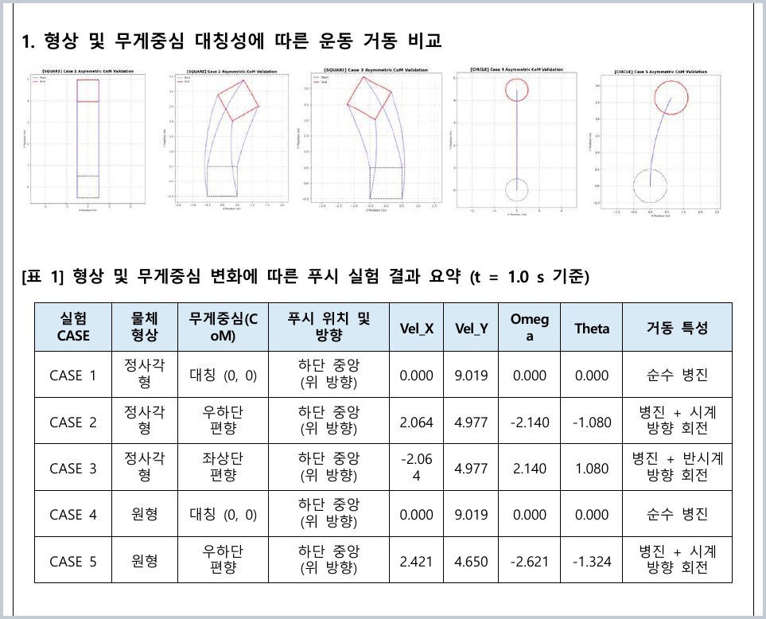
</p>

1.0 s simulation에서 다음 경향을 확인했다.

| Case | Object / COM | Push condition | Final behavior |
|---|---|---|---|
| 1 | Square, centered COM | Bottom-center upward | Pure translation |
| 2 | Square, lower-right COM | Same push | Translation + clockwise rotation |
| 3 | Square, upper-left COM | Same push | Translation + counter-clockwise rotation |
| 4 | Circle, centered COM | Bottom-center upward | Pure translation |
| 5 | Circle, lower-right COM | Same push | Translation + clockwise rotation |

Centered COM에서는 force line이 COM을 통과하여 $\omega$와 $\theta$가 거의 0으로 유지되었다. COM offset 방향을 반대로 바꾸면 회전 부호도 반대로 나타났다.

### 12.2 Contact location and asymmetric shape

<p align="center">
  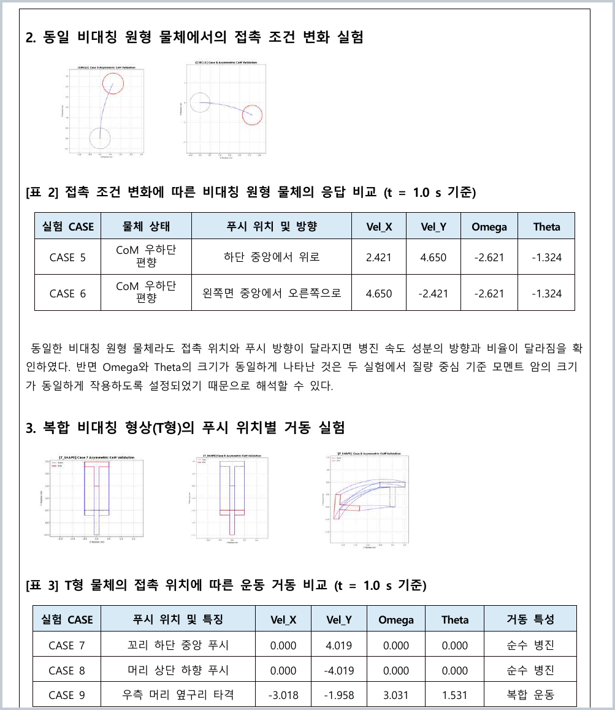
</p>

동일한 비대칭 원에서도 contact location과 direction이 바뀌면 translational velocity의 축별 성분이 달라졌다. T-shape에서는 force line이 COM을 지나는 stem-center push는 거의 순수 병진을 만들었지만, head side contact는 큰 병진과 회전을 동시에 생성했다.

이 검증은 수치가 실제 하드웨어와 완전히 일치함을 증명하는 calibration test가 아니라, 모델이 candidate ranking에 필요한 **방향성 있는 물리 경향**을 재현하는지 확인한 sanity check다.

---

## 13. Real-Robot Validation and Sim-to-Real Correction

### 13.1 Square development tests

- 9회 임의 target test 평균 IoU: **0.7636**
- 평균 steps: **7.2**
- 실제 대회 target 단일 test final IoU: **0.8026**
- 실전 조건 test: 5 steps, final IoU **0.8**

### 13.2 Circle development tests

<p align="center">
  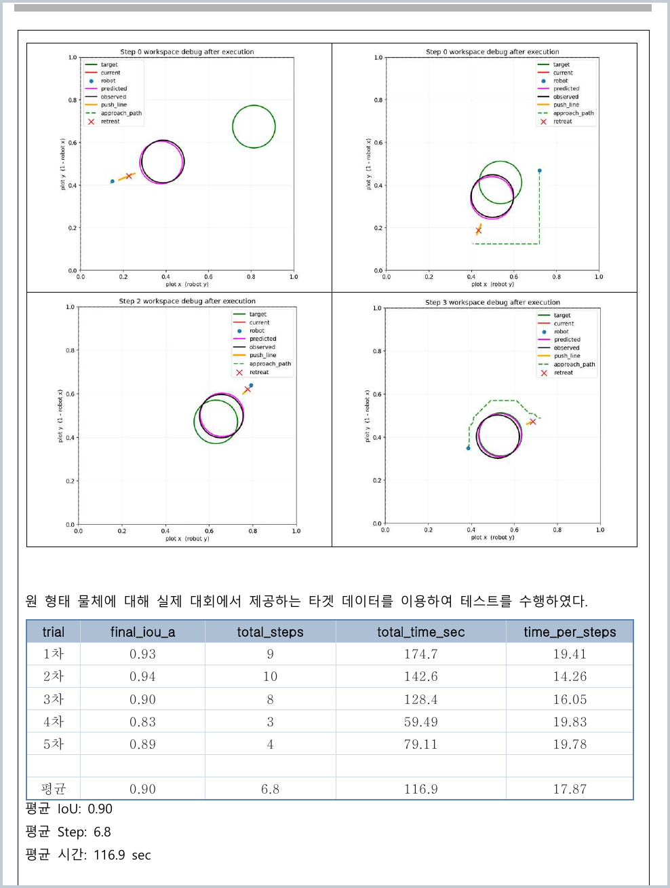
</p>

공식 target을 사용한 5회 test에서 평균 final IoU는 **0.90**, 평균 step은 **6.8**, 평균 time은 **116.9 s**였다.

<p align="center">
  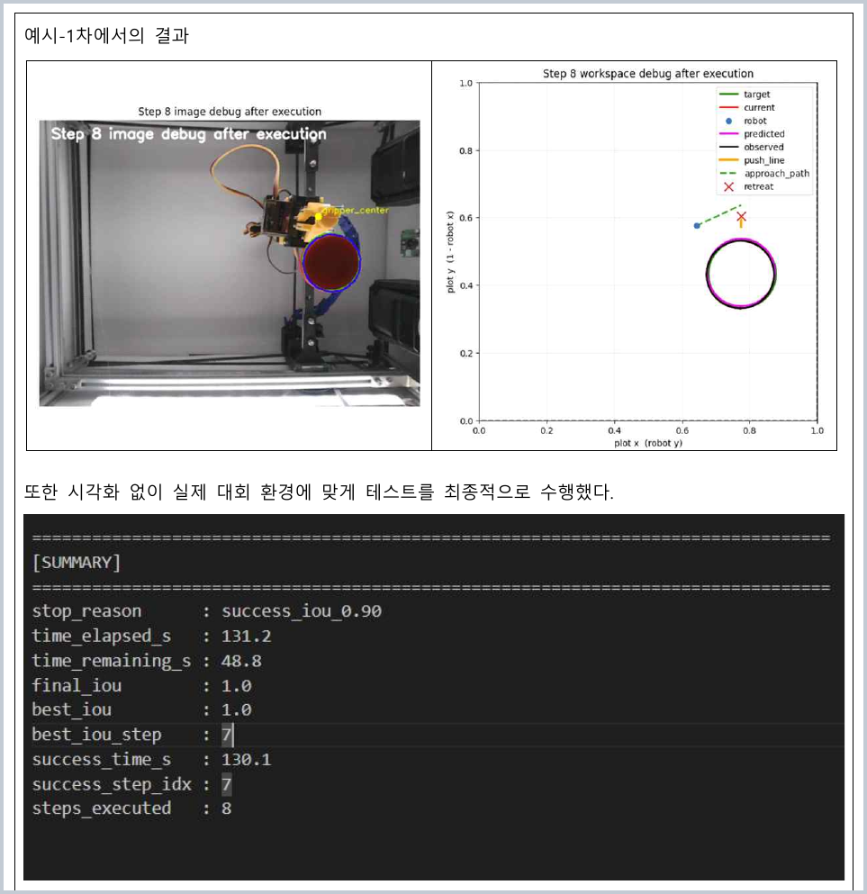
</p>

시각화를 제거한 실전 설정에서는 final IoU **1.0**, official evaluation score **67.1**을 기록했다.

이 값들은 6주차의 development validation이며, 최종 대회의 전체 Task 1 score와는 구분된다. 또한 결과는 dynamics model 단독 성능이 아니라 관측, candidate selection, path planning과 closed-loop re-observation이 결합된 시스템 성능이다.

---

## 14. Why Closed-Loop Replanning Was Essential

실제 pushing에는 다음 오차가 동시에 존재한다.

- unknown floor friction and contact friction
- pusher-center detection error
- object contour and pose estimation noise
- robot-cell calibration differences
- unmodeled compliance and transient contact
- mass-distribution mismatch

따라서 물리 모델을 long-horizon open-loop controller로 사용하지 않았다. 실제 action 이후 새로운 pose를 다시 관측하고, prediction과 observation의 차이를 기록한 뒤 다음 candidate set을 다시 생성한다.

```text
Predict one push
    ↓
Execute one push
    ↓
Observe actual result
    ↓
Update current state / COM belief
    ↓
Replan from the new state
```

이 구조는 dynamics model을 **완벽한 digital twin**이 아니라, 폐루프 planner 내부의 short-horizon physical prior로 사용한다.

---

## 15. Limitations

### 15.1 Simplified friction

Coulomb-friction coefficient와 effective rotation radius를 사용한 단순 모델이므로, distributed pressure와 full limit surface를 직접 식별하지 않는다.

### 15.2 Point-contact approximation

실제 pusher는 유한한 contact patch를 갖지만 모델에서는 local point contact로 근사한다.

### 15.3 Parameter identifiability

Observed pose 변화만으로 COM, floor friction, contact friction을 동시에 정확하게 식별하는 것은 어렵다. 여러 parameter combination이 비슷한 response를 만들 수 있다.

### 15.4 Concave / unseen shapes

Plus와 Organic 같은 concave surprise shape는 local contact geometry와 rotational response가 더 복잡해, rigid template와 단순 contact sampling의 오차가 커질 수 있다.

### 15.5 Learned correction was not the final deployed core

후반에는 물리 prediction과 actual result를 저장하여 residual-correction model용 데이터를 수집했지만, 최종 Task 1 pipeline의 핵심은 physics rollout과 closed-loop replanning이었다. 따라서 본 문서에서는 학습 보정 모델을 최종 적용된 기능으로 과장하지 않는다.

---

## 16. Suggested Repository Structure

```text
dynamics/
├─ README.md
├─ src/
│  ├─ rigid_body.py          # Newton-Euler state update
│  ├─ contact_model.py       # normal/tangent and slip handling
│  ├─ object_database.py     # CAD mass / COM / inertia candidates
│  ├─ rollout.py             # moving-contact one-push simulation
│  └─ belief_update.py       # predicted-observed case matching
├─ configs/
│  ├─ objects.yaml
│  ├─ friction.yaml
│  └─ robot_motion.yaml
├─ tests/
│  ├─ test_symmetric_push.py
│  ├─ test_com_sign.py
│  └─ test_moving_contact.py
```

공개 코드에서는 다음을 config로 분리하는 것이 적절하다.

- measured pusher speed and pusher radius
- integration timestep
- contact and ground friction coefficients
- object mass / COM / inertia candidates
- effective friction radius
- maximum stroke and near-goal stroke bins

---


> 모든 시각 자료는 repository 최상위 `images/` 폴더에서 공통 관리한다.

## 17. Takeaway

K-DAS의 Task 1 dynamics module은 복잡한 planar pushing contact를 완벽하게 재현하기 위한 고정밀 simulator가 아니다. 대신 **질량중심, 관성모멘트, 접촉 위치, 힘과 토크, 마찰, 실제 pusher speed와 moving contact**를 반영해 여러 candidate의 다음 상태를 빠르게 비교하는 1-step physical predictor다.

> **물리 모델로 다음 action의 방향성을 예측하고, 실제 실행 결과로 매 step 다시 보정하는 것**이 이 모듈의 핵심이다.
