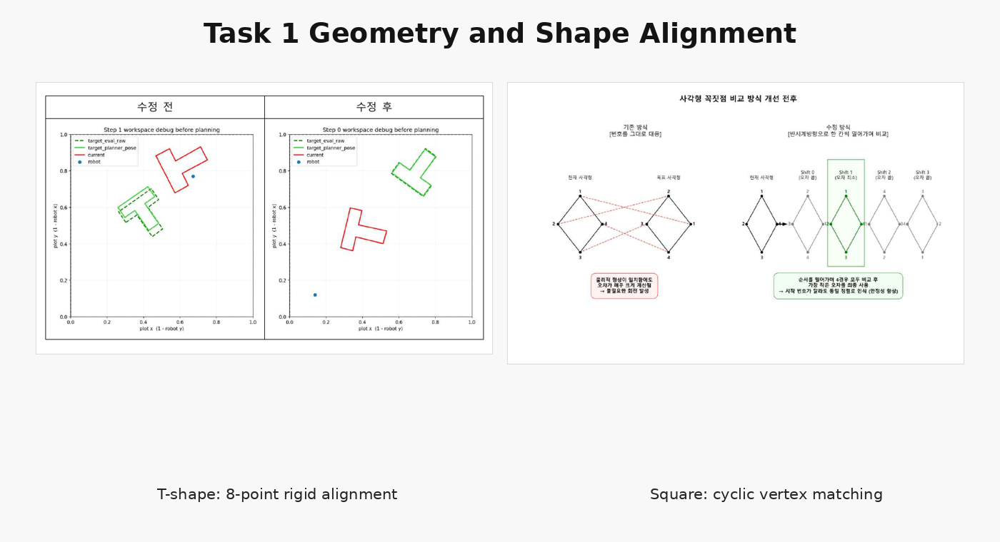
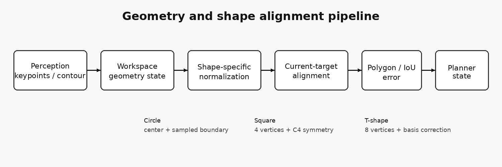
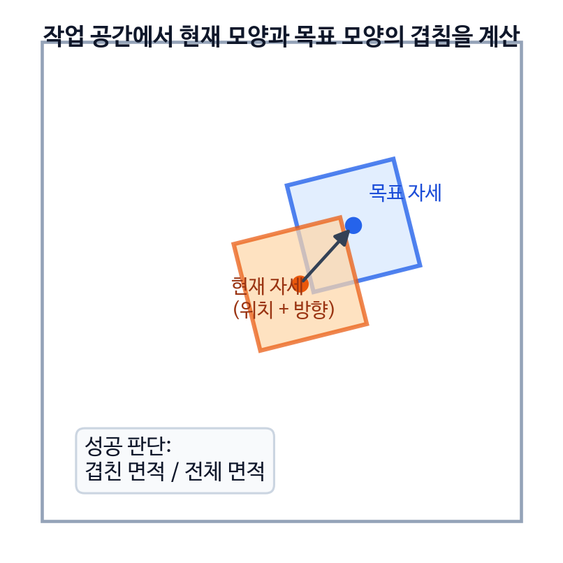
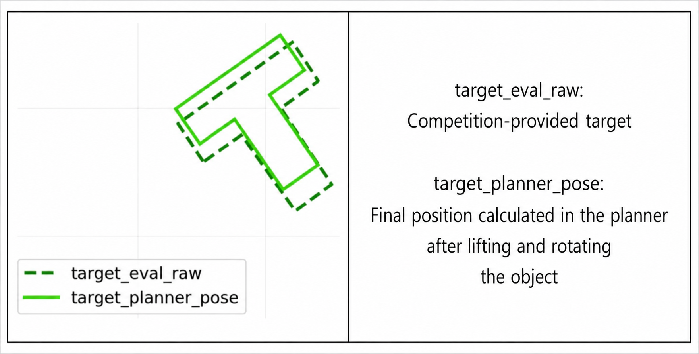
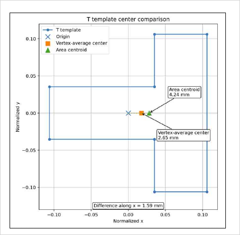
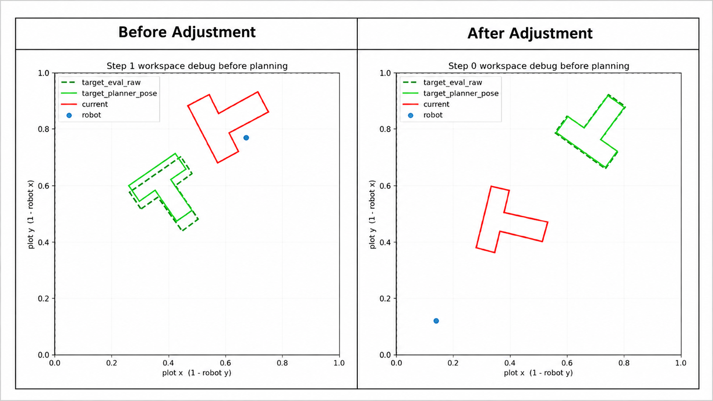
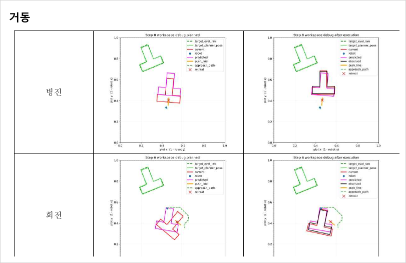
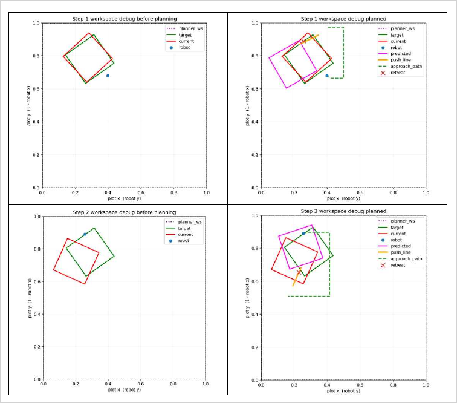
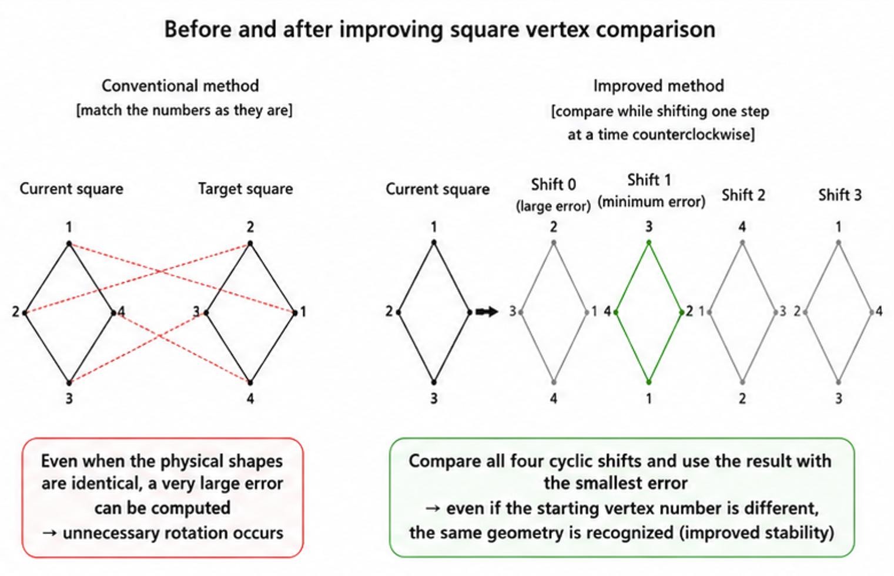
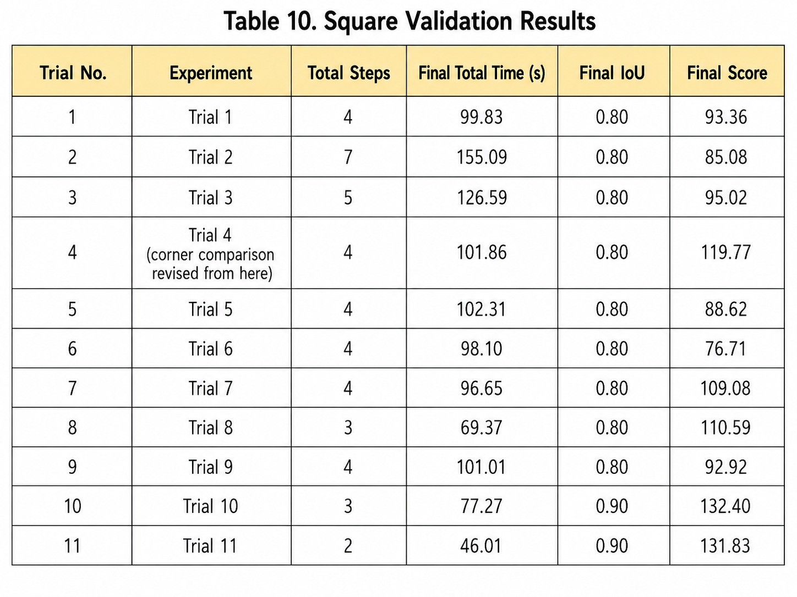

<p align="center">
  
</p>

# Geometry and Shape Alignment for Planar Pushing

**Task 1 · Model-Based Closed-Loop Planar Pushing · Team K-DAS**

이 모듈은 관측에서 얻은 물체의 중심, 방향, contour와 keypoint를 planner가 사용할 수 있는 **workspace geometry state**로 구성하고, 현재 형상과 목표 형상을 같은 기준에서 비교하는 역할을 한다.

Task 1에서는 중심 위치만 맞추는 것으로는 충분하지 않다. 사각형과 T자형은 회전 오차가 실제 접촉 위치와 IoU에 직접 영향을 주며, 비대칭 형상에서는 중심을 정의하는 방식 자체가 목표 위치를 바꿀 수 있다. 따라서 K-DAS는 물체를 polygon과 pose로 표현하고, 형상별 대칭성과 기준축 차이를 반영한 정합 절차를 별도로 구성하였다.

> 이 문서는 image-space detection이 아니라 **workspace에서의 형상 표현, current-target alignment와 IoU 계산**을 다룬다. 픽셀 좌표를 workspace 좌표로 변환하는 과정은 공통 `mapping/README.md`에서 분리한다.

---

## 1. Role in the Task 1 System

<p align="center">
  
</p>

```text
Perception contour / keypoints
        ↓
Mapping to workspace coordinates
        ↓
Build pose and polygon representation
        ↓
Apply shape-specific normalization
        ↓
Align current and target geometry
        ↓
Compute pose error, shape error and IoU
        ↓
Pass normalized state to planning and evaluation
```

이 모듈의 핵심 출력은 다음과 같은 형태로 정리할 수 있다.

```python
geometry_state = {
    "shape_type": "circle | square | t_shape | unknown",
    "center_ws": [x, y],
    "orientation_rad": theta,
    "polygon_ws": [[x0, y0], ...],
    "keypoints_ws": [[x0, y0], ...],
    "symmetry_order": 1 | 4,
    "alignment_metadata": {...},
}
```

관련 문서:

- Task 1 overview: [`../README.md`](../README.md)
- Planning and candidate selection: [`../planning/README.md`](../planning/README.md)
- Shared mapping: [`../../mapping/README.md`](../../mapping/README.md)

---

## 2. Pose and Polygon Representation

물체 pose는 작업 평면에서의 중심 위치와 회전각으로 표현한다.

$$
q=[x,\ y,\ \theta]
$$

Local template의 꼭짓점 $p_i^{local}$은 회전과 이동을 통해 workspace 좌표로 변환된다.

$$
R(\theta)=
\begin{bmatrix}
\cos\theta & -\sin\theta\\
\sin\theta & \cos\theta
\end{bmatrix}
$$

$$
p_i^{world}=c+R(\theta)p_i^{local}
$$

여기서 $c=[x,y]^T$는 물체 중심이다. 이 표현을 사용하면 planner는 중심과 회전각을 별도로 다룰 수 있고, 동시에 실제 polygon이 workspace의 어느 영역을 차지하는지도 계산할 수 있다.

### 2.1 Shape-specific geometry

| Shape | Geometry representation | Orientation handling |
|---|---|---|
| Circle | center, radius, sampled boundary points | 회전 영향이 작으므로 orientation 비중이 낮음 |
| Square | ordered four vertices | 90° rotational symmetry를 별도로 처리 |
| T-shape | ordered eight vertices | 비대칭 형상이므로 기준축과 vertex correspondence가 중요 |
| Unknown / surprise shape | detected contour or simplified polygon | 가능한 한 template hard-coding을 줄이고 contour-level 비교 사용 |

사각형과 T자형을 꼭짓점 집합으로 표현하고, 원형도 둘레를 일정 개수의 점으로 sampling하면 서로 다른 물체를 공통 polygon 연산으로 비교할 수 있다.

---

## 3. IoU as the Shape-level Success Metric

<p align="center">
  
</p>

현재 형상 $S_{current}$와 목표 형상 $S_{target}$의 겹침은 IoU로 계산한다.

$$
\mathrm{IoU}=\frac{\mathrm{Area}(S_{current}\cap S_{target})}
{\mathrm{Area}(S_{current}\cup S_{target})}
$$

- `IoU = 1.0`: 두 형상이 완전히 겹침
- `IoU = 0.0`: 두 형상이 전혀 겹치지 않음

IoU를 사용한 이유는 다음과 같다.

1. 중심 위치 오차와 회전 오차를 하나의 형상 지표로 반영한다.
2. 같은 중심에 있어도 방향이 다른 사각형과 T자형을 구분한다.
3. planner의 내부 pose error와 대회 evaluator의 실제 shape overlap을 연결한다.
4. surprise shape에서도 contour가 존재하면 동일한 방식으로 평가할 수 있다.

다만 IoU 하나만으로 candidate를 선택하면 작은 형상 변화에 민감하거나, 멀리 떨어진 상태에서 gradient가 부족할 수 있다. 따라서 planner 내부에서는 pose error와 reference-path progress를 함께 사용하고, IoU는 성공 판정과 최종 형상 품질 확인에 사용하였다.

---

## 4. Why Shape Alignment Required a Separate Module

Perception이 안정적으로 동작하더라도, detector와 planner가 형상을 서로 다른 기준으로 해석하면 잘못된 target pose가 만들어진다.

대표적인 문제는 다음과 같았다.

- detector orientation과 canonical template orientation의 기준축 차이
- 꼭짓점 평균 중심과 polygon 면적중심의 차이
- T자형 target을 중심과 각도 하나로 축약하면서 생기는 형상 손실
- 사각형의 동일한 자세가 서로 다른 vertex index로 반환되는 문제

이러한 오차는 물리 모델이나 path planner에서 해결할 수 있는 문제가 아니다. 후보 action을 생성하기 전에 current와 target geometry를 같은 기준으로 정규화해야 한다.

---

## 5. T-shape Basis Mismatch

<p align="center">
  
</p>

초기 T자형 planner에서는 시각화상의 target 방향과 planner가 내부적으로 정렬하려는 방향이 일치하지 않았다. 원인은 두 모듈의 orientation 정의가 달랐기 때문이다.

- **Detector**: image contour에서 추정한 stem 방향을 기준으로 orientation 계산
- **Planner**: config에 정의된 `T_BASE` canonical shape의 축을 기준으로 orientation 해석

두 기준 사이에는 약 90°의 차이가 있었다. 원형은 방향성이 없고 정사각형은 90° 대칭성을 가지므로 같은 문제가 쉽게 드러나지 않았지만, 비대칭 T자형에서는 명확한 target mismatch로 나타났다.

### 5.1 Correction rule

처음에는 current observation에만 90° correction을 적용했으나, target에는 동일한 보정이 적용되지 않아 여전히 서로 다른 frame에서 비교되는 문제가 남았다.

최종적으로는 current와 target 모두에 동일한 basis correction을 적용하였다.

$$
\theta_{planner}=\theta_{detector}+\frac{\pi}{2}
$$

중요한 점은 90° 자체가 보편적인 T자형 규칙이 아니라, **해당 detector와 canonical template 사이의 기준축 차이를 보정한 값**이라는 것이다. 공개 코드에서는 이를 shape configuration으로 분리해야 한다.

---

## 6. Why Centroid-only Target Reconstruction Failed

<p align="center">
  
</p>

초기 구현은 대회 측에서 제공한 T자형 8개 꼭짓점을 그대로 planner에 전달하지 않았다. 먼저 target을 중심점과 회전각으로 축약하고, 내부 canonical T template를 해당 pose에 다시 배치했다.

이 과정에서는 target pose를 계산할 때 사용한 중심 정의와 canonical template를 배치할 때 사용한 기준점이 달랐다.

<p align="center">
  
</p>

내부 T template를 기준으로 분석했을 때 다음 차이가 확인되었다.

- Vertex-average center: 약 **2.65 mm**
- Polygon area centroid: 약 **4.24 mm**
- 두 중심 정의의 차이: 약 **1.59 mm**

1.59 mm는 작아 보일 수 있지만, 크기가 작은 CloudGripper object에서는 target polygon 전체가 평행 이동하는 오차로 이어진다. 특히 T자형은 비대칭이므로 중심 정의의 차이가 target alignment에 직접 반영된다.

---

## 7. Eight-point Rigid Alignment for T-shape

중심과 각도 하나로 target을 다시 만드는 대신, 대회 target의 8개 꼭짓점 전체를 직접 사용하도록 수정하였다.

<p align="center">
  
</p>

Canonical T template의 꼭짓점을 $p_i$, 실제 target 꼭짓점을 $q_i$라고 하면, 두 형상을 가장 잘 겹치게 만드는 회전과 이동을 찾는다.

$$
R^{*},t^{*}=\arg\min_{R,t}\sum_i\|Rp_i+t-q_i\|^2
$$

이 정합은 다음 의미를 가진다.

- 중심점 하나가 아니라 **형상 전체**를 이용한다.
- target의 실제 크기와 비대칭 구조를 더 많이 보존한다.
- 회전과 이동을 동시에 계산한다.
- planner canonical shape와 evaluator target 사이의 offset을 줄인다.

<p align="center">
  
</p>

### 7.1 Required preprocessing

Rigid alignment이 안정적으로 동작하려면 current와 target의 8개 vertex가 일관된 순서를 가져야 한다. Perception 단계에서는 concave corner를 포함한 keypoint를 정렬하고, geometry 단계에서는 동일한 canonical order를 기준으로 correspondence를 구성한다.

### 7.2 Development-stage validation

<p align="center">
  
</p>

7주차 초기 검증에서는 일부 run이 높은 IoU에 도달했지만 전체 성능은 아직 불안정했다.

| Metric | Development-stage result |
|---|---:|
| Mean max IoU | **0.5896** |
| Runs reaching IoU ≥ 0.8 | **2 / 10** |
| Best observed max IoU | **0.8698** |
| Mean step at max IoU | **10.1** |

이 결과는 geometry correction만으로 전체 Task 1이 완성되는 것은 아니라는 점을 보여준다. 이후 candidate scoring, approach path와 execution time 개선이 추가되면서 최종 평가에서 T와 T-long은 각각 **52.24**, **57.21**의 Top-3 average score를 기록했다.

---

---

## 8. Square Symmetry Problem

<p align="center">
  
</p>

사각형은 방향성이 있지만 동시에 90° rotational symmetry를 갖는다. 같은 물리적 자세라도 contour detector가 반환하는 첫 번째 꼭짓점은 프레임마다 달라질 수 있다.

예를 들어 current vertex order가 `[1,2,3,4]`이고 target이 `[2,3,4,1]`로 들어오면 두 polygon은 사실상 같은 정렬 상태일 수 있다. 그러나 index를 고정한 채 비교하면 큰 shape error가 계산되고, planner가 이미 정렬된 사각형을 불필요하게 다시 회전시킬 수 있다.

---

## 9. Cyclic Vertex Matching for Square

사각형에서는 target vertex sequence를 네 가지 cyclic shift로 이동시키며 비교하고, 평균 거리 오차가 가장 작은 correspondence를 사용한다.

$$
E_{square}=\min_{k\in\{0,1,2,3\}}
\frac{1}{4}\sum_{i=0}^{3}
\left\|p_i-q_{(i+k)\bmod4}\right\|_2
$$

```python
best_error = float("inf")

for shift in range(4):
    rolled_target = np.roll(target_points, shift=shift, axis=0)
    error = mean_distance(current_points, rolled_target)
    best_error = min(best_error, error)
```

<p align="center">
  
</p>

이 방식은 사각형의 vertex start index가 달라도 같은 physical alignment로 인정한다. 특히 목표 근처에서 불필요한 correction rotation을 줄이는 데 중요했다.

> 현재 구현은 동일한 winding direction을 유지한 cyclic shift를 비교한다. Detector의 clockwise/counter-clockwise ordering까지 바뀔 수 있는 환경에서는 winding normalization을 먼저 수행해야 한다.

---

## 10. Square Validation Results

<p align="center">
  
</p>

사각형 symmetry correction과 실행 경로 개선이 적용된 11회의 테스트에서는 모든 run이 최종 IoU 0.8 이상을 기록했다.

| Metric | Result |
|---|---:|
| Successful runs, final IoU ≥ 0.8 | **11 / 11** |
| Best final IoU | **0.90** |
| Average final score | **103.22** |
| Average number of steps | **4.0** |
| Average total time | **97.65 s** |
| Average time per step | **24.41 s** |

<p align="center">
  
</p>

10차와 11차 run에서는 최종 IoU 0.90을 기록했으며, 11차는 2 step, 46.01초 만에 성공 기준을 만족했다. 이 결과는 square geometry normalization이 전체 planner와 결합되었을 때 반복적인 불필요 회전을 줄이고 목표 근처 정렬을 안정화했음을 보여준다.

다만 이 결과는 symmetry correction만의 단독 ablation이 아니다. 동일 기간에 approach-path waypoint 제한과 실행 시간 관련 개선도 함께 반영되었으므로, 전체 system configuration의 검증 결과로 해석해야 한다.

---

## 11. Handling Surprise Shapes

최종 평가에는 Plus와 Organic object가 surprise shape로 포함되었다. 이 형상들은 T자형보다 더 복잡한 concavity를 가지거나 명확한 canonical axis를 정의하기 어렵다.

K-DAS는 다음 원칙으로 대응했다.

- 가능하면 detection contour를 직접 polygon으로 유지
- 중심과 orientation 하나로 과도하게 축약하지 않음
- candidate contact point를 contour에서 sampling
- IoU와 contour-level geometry를 공통 평가 기준으로 사용

최종 Top-3 average score는 Plus **34.47**, Organic **37.82**였다. Seen object보다 낮은 결과였지만, 특정 template만 가정한 시스템이 아니라 contour 기반 공통 interface를 유지한 덕분에 unseen object에서도 유효한 push를 수행할 수 있었다.

<p align="center">
  
</p>

---

## 12. Interface to Planning

Geometry module은 planner에 다음 정보를 제공한다.

```python
aligned = {
    "current_pose": [x, y, theta],
    "target_pose": [x_goal, y_goal, theta_goal],
    "current_polygon": current_polygon_ws,
    "target_polygon": target_polygon_ws,
    "pose_error": [dx, dy, dtheta],
    "shape_error": point_set_error,
    "iou": current_iou,
    "symmetry_shift": selected_shift,
}
```

Planner는 이 상태를 이용하여 다음 작업을 수행한다.

- reference pose path 생성
- candidate별 predicted next polygon 계산
- target과의 pose / shape error 평가
- success threshold 판단
- 목표 근처 correction 필요 여부 판단

Geometry와 planning을 분리함으로써, 물리 모델이나 candidate generator를 변경하더라도 current-target 정합 규칙은 일관되게 유지할 수 있다.

---

## 13. Failure Cases and Safeguards

### 13.1 Wrong vertex ordering

T자형 8-point correspondence가 흔들리면 rigid alignment가 완전히 다른 회전을 선택할 수 있다. Vertex ordering validation과 polygon winding normalization이 필요하다.

### 13.2 Basis correction applied to one side only

Current에만 correction을 적용하고 target에는 적용하지 않으면 서로 다른 coordinate convention을 비교하게 된다. Basis correction은 current와 target 양쪽에 동일하게 적용해야 한다.

### 13.3 Template over-simplification

비대칭 또는 surprise shape를 중심과 orientation 하나로만 축약하면 실제 contour가 손실된다. 가능한 경우 target polygon 자체를 유지해야 한다.

### 13.4 Symmetry ignored

Square와 같이 대칭성이 있는 물체에서 fixed vertex index comparison을 사용하면 불필요한 회전 action이 발생할 수 있다. Shape별 symmetry group을 configuration으로 관리해야 한다.

### 13.5 IoU-only optimization

초기 상태에서 overlap이 거의 없으면 IoU만으로 action quality를 구분하기 어렵다. Pose error, progress와 path feasibility를 함께 사용해야 한다.

---

## 14. Suggested Repository Layout

```text
task1/
└─ geometry/
   ├─ README.md
   ├─ pose.py
   ├─ polygon.py
   ├─ iou.py
   ├─ alignment.py
   ├─ symmetry.py
   ├─ shape_configs/
   │  ├─ circle.yaml
   │  ├─ square.yaml
   │  └─ t_shape.yaml
   ├─ tests/
   │  ├─ test_iou.py
   │  ├─ test_t_alignment.py
   │  └─ test_square_symmetry.py
```

Shape configuration에는 다음 항목을 명시하는 것이 적절하다.

- canonical keypoints
- orientation basis offset
- expected vertex count
- symmetry order
- winding convention
- IoU / success threshold
- target-pose reconstruction rule

---


> 모든 시각 자료는 repository 최상위 `images/` 폴더에서 공통 관리한다.

## 15. Takeaway

Task 1의 geometry module은 단순히 contour를 polygon으로 바꾸는 전처리 단계가 아니다. 이 모듈은 detector, evaluator와 planner가 물체의 방향과 중심을 **같은 기준으로 해석하도록 만드는 정합 계층**이다.

K-DAS는 T자형에서 detector–planner의 90° basis mismatch와 중심 정의 차이를 분석하고, 8개 꼭짓점 전체를 사용하는 rigid alignment로 target geometry를 보존했다. 사각형에서는 90° 대칭성을 반영한 cyclic vertex matching을 적용하여 이미 정렬된 물체를 불필요하게 다시 회전시키는 문제를 줄였다.

> **정확한 pushing은 좋은 물리 모델만으로 시작되지 않는다. 현재 형상과 목표 형상을 동일한 기하 기준으로 표현하는 것에서 시작된다.**
