<p align="center">
  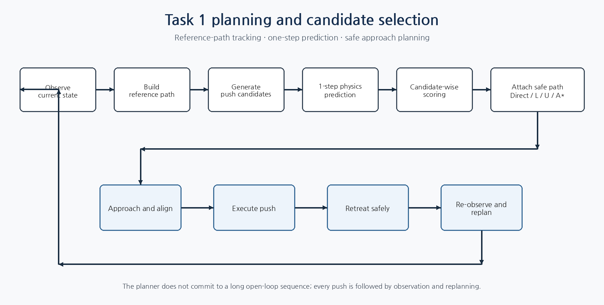
</p>

# Planning and Candidate Selection for Planar Pushing

**Task 1 · Model-Based Closed-Loop Planar Pushing · Team K-DAS**

이 모듈은 현재 물체 상태와 목표 형상 사이에서 **어디를, 어느 방향으로, 얼마나 밀 것인지**를 결정한다. 여러 push candidate를 생성하고, 각 후보를 1-step rigid-body dynamics model로 예측한 뒤, 기준 경로상의 후보별 중간 목표와 비교한다. 이후 실제 로봇이 충돌 없이 시작점까지 접근할 수 있는 후보만 남겨 최종 action을 선택한다.

> 핵심은 가장 큰 한 번의 push를 찾는 것이 아니라, **실행 가능한 작은 개선을 반복적으로 선택하는 것**이다. 각 push 뒤에는 물체를 다시 관측하고 전체 planning을 새로 수행한다.

---

## 1. Role in the Task 1 System

```text
Perception / Geometry state
        ↓
Reference path from current pose to target pose
        ↓
Contact × direction × stroke candidate generation
        ↓
One-step dynamics prediction
        ↓
Candidate-specific progress and risk scoring
        ↓
Direct / L / U / A* safe approach path attachment
        ↓
Approach → push → retreat → re-observe → replan
```

관련 문서:

- Task 1 overview: [`../README.md`](../README.md)
- Geometry and alignment: [`../geometry/README.md`](../geometry/README.md)
- Rigid-body dynamics: [`../dynamics/README.md`](../dynamics/README.md)
- Shared mapping: [`../../mapping/README.md`](../../mapping/README.md)

---

## 2. Why a Reference Path Was Needed

최종 목표 pose만 기준으로 후보를 평가하면 현재 한 번의 push로 가능한 이동량과 관계없이 모든 후보가 같은 먼 목표와 비교된다. 이 경우 짧지만 안정적인 후보가 과소평가되고, 긴 후보는 overshoot 위험이 있어도 유리하게 평가될 수 있다.

따라서 현재 pose와 목표 pose 사이에 부드러운 기준 경로를 만들고, 후보의 예상 이동량에 맞는 **중간 목표**를 선택하였다.

### 2.1 Minimum-jerk interpolation

물체 pose를 다음과 같이 표현한다.

$$
q=[x,\ y,\ \theta]
$$

정규화 시간 $t\in[0,1]$에서 보간 함수는 다음과 같다.

$$
s(t)=10t^3-15t^4+6t^5
$$

$$
q_{ref}(t)=q_{current}+s(t)(q_{target}-q_{current})
$$

이 5차 보간은 시작점과 끝점에서 속도와 가속도가 급격하게 변하지 않는 기준을 제공한다. 회전각 차이는 가장 짧은 회전 방향을 사용하도록 $[-\pi,\pi)$ 범위로 wrap한다.

<p align="center">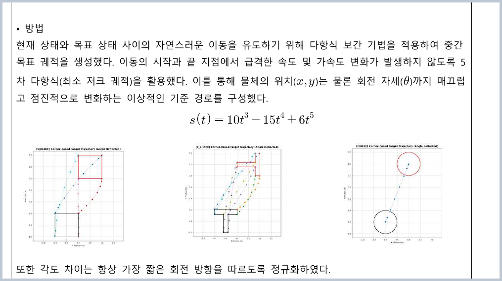</p>

### 2.2 Candidate-specific intermediate target

각 후보 $a_j$의 1-step 예측 pose를 $\hat q_{t+1}^{(j)}$라고 하면, 해당 후보와 가장 잘 대응하는 reference point를 선택한다.

$$
k_j^*=\arg\min_k d\left(\hat q_{t+1}^{(j)},q_{ref,k}\right)
$$

즉 모든 후보를 하나의 고정된 중간 목표와 비교하지 않고, **각 후보가 실제로 도달할 수 있는 경로 지점**을 기준으로 평가한다. 이 구조는 후보별 이동량이 다른 상황에서 평가의 공정성과 안정성을 높인다.

---

## 3. Push Candidate Generation

Action은 다음 세 요소로 구성된다.

$$
a=(p_{contact},\ d_{push},\ L_{stroke})
$$

- `contact`: 물체의 어느 지점을 밀 것인가
- `direction`: 어느 방향으로 밀 것인가
- `stroke`: 얼마나 멀리 밀 것인가

### 3.1 Contact points

원형 물체는 둘레를 16개 방향으로 분할하였다. 다각형 물체는 각 변의 10%, 30%, 50%, 70%, 90% 지점에 접촉 후보를 배치하였다.

<p align="center">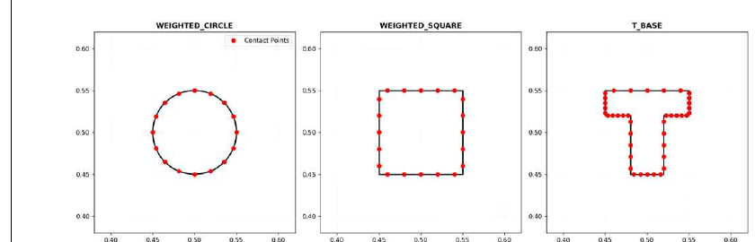</p>

### 3.2 Translation and rotation candidates

각 접촉점에서는 기본적으로 세 종류의 방향을 생성하였다.

$$
d_{normal}=-\hat n
$$

$$
d_{spin,left}=-\hat n+\lambda\hat t
$$

$$
d_{spin,right}=-\hat n-\lambda\hat t
$$

법선 방향 push는 병진 이동을 우선하며, 접선 성분을 더한 후보는 회전 효과를 함께 유도한다.

<p align="center">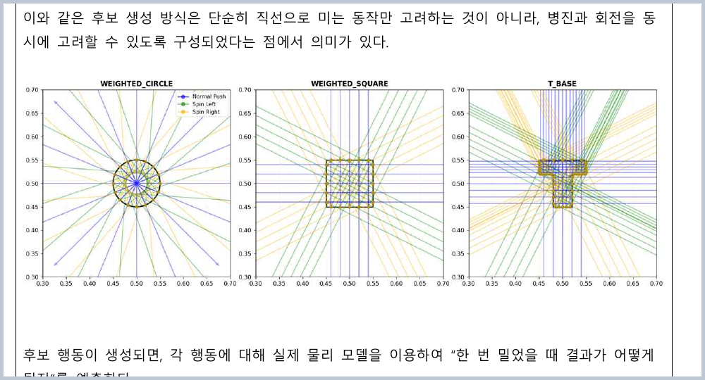</p>

### 3.3 Distance-aware stroke

목표와 멀리 떨어진 초기 구간에서는 긴 stroke를 사용하고, 목표에 가까워질수록 짧은 stroke로 전환한다. 최종 조정 단계에서 긴 push를 계속 사용하면 overshoot와 workspace 이탈 가능성이 커지기 때문이다.

개선된 기준에서는 대략 다음 구간을 사용하였다.

| Remaining distance | Stroke policy |
|---:|---|
| 5 cm 초과 | Long stroke |
| 1–5 cm | Medium stroke |
| 1 cm 이하 | Short correction stroke |

---

## 4. One-step Prediction Interface

생성된 모든 후보는 실제로 실행되기 전에 rigid-body dynamics model로 한 번 rollout된다.

$$
\hat q_{t+1}^{(j)}=f_{dyn}(q_t,a_j;\phi)
$$

여기서 $\phi$는 질량, COM, 관성모멘트, 접촉 및 바닥 마찰 등의 parameter를 포함한다. Planning module은 dynamics model이 예측한 다음 pose와 polygon을 받아 후보의 progress와 위험을 평가한다.

이 예측은 정밀한 장기 simulation이 아니라 **동일 상태에서 후보들의 상대 순위를 비교하기 위한 short-horizon predictor**다.

---

## 5. Candidate-wise Scoring

<p align="center">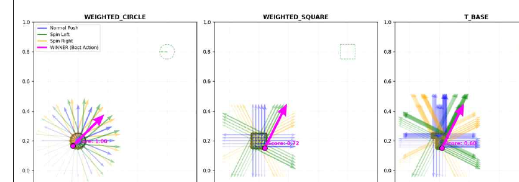</p>

후보 평가는 하나의 거리만 최소화하지 않고 다음 항목을 함께 고려한다.

1. **Progress**: 기준 경로상의 오차가 실제로 감소했는가
2. **Direction agreement**: 예측 이동이 목표 방향과 일치하는가
3. **Overshoot risk**: 후보가 적절한 reference point를 지나치지 않는가
4. **Workspace margin**: 예측 형상이 경계에 너무 가까워지지 않는가
5. **Approach cost**: 로봇이 해당 시작점까지 안전하고 짧게 접근할 수 있는가

개념적으로 후보 score는 다음처럼 정리할 수 있다.

$$
S_j=w_p\Delta E_j+w_dC_{dir,j}
-w_oP_{over,j}-w_bP_{boundary,j}-w_aC_{approach,j}
$$

여기서 $\Delta E_j$는 현재 오차와 예측 후 오차의 차이이며, 방향 일치도는 목표 방향 벡터 $g$와 예측 이동 벡터 $m_j$의 cosine similarity로 계산할 수 있다.

$$
C_{dir,j}=\frac{g\cdot m_j}{\|g\|\|m_j\|}
$$

실제 구현에서는 shape type과 목표까지의 거리에 따라 항목의 중요도가 달라질 수 있으므로, 공개 코드에서는 weight와 threshold를 configuration으로 분리하는 것이 적절하다.

---

## 6. Computational Funnel

<p align="center">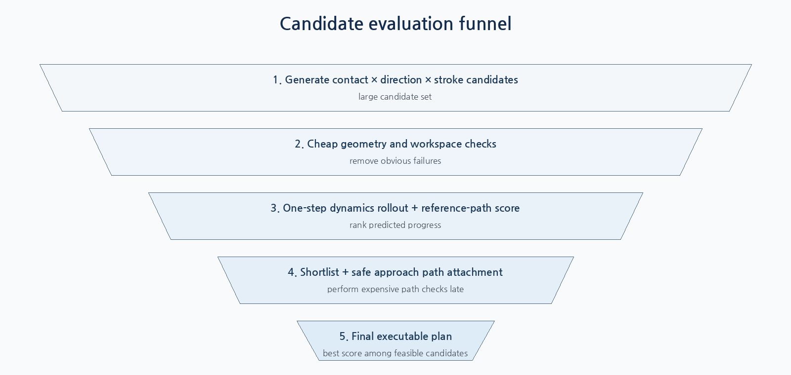</p>

모든 후보에 대해 처음부터 A*를 수행하면 planning 시간이 불필요하게 증가한다. 따라서 계산량이 작은 판단을 앞에 두고, 비싼 접근 경로 탐색은 shortlist 이후로 미뤘다.

```text
candidate generation
→ basic geometry / boundary rejection
→ one-step dynamics rollout
→ reference-path score
→ shortlist
→ safe approach path attachment
→ final executable candidate
```

이 구조는 “물리적으로 좋아 보이지만 실행할 수 없는 후보”와 “실행은 가능하지만 목표 진척이 낮은 후보”를 단계적으로 분리한다.

---

## 7. Safe Approach Path Planning

물리적으로 가장 좋은 push라도 gripper가 물체와 충돌하지 않고 시작점까지 갈 수 없다면 실행할 수 없다. 접근 경로는 가장 단순한 방법부터 순서대로 검사한다.

<p align="center">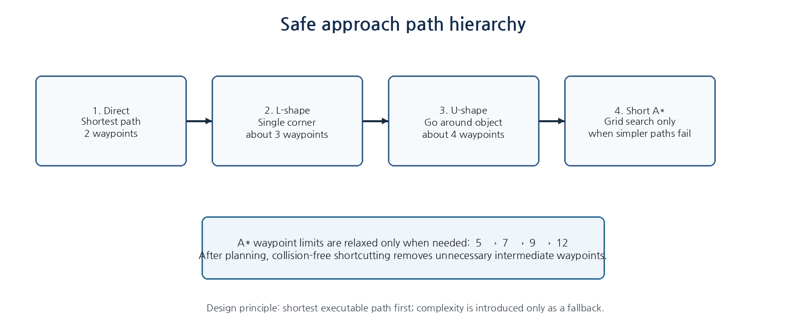</p>

### 7.1 Direct → L-shape → U-shape → Short A*

| Priority | Path type | Purpose |
|---:|---|---|
| 1 | Direct | 가장 짧고 빠른 직선 접근 |
| 2 | L-shape | 한 번 꺾어 장애물 회피 |
| 3 | U-shape | 물체 bounding box 바깥을 크게 우회 |
| 4 | Short A* | 앞의 기하 경로가 모두 실패했을 때 격자 탐색 |

A*의 기본 평가식은 다음과 같다.

$$
f(n)=g(n)+h(n)
$$

- $g(n)$: 시작점에서 현재 node까지의 실제 이동 비용
- $h(n)$: 현재 node에서 목표까지의 추정 비용

### 7.2 Progressive waypoint limits

A* 경로를 5개 waypoint로 고정 제한하면 실행 시간은 줄지만, 6개 이상의 충분히 실행 가능한 경로까지 버리는 문제가 발생했다. 이를 해결하기 위해 제한을 점진적으로 완화하였다.

```python
for max_waypoints in [5, 7, 9, 12]:
    feasible = attach_paths(candidates, max_waypoints=max_waypoints)
    if feasible:
        break
```

<p align="center">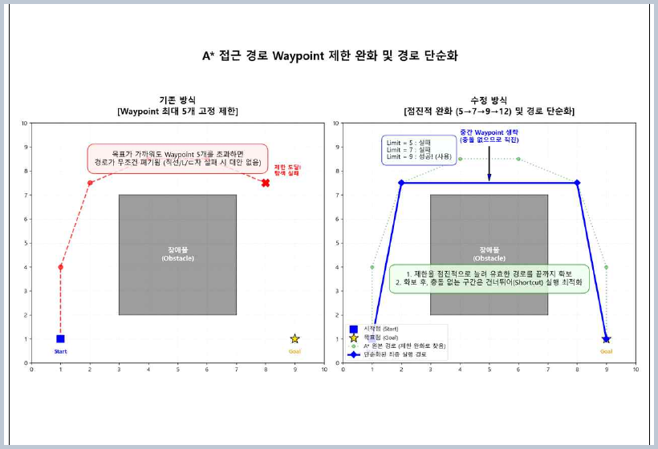</p>

짧은 경로가 가능하면 5개 제한에서 즉시 종료하고, 모든 짧은 경로가 실패했을 때만 더 긴 우회를 허용한다. 생성된 경로는 중간 waypoint를 건너뛰어도 충돌하지 않는지 검사하여 shortcut simplification을 수행한다.

### 7.3 Start state near the safety margin

Push 이후 gripper가 물체 가까이에 남아 있으면 다음 planning에서 시작점이 inflated obstacle 내부로 판정되어 `no plan`이 발생할 수 있다.

- 시작점이 **실제 object polygon 내부**이면 위험하므로 허용하지 않는다.
- 실제 물체 내부는 아니고 safety margin에만 걸린 경우에는, 먼저 물체 바깥의 안전 위치로 빠져나온 뒤 일반 경로 계획을 수행할 수 있다.

<p align="center">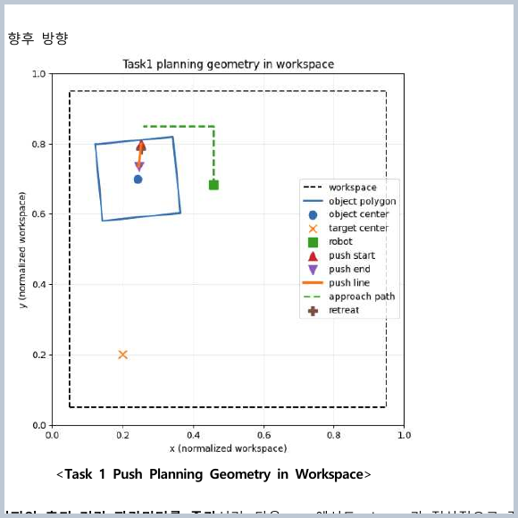</p>

---

## 8. Execution Plan and Closed-loop Replanning

선택된 plan은 다음 순서로 실행된다.

| Stage | Description |
|---|---|
| Approach | 경유점을 따라 push start 근처까지 이동 |
| Align | 정확한 시작점과 방향으로 정렬 |
| Push | 선택된 stroke만큼 물체를 밀기 |
| Retreat | 다음 planning을 위해 물체에서 후퇴 |
| Re-observe | 실제 pose와 robot state를 다시 측정 |
| Replan | 새로운 state에서 후보를 다시 생성·평가 |

<p align="center">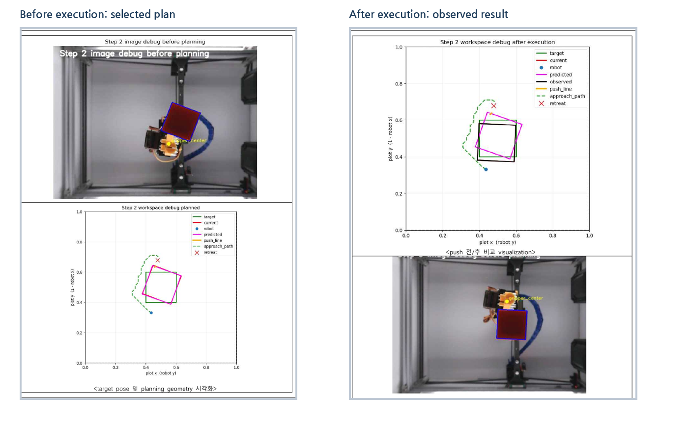</p>

Push 이후에는 예측 pose와 실제 observed pose를 비교하고, 관측된 병진·회전 결과를 다음 planning과 COM belief update에 반영한다. 따라서 하나의 잘못된 1-step prediction이 이후 모든 action을 결정하지 않는다.

---

## 9. Execution-time Optimization

실제 원격 로봇에서는 계산 시간뿐 아니라 waypoint마다 반복되는 대기 시간이 전체 성능을 크게 제한했다.

<p align="center">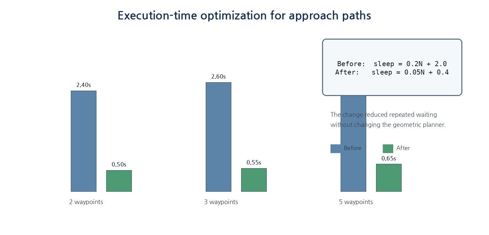</p>

기존과 개선 후 sleep 모델은 다음과 같았다.

$$
T_{wait,old}=0.2N+2.0
$$

$$
T_{wait,new}=0.05N+0.4
$$

5개 waypoint 경로의 경우 대기 시간이 약 `3.00 s → 0.65 s`로 감소하였다. 또한 A* 이전에 U-shape를 추가하고 waypoint 수를 제한함으로써, 복잡한 경로가 무조건 긴 실행 시간으로 이어지는 문제를 완화했다.

---

## 10. Development Validation

Planning과 execution 개선이 함께 적용된 사각형 실제 로봇 테스트 11회에서 모든 run이 최종 IoU `0.8` 이상을 기록하였다. 이 결과는 candidate scoring이나 A* 개선 하나만을 분리한 ablation이 아니라, geometry correction, execution timing과 closed-loop replanning이 함께 적용된 통합 결과다.

<p align="center">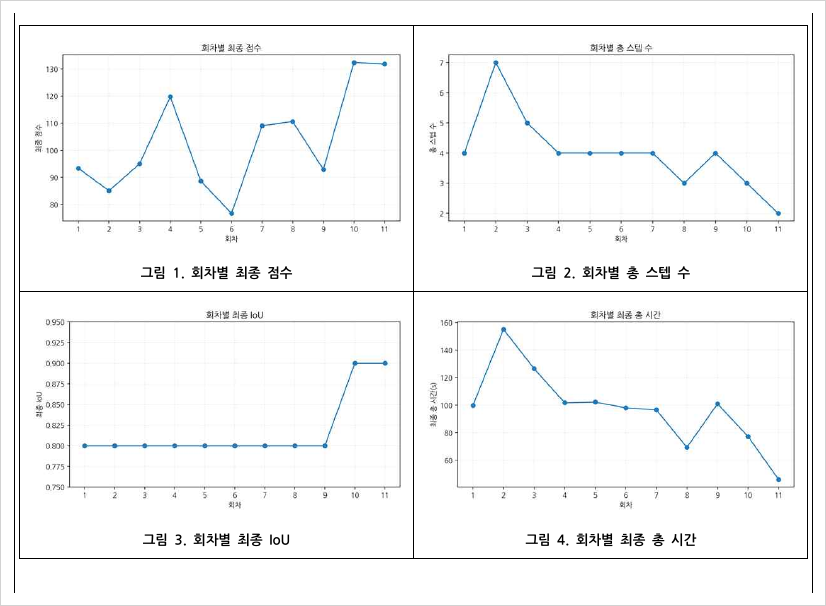</p>

최종 대회에서 K-DAS는 Task 1 score `49.69`로 1위를 기록했다. Planning 관점에서 핵심 기여는 다음 세 가지였다.

- 후보별로 물리 예측과 기준 경로 progress를 평가
- 실제 실행 가능한 접근 경로를 후보 선택에 포함
- 매 push 이후 관찰과 replanning으로 모델 오차를 보정

---

## 11. Failure Cases and Limitations

### 11.1 Overshoot and workspace exit

긴 stroke는 빠른 이동에는 유리하지만, 목표 근처 또는 workspace 경계에서 위험하다. 거리 기반 stroke와 boundary margin이 필요하다.

### 11.2 No-plan after retreat

후퇴 거리가 너무 짧거나 mapping error가 존재하면 planner는 gripper와 object가 겹친 것으로 판단할 수 있다. Retreat parameter만 키우는 것은 임시 완화이며, 근본적으로는 observation–mapping 정합성이 중요하다.

### 11.3 One-step horizon

현재 구조는 long-horizon push sequence를 한 번에 최적화하지 않는다. 대신 short-horizon candidate selection과 closed-loop replanning을 사용한다.

### 11.4 Discrete action density

접촉점, 방향과 stroke가 이산 후보이므로 continuous optimum을 보장하지 않는다. 후보 수를 늘리면 품질은 좋아질 수 있지만 dynamics rollout과 path attachment 비용도 증가한다.

---

## 12. Suggested Repository Structure

```text
planning/
├─ README.md
├─ reference_path.py
├─ candidate_generation.py
├─ candidate_scoring.py
├─ approach_path.py
├─ execution_plan.py
├─ configs/
│  ├─ action_space.yaml
│  ├─ scoring_weights.yaml
│  └─ approach_planner.yaml
├─ tests/
│  ├─ test_reference_path.py
│  ├─ test_candidate_scoring.py
│  └─ test_approach_path.py
```

공개 시 다음 설정을 코드 내부 상수와 분리해 기록해야 한다.

- contact sampling density
- spin tangent ratio $\lambda$
- distance별 stroke bin
- score weight와 penalty threshold
- obstacle inflation / workspace margin
- A* grid resolution과 waypoint limits
- retreat distance와 execution sleep

---


> 모든 시각 자료는 repository 최상위 `images/` 폴더에서 공통 관리한다.

## 13. Takeaway

K-DAS의 Task 1 planner는 단순히 목표를 향해 가장 가까운 면을 미는 rule-based controller가 아니다. **기준 경로, candidate-wise 1-step physics prediction, multi-objective scoring, safe approach path와 closed-loop replanning**을 연결한 model-based manipulation planner다.

> 좋은 push는 물체를 목표 방향으로 움직이는 것뿐 아니라, 로봇이 안전하게 실행할 수 있고 다음 step의 planning을 방해하지 않아야 한다.
