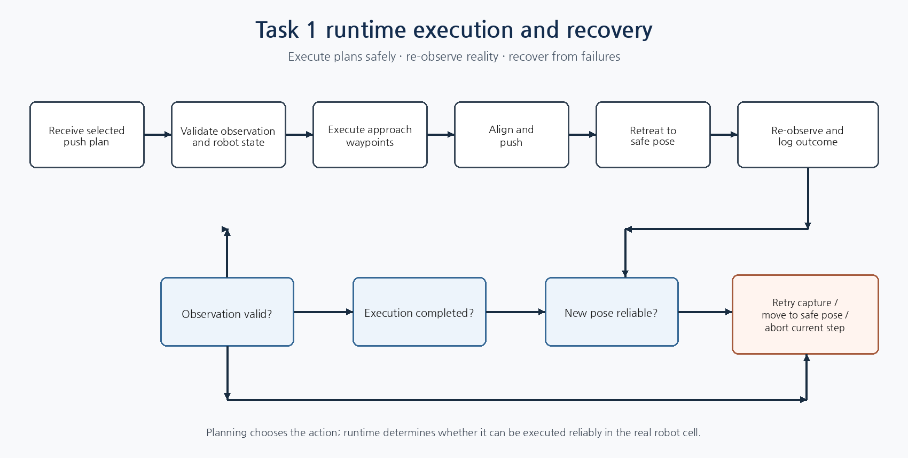
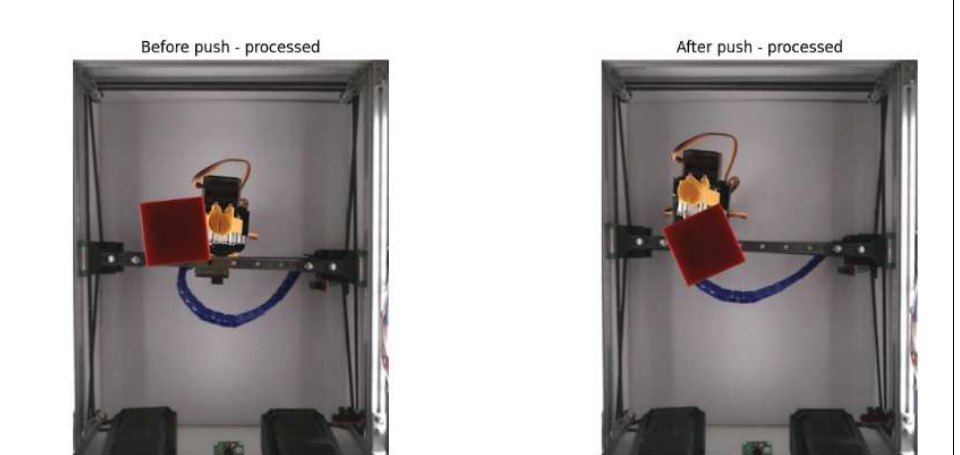
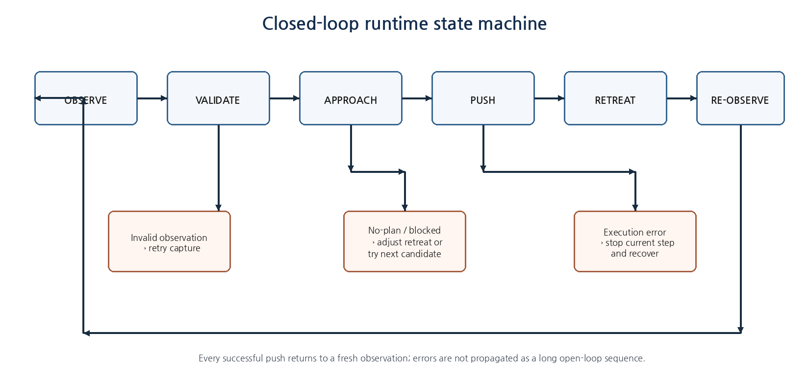
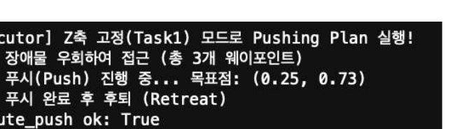
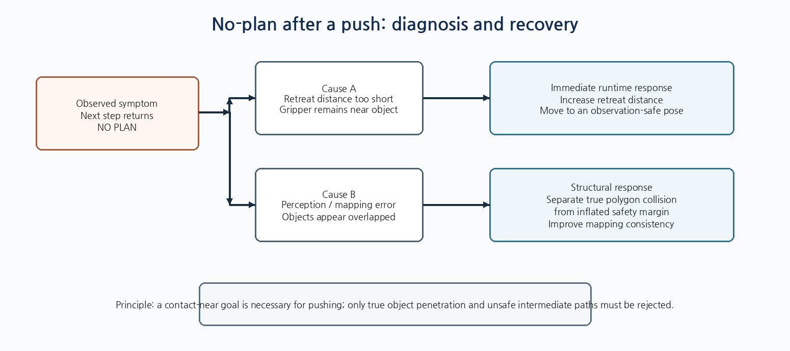
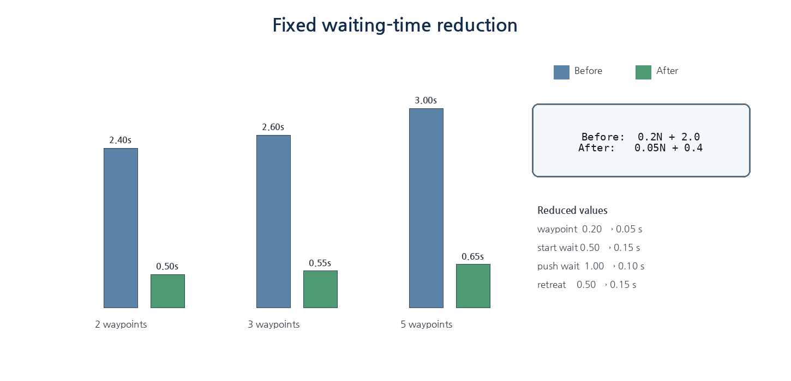
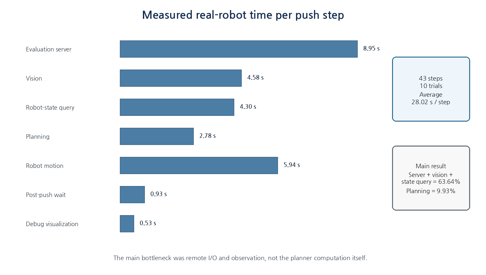
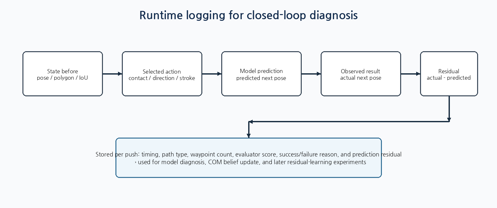
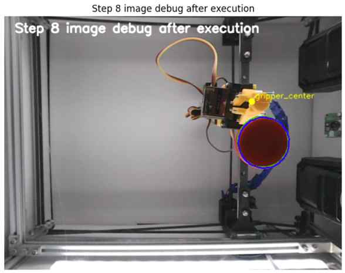
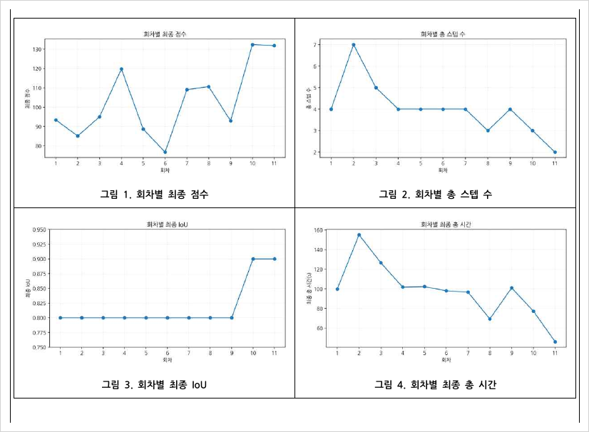

<p align="center">
  
</p>

# Runtime Execution for Planar Pushing

**Task 1 · Model-Based Closed-Loop Planar Pushing · Team K-DAS**

이 모듈은 Planning이 선택한 push action과 approach path를 실제 CloudGripper에서 실행하고, **관측 실패·접근 불가능·통신 지연·불충분한 후퇴·예측 오차**를 처리한다. Task 1은 한 번의 계획을 끝까지 수행하는 open-loop system이 아니라, 한 번 밀고 실제 상태를 다시 확인한 뒤 다음 plan을 만드는 closed-loop runtime으로 구성된다.

> Planning은 “무엇을 실행할 것인가”를 결정하고, Runtime은 “그 계획을 실제 로봇에서 안전하고 반복 가능하게 수행할 수 있는가”를 책임진다.

---

## 1. Role in the Task 1 System

| Layer | Main responsibility |
|---|---|
| Perception / Geometry | 물체와 gripper의 상태, polygon, pose, IoU 추정 |
| Planning | contact, direction, stroke와 안전 접근 경로 선택 |
| Dynamics | candidate별 1-step 결과 예측 |
| **Runtime** | approach, push, retreat, 재관찰, 지연·실패 복구 |
| Mapping | camera pixel과 robot workspace의 좌표 변환 |

```text
Selected plan
    → observation / state validation
    → approach waypoint execution
    → final alignment
    → push
    → retreat
    → re-observation
    → evaluator / log update
    → next planning step
```

관련 문서:

- Task 1 overview: [`../README.md`](../README.md)
- Planning: [`../planning/README.md`](../planning/README.md)
- Dynamics: [`../dynamics/README.md`](../dynamics/README.md)
- Shared Mapping: [`../../mapping/README.md`](../../mapping/README.md)

---

## 2. From Single-step Validation to a Closed Loop

초기 로봇 이식 단계에서는 전체 loop를 바로 실행하지 않고, 한 번의 push가 올바르게 계획되고 수행되는지부터 확인했다.

- `task1_one_step_push_eval.ipynb`: Mapping → Perception → Planning → one push
- `task1_loop.ipynb`: push 이후 재관찰하고 성공 조건까지 반복

<p align="center">
  
</p>

단일 step 검증이 완료된 뒤, runtime은 다음 상태 기계로 확장되었다.

<p align="center">
  
</p>

핵심은 모델이 예측한 다음 상태를 그대로 다음 step의 초기값으로 사용하지 않는 것이다. Push 이후 실제 영상과 robot state를 다시 읽어, 관측된 상태에서 planner를 새로 실행한다.

---

## 3. Approach, Push, and Retreat Execution

Runtime은 planner가 전달한 waypoint와 push segment를 다음 순서로 실행한다.

1. 안전 높이에서 approach waypoint를 순차적으로 이동한다.
2. 최종 push start에 맞춰 gripper를 정렬한다.
3. 계획된 end point까지 push를 수행한다.
4. 물체에서 반대 방향으로 후퇴한다.
5. 다음 관측을 방해하지 않는 위치에서 안정화한다.
6. 새 이미지를 받아 다음 step을 시작한다.

<p align="center">
  
</p>

```python
for waypoint in approach_path:
    robot.move_xy(*waypoint)
    wait(PATH_SLEEP_TIME)

robot.move_xy(*push_start)
wait(START_SLEEP_TIME)
robot.move_xy(*push_end)
wait(PUSH_SLEEP_TIME)
robot.move_xy(*retreat_point)
wait(RETREAT_SLEEP_TIME)
```

실제 공개 코드에서는 waypoint 이동 완료 여부를 robot state로 확인하고, 고정 sleep은 최소한의 안정화 용도로만 사용하도록 분리하는 것이 적절하다.

---

## 4. No-plan After Push

실제 로봇 검증에서 첫 번째 push는 성공했지만 다음 step에서 planner가 `NO PLAN`을 반환하는 문제가 발생했다. 수동으로 gripper를 뒤로 이동한 뒤 다시 실행하면 plan이 생성되었기 때문에, 실행 후 gripper 위치가 주요 원인으로 확인되었다.

<p align="center">
  
</p>

### 4.1 Retreat distance was too short

Push 이후 후퇴 거리가 작으면 다음 관측에서 gripper와 물체가 지나치게 가까운 상태로 남는다. Planner는 이를 충돌 또는 이동 가능 공간 부족으로 판단해 모든 접근 경로를 거부할 수 있다.

단기적으로는 retreat distance를 증가시켜 다음 step의 planning 공간을 확보했다.

### 4.2 Perception and mapping uncertainty

실제로는 떨어져 있어도 pixel-to-workspace 변환 오차 때문에 두 객체가 겹쳐 보일 수 있었다. 따라서 다음을 구분해야 한다.

- 실제 물체 polygon 내부 침투: 거부
- 접근 경로가 물체를 통과함: 거부
- 최종 contact point가 inflated safety margin에만 위치함: 제한적으로 허용
- gripper가 margin 안에서 시작함: 먼저 안전 방향으로 탈출한 뒤 일반 planning 수행

<p align="center">
  
</p>

Retreat parameter 조정은 현상을 완화하는 runtime 대응이며, 근본적으로는 Mapping 정합과 정확한 object/gripper geometry가 필요하다.

---

## 5. Observation Validation and Recovery

실제 영상은 항상 유효하지 않다. Gripper가 contour를 가리거나, segmentation이 순간적으로 실패하거나, remote image request가 지연될 수 있다. 잘못된 관측을 바로 planner에 넣으면 위험한 action이 생성될 수 있으므로 다음 조건을 확인한다.

- object와 gripper detection이 모두 존재하는가
- polygon area와 center가 workspace 범위에 있는가
- 이전 frame 대비 이동량이 물리적으로 가능한가
- pose와 keypoint 순서가 유효한가
- robot state와 visual gripper 위치가 크게 충돌하지 않는가

```text
valid observation
    → update current state and plan

invalid observation
    → retry image capture
    → move to observation-safe pose if needed
    → keep the previous action unexecuted
    → abort/reset only after repeated failure
```

Runtime의 복구 원칙은 **불확실한 상태에서 새로운 push를 실행하지 않는 것**이다.

---

## 6. Execution-time Bottleneck Analysis

중간평가에서는 시뮬레이션과 로컬 테스트에서 예상한 것보다 한 step이 훨씬 오래 걸렸다. 실제 평가 시간에는 다음 항목이 모두 포함되었다.

- 해외 평가 서버 응답
- camera image 획득
- robot state query
- evaluator 호출
- network latency
- 실제 waypoint 이동
- 코드 내부의 고정 sleep

초기 테스트에서는 목표까지 약 10 step이 필요했지만, 실제 환경에서는 한 step이 길어 3~4회 push만 수행한 상태로 시간이 종료되는 경우가 있었다.

### 6.1 Fixed waiting-time reduction

<p align="center">
  
</p>

| Waiting item | Before | After |
|---|---:|---:|
| Each approach waypoint | 0.20 s | 0.05 s |
| Arrival at push start | 0.50 s | 0.15 s |
| After push | 1.00 s | 0.10 s |
| After retreat | 0.50 s | 0.15 s |

기존과 개선 후 고정 대기시간은 다음과 같다.

$$
T_{wait,old}=0.2N+2.0
$$

$$
T_{wait,new}=0.05N+0.4
$$

5-waypoint 경로에서는 sleep만 약 `3.00 s`에서 `0.65 s`로 감소했다.

### 6.2 Path-length control

긴 A* 경로에서는 20개 또는 31개의 waypoint가 생성되어, 계산시간보다 실제 waypoint 실행시간이 더 큰 병목이 되었다. 이를 줄이기 위해 다음을 적용했다.

- Direct → L-shape → U-shape → Short A* 우선순위
- A* waypoint limit
- `5 → 7 → 9 → 12`의 점진적 완화
- collision-free shortcutting으로 불필요한 중간점 제거

---

## 7. Measured Real-robot Runtime

개선 이후 실제 terminal 시간을 기준으로 10회 테스트, 총 43개 push step을 측정했다.

<p align="center">
  
</p>

- 전체 평균: `28.02 s / step`
- Evaluation server + vision + robot state: `17.83 s`, 전체의 `63.64%`
- Planning: `2.78 s`, 전체의 `9.93%`
- Robot motion: `5.94 s`, 전체의 `21.21%`
- 통제 가능한 planning·motion·wait·debug 구간: 평균 약 `10.18 s / step`

이 분석은 planner 계산만 미세하게 최적화하는 것보다, remote I/O 대기와 불필요한 로봇 정지 시간을 구분해 개선해야 한다는 점을 보여주었다. 제한시간 180초에서는 대략 6회의 push를 수행할 수 있는 실행 여유를 확보하는 것을 목표로 했다.

---

## 8. Runtime Logging and Model Correction

<p align="center">
  
</p>

각 push마다 다음 정보를 함께 저장한다.

- 실행 전 pose, polygon, IoU
- 선택된 contact, push direction, stroke
- approach path type과 waypoint 수
- physics model이 예측한 next pose
- 실행 후 실제로 관측된 next pose
- prediction residual
- 각 단계의 latency와 failure reason

$$
r_t=q_{t+1}^{observed}-\hat q_{t+1}^{physics}
$$

이 로그는 즉시 다음 planning을 실제 관측 상태로 초기화하는 데 사용되며, COM belief 갱신과 이후 residual-correction 실험의 데이터가 된다. 물리 모델을 완전히 신뢰하거나 폐기하는 대신, **예측은 action ranking에 사용하고 실제 결과는 다음 step과 모델 진단에 사용**한다.

---

## 9. Integrated Runtime Validation

<p align="center">
  
</p>

Runtime, geometry correction, planning과 timing optimization이 함께 적용된 사각형 개발 테스트 11회에서는 모든 run이 최종 IoU `0.8` 이상을 기록했다. 이는 runtime 하나의 단독 ablation이 아니라 통합 system configuration의 결과다.

<p align="center">
  
</p>

최종 대회에서 K-DAS는 Task 1 score `49.69`로 1위를 기록했다.

<p align="center">
  
</p>

---

## 10. Failure Policy

| Failure condition | Runtime response |
|---|---|
| Object or gripper detection missing | capture retry, observation-safe pose |
| No feasible approach path | try next candidate or relaxed path limit |
| Gripper too close after push | increase retreat and re-observe |
| Robot/API command error | stop current step, query state, recover |
| Object outside workspace | do not continue pushing toward boundary; reset if required |
| Evaluator or server latency | preserve state, avoid duplicate command, continue after response |
| Repeated invalid observations | abort current run or controlled reset |

복구 로직은 무조건 동작을 계속하기 위한 것이 아니라, **불확실한 상태에서 잘못된 push를 방지하기 위한 fail-safe layer**다.

---

## 11. Limitations

- 고정 sleep을 줄였지만 command completion을 완전히 event-driven으로 처리한 것은 아니다.
- Mapping error가 큰 경우 retreat distance만으로 no-plan을 근본적으로 해결할 수 없다.
- Remote server latency는 local runtime에서 직접 줄일 수 없다.
- Runtime logging은 원인 분석에 유용하지만, 각 개선의 독립적인 기여도를 보여주는 ablation은 제한적이다.
- Surprise shape에서는 contour와 contact geometry가 달라질 수 있으므로 observation validity와 approach margin을 보수적으로 설정해야 한다.

---

## 12. Suggested Repository Structure

```text
runtime/
├─ README.md
├─ executor.py
├─ observation_guard.py
├─ recovery.py
├─ timing.py
├─ logging.py
├─ configs/
│  ├─ execution.yaml
│  └─ recovery.yaml
└─ tests/
   ├─ test_state_machine.py
   ├─ test_no_plan_recovery.py
   └─ test_timing_budget.py
```

Robot token, private evaluation URL, robot-specific calibration과 absolute path는 공개 configuration에서 제거해야 한다.

---

## 13. Takeaway

K-DAS의 Task 1 Runtime은 planner의 출력을 단순히 API 명령으로 변환하는 코드가 아니다. **Approach–push–retreat를 실제 로봇에서 실행하고, 관측 실패와 no-plan을 복구하며, 원격 지연을 분석하고, 매 step 실제 결과로 planning loop를 다시 닫는 실행 계층**이다.

> Task 1의 실제 안정성은 물리 모델의 정확도만으로 확보된 것이 아니라, 짧은 예측과 실제 재관찰을 반복하고 실패 시 무리하게 다음 action을 실행하지 않는 runtime 구조에서 완성되었다.
