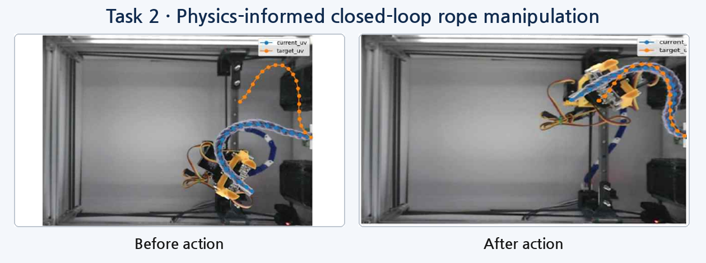
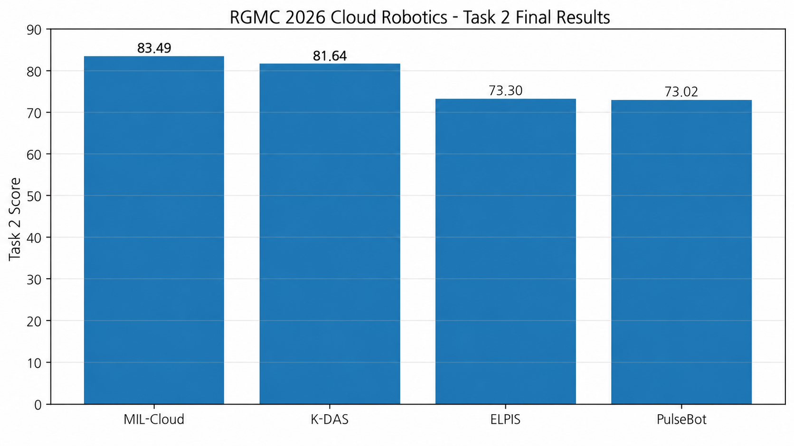

<p align="center">
  
</p>

<p align="center">
  
</p>

# Task 2 — Linear Deformable Object Shape Control

**IEEE ICRA 2026 Cloud Robotics Competition · Team K-DAS · Kookmin University**

The objective of Task 2 is to manipulate a rope-like deformable object with one fixed end so that its shape matches the target as closely as possible at the end of the time limit. Unlike Task 1, which focuses on matching the position and orientation of rigid objects, Task 2 requires simultaneous consideration of the rope’s overall curved shape, node ordering, local tangent direction, and length consistency.

K-DAS represents the rope using **20 ordered nodes** and developed a closed-loop manipulation system that integrates a **DER-based physics model**, **Residual GNN**, **2-step MPC**, **Behavior Cloning / candidate-aware offline RL**, and **geometry-aware runtime safety**.

> This README provides a high-level overview of the Task 2 problem definition, development process, final system, and competition results. Equations, model architectures, training configurations, detailed ablations, and implementation details are documented separately in each module README.

---

## 1. Competition Result

| Item | K-DAS Result |
|---|---:|
| Task 2 Final Score | **81.64** |
| Original Rope | **92.61** |
| Longer Rope | **87.73** |
| Thicker Red Rope | **64.59** |
| Mid-term Evaluation | **76.90 / 100, 1st place** |
| Competition Overall | **1st place** |

The strong performance on the original and longer ropes indicates that the 20-node representation, target-edge-based prediction, 2-step teacher, and closed-loop replanning remained relatively robust to changes in rope length. In contrast, the thicker red rope introduced a larger domain gap in both perception and dynamics because its color, thickness, bending stiffness, friction, and gripper-contact characteristics differed from those of the training and development ropes.

<p align="center">
  
</p>

---

## 2. System at a Glance

<p align="center">
  
</p>

```text
Top-view image
    ↓
Rope segmentation and ordered 20-node state
    ↓
Shared pixel-to-workspace mapping
    ↓
DER physical rollout
    ↓
Residual GNN correction + target-edge consistency
    ↓
2-step MPC teacher / learned BC-RL policy
    ↓
Geometry-aware runtime correction
    ↓
Grasp → rotate → drag → score check → release or hold
    ↓
Re-observe and re-plan
```

The final system does not attempt to complete the target shape with a single action. At every step, it re-observes the current rope, selects and executes an action, and then replans from the shape that was actually produced. This closed-loop structure is essential for reducing the accumulation of mismatch between the dynamics model and the real robot, while also helping preserve high-scoring configurations once they are reached.

---

## 3. Development Story

### 3.1 How Should the Rope Shape Be Represented?

> “Can the problem be solved by matching only the center position and orientation, as with a rigid body?”

A rope cannot be represented by a single pose. Even when two rope shapes have the same center and overall orientation, they can still represent completely different states if their intermediate curvature and endpoint geometry differ. We therefore convert the observed rope into **20 ordered nodes** that preserve progression along the rope and formulate the control problem using correspondence between the current and target nodes.

During development, we evaluated the system using several complementary metrics:

- node-wise mean error and RMSE
- edge-length consistency between neighboring nodes
- overall shape quality and final evaluation score
- local tangent and endpoint direction


---

### 3.2 Can a Physics Model Predict the Rope’s Next Shape?

> “If we grasp a particular node and move it in a certain direction, how will the entire rope deform?”

Selecting a good action requires predicting the rope shape after that action is executed. We initially modeled the rope as a node-edge chain based on the perspective of Discrete Elastic Rods. The model incorporates length constraints, bending resistance, damping, a fixed endpoint, and grasp-and-drag constraints.

The DER-based model was useful for capturing several fundamental physical behaviors:

- preservation of the fixed endpoint
- continuous shape deformation after dragging
- damping and stabilization of motion
- preservation of neighboring-node lengths

However, accurately modeling every aspect of the real system—including rope material properties, table friction, gripper contact, and camera-detection error—was difficult. The model reproduced physically plausible global behavior, but systematic prediction errors remained at the individual-node level.

Detailed implementation: [`dynamics/der/README.md`](dynamics/der/README.md)

---

### 3.3 Can Learning Correct the Prediction Error of the Physics Model?

> “Can we preserve the physical structure provided by DER while learning only the systematic error that remains?”

Rather than relearning the entire dynamics model using pure learning, we retained the DER output as a **physical prior**. The Residual GNN takes the current rope state, DER rollout, grasp node, and target displacement as inputs and predicts the node-wise residual displacement between the DER prediction and the actual next state.

The initial residual model substantially reduced position error, but the predicted rope sometimes stretched or contracted unnaturally. To address this, we added a **target-edge loss** that encourages preservation of the target rope’s edge-length distribution. This revealed a trade-off between node-position accuracy and edge consistency, and the model with stronger edge consistency was selected for downstream MPC and policy learning.

Representative results:

- DER baseline mean RMSE: **7.67 mm**
- Residual GNN mean RMSE: **2.41 mm**
- Edge relative error: **12.9% → 3.1%**

Detailed implementation: [`dynamics/residual_gnn/README.md`](dynamics/residual_gnn/README.md)

---

### 3.4 Which Grasp-and-Drag Action Should Be Executed?

> “Once a predictive model is available, which action will move the rope closest to the target shape?”

Combining movement directions and stroke lengths for each node produces a large set of action candidates. Evaluating every candidate with the same level of accuracy is computationally expensive, so we first reduce the candidate set using directional suitability and overshoot risk, then perform DER + GNN rollouts only for the shortlisted actions.

The initial 1-step MPC selected the candidate with the lowest predicted shape error immediately after the action. This structure alone achieved **76.90 / 100 and 1st place in the Task 2 mid-term evaluation**, demonstrating that model-based candidate selection was effective on the real robot.

Detailed implementation: [`planning/mpc/README.md`](planning/mpc/README.md)

---

### 3.5 Is an Action Good Enough If It Improves Only the Next Step?

> “Is the action that reduces the current error the most still a good choice when the following action is also considered?”

Mid-term evaluation logs showed cases in which the system approached the target closely and then moved away after an additional action. Because 1-step MPC evaluates only the immediately predicted next state, it could not fully account for how the action would affect future manipulability or stability near the goal.

To address this, we extended the planner to **2-step MPC**, which evaluates another set of candidate actions from the predicted state after the first action. A higher weight is assigned to the future cost than to the immediate cost so that the planner prioritizes actions that are easier to continue from rather than those that provide only short-term improvement.

Using identical evaluation seeds:

- Success rate: **4/5 → 5/5**
- Average steps to success: **15.50 → 9.33**
- Final mean error: **4.408 mm → 3.685 mm**

Extending the horizon beyond two steps causes the computational cost to grow rapidly with the number of candidates. Therefore, 2-step MPC was selected as a practical compromise between teacher quality and computational cost.

---

### 3.6 Can the Slow MPC Teacher Be Converted into a Fast Policy?

> “We can generate good teacher actions, but do we need to run MPC for every action?”

MPC generates high-quality actions, but each candidate requires repeated DER rollouts and GNN predictions, making continuous online use on the real robot expensive. We therefore used the decisions made by 2-step MPC to construct a teacher dataset and trained a policy that approximates those decisions much more quickly.

Two learning strategies were used:

- **Behavior Cloning:** directly imitates high-quality teacher steps to learn a stable initial policy
- **Candidate-aware Offline RL:** uses not only the selected action but also the relative quality and ranking of rejected candidates from the same state for critic supervision

During early RL training, a very small number of candidate outliers produced extremely large Q targets and destabilized the critic. Training became stable after introducing candidate-error clipping and adjusting the Q scale, and the resulting policy improved both goal approach and edge consistency over the earlier policy.

Detailed implementation: [`policy/candidate_aware_rl/README.md`](policy/candidate_aware_rl/README.md)

---

### 3.7 Can a Learned Action Be Sent Directly to the Real Robot?

> “Will an action that is good in simulation produce the same direction and magnitude of deformation through the real gripper?”

Even when the policy selected an appropriate grasp node and target displacement, the real robot did not always produce the same shape change because of gripper rotation direction, contact state, endpoint compliance, and elastic recovery after release. The following issues were repeatedly observed:

- sign mismatch between the gripper rotation command and the actual rope-tangent change
- unstable rotation transfer near endpoint nodes 18–19
- score degradation caused by additional actions after reaching a near-goal state
- shape collapse or relaxation immediately after gripper release
- rope-observation failures and workspace-boundary violations

To address these issues, we added a **geometry-aware runtime safety layer** after the policy output.

- **Directed tangent:** computes the local orientation difference between the current and target ropes using the increasing node-index direction.
- **Rotation probe:** measures the sign relationship between real robot rotation commands and tangent changes, applying partial sign correction only when necessary.
- **Geometry risk control:** checks direction reversal, overshoot, and servo-angle boundaries, then attenuates or limits risky rotations.
- **Endpoint-specific correction:** applies more conservative maximum rotation and correction ratios to nodes 18–19 than to central nodes.
- **Initial correction:** prioritizes central-node manipulation during early steps and applies an initial push when additional space is needed for the target deformation.
- **Score hold:** stops unnecessary additional actions based on the remaining time and current score to preserve an already good shape.
- **Failure recovery:** performs a reset or re-observation when rope detection fails or workspace violations occur.

In particular, **pre-release score hold** checks the evaluation score immediately after a drag and before opening the gripper. If the score is above the threshold, the gripper remains closed to physically preserve the current rope shape. The score continues to be monitored during the hold; if it remains stable, the gripper stays closed until the final evaluation, while a drop below the threshold releases the hold and triggers either release or another corrective action. This strategy reduces final-score loss caused by elastic recovery and shape relaxation at the moment of release.

Among 18 analyzable real-robot actions, **14 actions (77.8%)** reduced the mean node error, while the overall average error decreased from **173.69 mm to 106.23 mm**. This indicates that the executed real-robot actions generally moved the rope toward the target shape. However, these values reflect the combined effect of the policy and runtime-safety layer and should not be interpreted as an ablation separating their individual contributions.

Detailed implementation: [`runtime/README.md`](runtime/README.md)

---

## 4. Final Closed-Loop Execution

```python
while time_remaining:
    current_rope = observe_rope()
    current_nodes = extract_ordered_nodes(current_rope, num_nodes=20)
    state = map_to_workspace(current_nodes)

    action = policy_or_mpc(state, goal_state)
    safe_action = runtime_geometry_check(action, state, goal_state)

    grasp(safe_action.node)
    align_local_tangent(safe_action.rotation)
    drag_to(safe_action.target)

    score = evaluate_before_release()
    if should_hold(score, time_remaining):
        while time_remaining and hold_condition_is_valid(score):
            hold_gripper_closed()
            score = reevaluate_score()
        if not time_remaining:
            break

    release()
    reobserve_and_continue()
```

The key principle is not `predict once and execute open-loop`, but to repeatedly perform **observe → select → execute → re-observe**. Even when the next state produced by the real robot differs from the model prediction, the following step begins planning again from the newly observed real state.

---

## 5. Module Documentation

| Module | Role | Documentation |
|---|---|---|
| DER Dynamics | length, bending, damping, fixed-end, drag constraint | [`dynamics/der/`](dynamics/der/README.md) |
| Residual GNN | DER prediction error correction, target-edge loss | [`dynamics/residual_gnn/`](dynamics/residual_gnn/README.md) |
| MPC | candidate generation, shortlist, 1-step / 2-step planning | [`planning/mpc/`](planning/mpc/README.md) |
| Candidate-aware Offline RL | BC warm-start, candidate-aware actor-critic, qsafe stabilization | [`policy/candidate_aware_rl/`](policy/candidate_aware_rl/README.md) |
| Runtime Safety | tangent alignment, rotation probe, endpoint control, pre-release score hold | [`runtime/`](runtime/README.md) |

### Shared Mapping Dependency

Task 1 and Task 2 use a shared Mapping module that converts camera coordinates into commands in the real robot workspace. Mapping is maintained as a top-level repository module parallel to both tasks. Robot-specific calibration, LUT construction, safe probing, and coordinate transformation are documented separately in [`mapping/README.md`](../mapping/README.md). This Task 2 README uses the mapping output as an input and does not repeat the calibration methodology itself.

---

## 6. What Worked, What Did Not

| Observed Issue | Initial Approach | Final Decision / Improvement |
|---|---|---|
| Real rope dynamics mismatch | DER parameter tuning alone | Keep DER as a physical prior and correct residual error with a GNN |
| Predicted rope-length distortion | Train mainly with node-position loss | Add target-edge loss and goal-edge projection |
| Moving away again near the goal | 1-step MPC | Use 2-step MPC with future cost |
| MPC execution speed | Run online MPC at every step | Approximate it with BC and candidate-aware offline RL |
| RL critic divergence | Use raw candidate error directly in Q targets | Analyze outliers, apply clipping, and rescale Q targets |
| Rotation-direction error | Estimate command sign from geometry alone | Measure the sign convention using real-robot rotation probes |
| Endpoint shape collapse | Apply identical rotation rules to all nodes | Use endpoint-specific limits and conservative correction |
| Score drop after reaching a high score | Continue taking actions | Use remaining-time-based score hold and pre-release checks |
| Performance degradation on the thicker red rope | Reuse the original-rope model and thresholds | Identify observation and dynamics domain gap as a remaining limitation |

---


## 7. Repository Structure

```text
task2/
├── README.md
├── dynamics/
│   ├── der/
│   │   └── README.md
│   └── residual_gnn/
│       └── README.md
├── planning/
│   └── mpc/
│       └── README.md
├── policy/
│   └── candidate_aware_rl/
│       └── README.md
└── runtime/
    └── README.md
```

## 8. Key Takeaway

The core of K-DAS Task 2 is not a single complex model, but the way multiple layers with different strengths were connected.

- DER provides the rope’s fundamental physical structure.
- Residual GNN corrects systematic model error that appears in the real environment.
- 2-step MPC generates teacher actions that account for future manipulability.
- BC and offline RL convert those decisions into a fast executable policy.
- Runtime safety handles the remaining uncertainty between the real gripper and the rope during execution.

As a result, the Task 2 solution evolved from a single learned policy into a **closed-loop deformable object manipulation system that combines physics-informed prediction, future-aware planning, learned action selection, and geometry-aware execution**.
