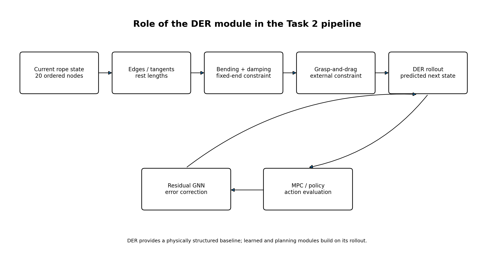
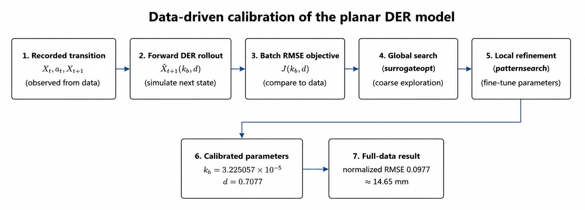
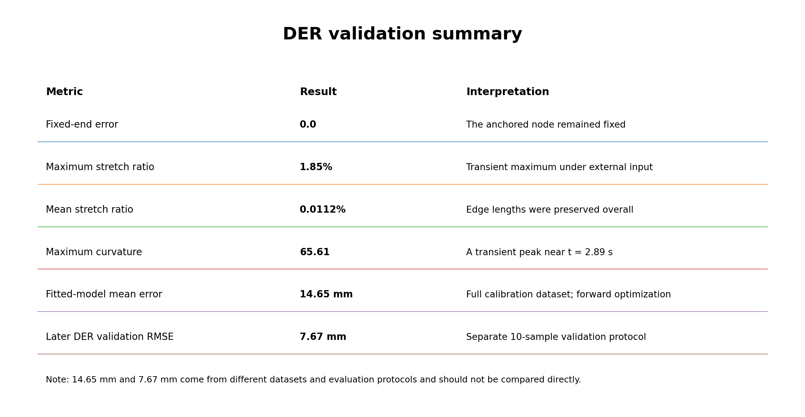

<p align="center">
  
</p>

# DER-Inspired Planar Rope Dynamics

**Task 2 · Linear Deformable Object Shape Control · Team K-DAS**

This module is a **physics-based baseline dynamics model** that predicts the rope shape after a grasp-and-drag action is applied to the current rope configuration. The rope is represented using 20 ordered nodes and 19 edges, and the next state is computed using length preservation, bending resistance, damping, a fixed endpoint, and a drag constraint on the grasped node.

> This implementation does not reproduce the full 3D Discrete Elastic Rods formulation of Bergou et al. Instead, it simplifies the **centerline, bending, and inextensibility** concepts required for top-view manipulation into a **DER-inspired planar model** for the 2D Task 2 setting.

---

## 1. Why a Physics Model?

In Task 2, it is not sufficient for the planner to compare only the current and target rope shapes. To evaluate multiple action candidates, the system must predict how the remaining nodes will move when a specific node is grasped and displaced.

```text
Current state X_t + Action a_t
                ↓
        Dynamics prediction
                ↓
       Predicted state X̂_t+1
                ↓
   Candidate cost and action selection
```

The initial objective was to answer the following question.

> **“If a particular node is moved to a new position, how will the entire rope shape change?”**

A purely rule-based displacement propagation model has difficulty capturing differences caused by current curvature and grasp location, while a pure learning model can generate physically unrealistic shapes when data is limited. We therefore first constructed a physics-based model that captures the rope’s structural properties, then used a Residual GNN to correct the remaining error.

---

## 2. Role in the Full Task 2 System

DER is not the final controller itself. It serves as the **physical prior** used by downstream modules.

1. Convert the current rope into 20 ordered nodes.
2. Run a DER rollout for each action candidate.
3. Use the Residual GNN to correct systematic error in the DER prediction.
4. Use MPC or the learned policy to compare actions based on the corrected next state.
5. After executing the real action, re-observe the rope and plan the next step.

Related documentation:

- Task 2 overview: [`../../README.md`](../../README.md)
- Residual correction: [`../residual_gnn/README.md`](../residual_gnn/README.md)
- MPC planning: [`../../planning/mpc/README.md`](../../planning/mpc/README.md)

---

## 3. Modeling Scope and Assumptions

| Item | Implementation |
|---|---|
| Space | Top-view 2D plane |
| Rope representation | 20 ordered nodes, 19 edges |
| Boundary condition | One endpoint node is fixed |
| Internal physics | Edge-length preservation, bending resistance, damping |
| Manipulation input | Grasp-and-drag action that moves a selected node to a target position |
| Contact model | Table friction and gripper contact represented using simplified coefficients and constraints |
| Excluded effects | 3D torsion, detailed self-collision contact, material-specific nonlinear friction, gripper-jaw deformation |

The purpose of this simplification is not to reproduce every physical phenomenon of the real rope perfectly, but to obtain a **fast and structured rollout model** that can compare the relative quality of action candidates.

---

## 4. State and Action Representation

### 4.1 Rope State

At time `t`, the rope state is represented as an ordered array of node coordinates.

$$
X_t = [x_0, x_1, \ldots, x_{N-1}], \qquad x_i \in \mathbb{R}^2, \quad N=20
$$

The node index increases from the fixed end toward the free end. This ordering must be preserved to compute edges, tangents, local curvature, and grasp-node influence consistently.

### 4.2 Manipulation Action

The minimal action representation is:

$$
a_t = (g, p_{\mathrm{target}})
$$

- `g`: index of the node to grasp
- `p_target`: workspace target position for the grasped node

During rollout, the grasp-node trajectory is applied over a finite time interval using the drag distance, action duration, or robot-speed configuration.

### 4.3 Transition Dataset

Real-robot data is stored as the following transition.

$$
X_t + a_t \rightarrow X_{t+1}
$$

The same transition format is used for DER parameter fitting, DER baseline generation, Residual GNN training, and validation.

---

## 5. Planar DER Formulation

### 5.1 Edge and Unit Tangent

The edge between adjacent nodes and its unit tangent are defined as:

$$
e_i = x_{i+1} - x_i
$$

$$
t_i = \frac{e_i}{\lVert e_i \rVert}
$$

The initial edge length `l_i^0` is used as the rope’s rest-length constraint.

### 5.2 Bending Angle

Local bending is represented by the rotation angle between adjacent edges.

$$
\phi_i = \cos^{-1}(t_{i-1} \cdot t_i)
$$

`φ_i` is small when the rope is close to straight and increases as the rope bends more sharply around the node.

### 5.3 Bending Energy

The bending energy in the planar model is defined as:

$$
E_{\mathrm{bend}} = \frac{1}{2}\sum_i k_b\phi_i^2
$$

`k_b` is the bending stiffness. A larger value causes the rope to resist bending and remain straighter, while a smaller value allows the rope to bend more easily under the same input.

### 5.4 Length Preservation

To prevent the rope from stretching or shrinking unrealistically during an action, each edge is constrained to remain near its rest length.

$$
C_i = \lVert e_i \rVert - l_i^0 = 0
$$

In this implementation, edge lengths are corrected iteratively through a projection step in addition to internal-force computation. This approach is numerically more stable than simply increasing an explicit stiffness force and keeps the overall rope length relatively consistent after actions.

### 5.5 Damping and Node Motion

The motion of each node is determined by the sum of bending force, damping force, and external or manipulation constraints.

$$
m_i\ddot{x}_i = f_i^{\mathrm{bend}} + f_i^{\mathrm{damp}} + f_i^{\mathrm{external}}
$$

The damping term prevents oscillation from growing indefinitely after an input.

$$
f_i^{\mathrm{damp}} = -d\dot{x}_i
$$

If `d` is too small, oscillations persist for too long. If it is too large, deformation propagates more sluggishly than in the real rope.

---

## 6. Boundary and Manipulation Constraints

### 6.1 Fixed End

The fixed-end node remains at its initial position throughout the rollout.

$$
x_0(t)=x_0(0), \qquad \dot{x}_0(t)=0
$$

If this condition is violated, the entire rope can drift through the workspace even when deformation near the free end is modeled correctly. Therefore, the constraint is enforced explicitly at every simulation step.

### 6.2 Grasp-and-Drag Constraint

The selected grasp node is driven toward the target in the same direction as the robot action. Rather than applying the action as a single instantaneous impulse, the drag trajectory is divided over a time interval so that adjacent nodes can respond continuously during the action.

### 6.3 Edge Projection

After the node positions are updated, they are corrected so that each edge remains close to its rest length. The fixed-node and grasp-node constraints are given priority, while the correction is distributed across the remaining nodes.

---

## 7. Numerical Rollout

A single simulation step in the DER rollout follows the sequence below.

```python
for step in simulation_steps:
    edges = compute_edges(nodes)
    tangents = normalize(edges)

    bending_force = compute_bending_force(nodes, tangents, kb)
    damping_force = -damping * velocity

    apply_grasp_drag_constraint(grasp_node, drag_trajectory[step])
    integrate_node_motion(bending_force + damping_force)

    project_edge_lengths(rest_lengths)
    enforce_fixed_endpoint(node=0)

return predicted_nodes
```

The key sequence is:

1. Compute edges and tangents
2. Compute bending force
3. Apply damping
4. Apply the grasp-and-drag constraint
5. Update node positions
6. Project edge lengths
7. Re-enforce the fixed-end constraint

Because this rollout is repeated for every candidate, both numerical stability and computational cost are important in addition to physical accuracy.

---

## 8. Parameter Identification

<p align="center">
  
</p>

After implementing the DER structure, the actual rope values for `k_b` and damping were still unknown. The same grasp-and-drag input produced different bending and recovery behavior in simulation and on the real rope, so both coefficients were estimated from real transition data.

### 8.1 Initial Inverse Estimation

The initial approach attempted to estimate the coefficients directly from observed deformation.

$$
k_{b,\mathrm{proxy}} = \frac{U}{K_{\mathrm{local}}+\epsilon}
$$

$$
\gamma_{\mathrm{proxy}} = \mathrm{clip}\left(\frac{\bar{d}_{\mathrm{visible}}}{U+\epsilon},0,1\right)
$$

- `U`: action displacement magnitude
- `K_local`: curvature change around the grasp node
- `d_visible`: mean displacement of visible nodes

However, the simulator contains non-smooth operations such as projection, thresholds, and clamps. Combined with partially observed nodes, this made it difficult to construct a stable inverse mapping.

### 8.2 Forward Numerical Optimization

Instead of direct inverse estimation, we switched to forward optimization: repeatedly run DER with different parameters and directly minimize the error between the simulated and observed next states.

Parameter vector:

$$
\theta=[k_b,d]
$$

Batch objective:

$$
J(k_b,d)=\frac{1}{N}\sum_{i=1}^{N}\sqrt{\frac{1}{M}\sum_{j=1}^{M}\lVert x^{\mathrm{sim}}_{i,j}(k_b,d)-x^{\mathrm{gt}}_{i,j}\rVert_2^2}
$$

- `N`: number of batch transitions
- `M`: number of nodes
- `x_sim`: DER rollout result
- `x_gt`: real observed result

Optimization was performed in two stages.

1. **surrogateopt**: globally explores a parameter space that is expensive to evaluate and difficult to differentiate
2. **patternsearch**: performs gradient-free local refinement around the best global-search result

Single-sample fitting tended to overfit individual trajectories, so the experiment was expanded from an initial 20-sample pilot test to approximately 200 valid transitions. For the full optimization, `parpool` and `parfor` were used to parallelize repeated rollouts.

### 8.3 Calibrated Parameters

| Parameter | Fitted value |
|---|---:|
| Bending stiffness `k_b` | `3.225057e-05` |
| Damping `d` | `0.7077` |
| Batch normalized RMSE | `0.0977` |
| Approximate physical-space error | `14.65 mm` |

These parameters are not values that best fit a single action. They are **surrogate physical parameters** selected to reduce the average error over the entire transition batch. They should therefore be interpreted not as exact material constants, but as the coefficients that produce the most consistent rollout under the current 2D simulator and data representation.

---

## 9. Validation

<p align="center">
  
</p>

### 9.1 Physics Sanity Check

A simulation starting from a straight rope and applying an external input was used to verify the following properties.

| Validation item | Result | Interpretation |
|---|---:|---|
| Fixed-end error | `0.0` | The fixed endpoint remained at the reference position throughout the rollout |
| Kinetic energy | Peaks after input, then decreases | Oscillation is damped rather than amplified |
| Maximum stretch ratio | `1.85%` | Temporary stretching under a strong input |
| Mean stretch ratio | `0.0112%` | Edge lengths are preserved well overall |
| Maximum curvature | `65.61` | A temporary large bend occurs near `t = 2.89 s` and then decreases |

This validation does not measure how accurately the model matches real data. Instead, it verifies that the basic physical conditions—fixed endpoint, damping, and length preservation—remain numerically stable.

### 9.2 Data-Fitting Result

Parameter fitting over the full transition dataset produced an average error of approximately **14.65 mm** relative to the observed real outcome. Overall curvature and shape change were broadly similar, but deformation propagation near the free endpoint, far from the grasp location, still showed patterns of over- or under-prediction.

### 9.3 Later Baseline Evaluation

On a separate 10-sample validation subset used in later Residual GNN experiments, the DER baseline achieved:

| Metric | DER baseline |
|---|---:|
| Mean RMSE | `7.67 mm` |
| Mean MAE | `6.24 mm` |

The `14.65 mm` and `7.67 mm` values were computed using different datasets and evaluation protocols and should not be compared as a direct performance improvement. The former is the batch average from the full parameter-fitting stage, while the latter is the DER baseline measured on a separate validation set used for the GNN comparison.

---

## 10. What the DER Model Explained Well

- Continuous deformation of intermediate and free-end nodes while preserving the fixed endpoint
- Basic propagation of grasp-node displacement through adjacent edges
- Changes in rope curvature according to bending stiffness
- Oscillation reduction and stabilization through damping
- Preservation of total length and local edge consistency through edge projection
- A physically structured baseline for comparing the relative quality of MPC action candidates

The most important role of DER was not to reproduce the real outcome perfectly, but to provide a **physically consistent starting point** instead of estimating node displacement without structure.

---

## 11. Limitations

### 11.1 Parameter Ambiguity

Observed real-world outcomes combine rope material properties, table friction, gripper contact, drag speed, and node-detection noise. Therefore, `k_b` and damping alone cannot explain every source of prediction error.

### 11.2 Endpoint Error

Nodes near the free endpoint, far from the grasp point, showed tension propagation and accumulated deformation that differed from the real rope. This is closer to a model-structure limitation than a simple parameter-tuning problem.

### 11.3 Simplified Contact

The model does not represent table-rope stick-slip friction, detailed gripper-jaw contact geometry, or elastic recovery after release with high fidelity.

### 11.4 2D Assumption

Because the system focuses on top-view shape control, out-of-plane motion and torsion are excluded. Accuracy can therefore decrease when the rope lifts from the surface or overlaps itself.

### 11.5 Perception and Mapping Error

DER treats the 20 node coordinates as ground truth, but real inputs contain segmentation, node-ordering, and pixel-to-workspace mapping errors. The final prediction error therefore does not represent dynamics error alone.

---

## 12. Why Residual GNN Was Added

Even after parameter optimization, systematic residual error remained. In particular, detailed node positions and endpoint propagation were difficult to match reliably using only two physical coefficients.

Instead of discarding DER, we adopted the following hybrid structure.

$$
\hat{X}_{t+1}^{\mathrm{final}} = \hat{X}_{t+1}^{\mathrm{DER}} + \Delta X_{t+1}^{\mathrm{GNN}}
$$

- DER: provides physical structure such as length, bending, and fixed-end behavior
- Residual GNN: corrects repeated node-wise prediction errors observed in real data

On a separate validation set, the DER baseline mean RMSE of `7.67 mm` decreased to `2.41 mm` after applying the Residual GNN. This does not imply that the physics model was unnecessary. Rather, it shows that **higher accuracy was achieved by preserving the structure provided by DER and restricting the learned model to residual correction**.

---

## 13. Repository Guide

The recommended module structure is shown below. File names should be adjusted to match the final public implementation.

```text
task2/dynamics/der/
├── README.md
├── src/              # planar DER rollout and constraints
├── configs/          # node count, kb, damping, simulation settings
├── scripts/          # parameter fitting and batch evaluation
├── notebooks/        # visualization and sanity checks
├── results/          # fitting logs and validation tables
```

The public release should document:

- coordinate units and normalization range
- node ordering and fixed-endpoint definition
- rest-edge-length construction
- simulation-step count and action-duration handling
- fitted `k_b`, damping, and the rope configuration they correspond to
- parameter-fitting dataset schema
- interface from DER output to Residual GNN and MPC

---

> All visual assets are managed centrally in the repository-level `images/` directory.

## 14. Minimal Interface

```python
predicted_nodes = der_rollout(
    current_nodes=current_nodes,       # shape: [20, 2]
    grasp_node=action.node_index,
    target_position=action.target_xy,
    bending_stiffness=3.225057e-05,
    damping=0.7077,
)
```

Expected output:

```text
predicted_nodes: [20, 2]
```

Downstream modules do not use this result directly as the final prediction. Residual GNN correction and edge-consistency processing are applied before computing action cost.

---

## 15. Takeaway

> **The DER module is a fast, physically structured baseline for predicting how a fixed-end rope responds to grasp-and-drag actions.**

The K-DAS DER module discretizes the rope into a 20-node chain and combines bending, damping, inextensibility, a fixed-end constraint, and manipulation constraints to reproduce the basic deformation behavior. The parameters were calibrated through forward optimization using real data, but systematic errors remained in endpoint propagation and contact uncertainty. This limitation led to the later hybrid dynamics architecture, which preserves the DER prediction as a physical prior and corrects its error using a Residual GNN.

---

## References

1. M. Bergou, M. Wardetzky, S. Robinson, B. Audoly, and E. Grinspun, “Discrete Elastic Rods,” *ACM Transactions on Graphics*, vol. 27, no. 3, 2008. [Official publication page](https://research.adobe.com/publication/discrete-elastic-rods/)
2. Task 2 project documentation: [`../../README.md`](../../README.md)
