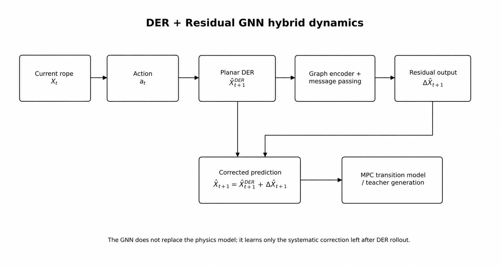
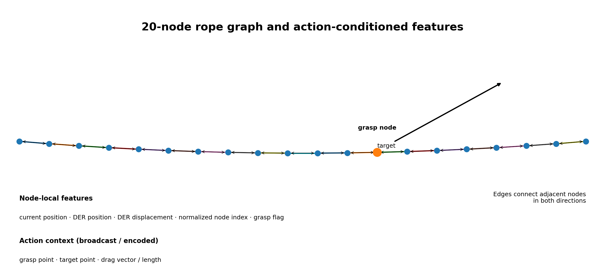
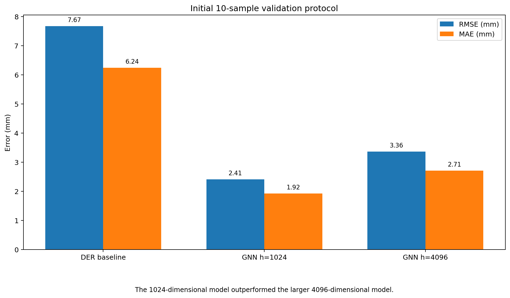
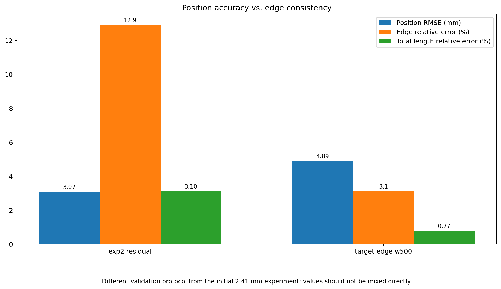
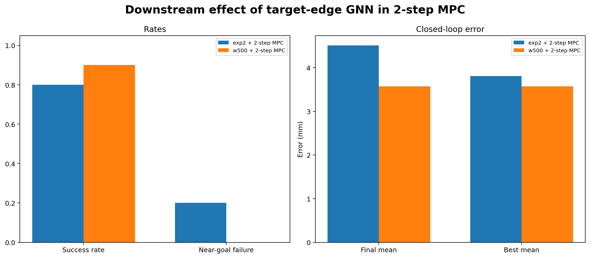

<p align="center">
  
</p>

# Residual GNN for Rope Dynamics Correction

**Task 2 · Linear Deformable Object Shape Control · Team K-DAS**

This module corrects the **systematic residual error** between the next rope state predicted by the DER-based physics model and the actual real-robot outcome using a Graph Neural Network. The rope is represented as a chain graph of 20 ordered nodes, and the GNN predicts the 2D residual displacement of each node using the current state, DER rollout, and grasp-action information.

> This implementation is inspired by the problem formulation of GraphDLO and the concept of graph-based dynamics prediction, but it does not reproduce the full architecture of the original paper. It is a **GraphDLO-inspired residual correction model** adapted to the K-DAS DER baseline, 20-node state representation, CloudGripper action format, and MPC teacher pipeline.

---

## 1. Why Residual Learning?

DER provides structural priors such as bending, damping, fixed-end constraints, and edge-length preservation, but the detailed behavior of the real rope is also influenced by:

- rope material properties and object-to-object variation
- table friction and stick-slip behavior
- gripper contact position and jaw interaction
- drag speed and release dynamics
- segmentation and 20-node extraction errors
- increasing endpoint-propagation uncertainty farther from the fixed end

Accurately identifying all of these effects within a single physics model is difficult. On the other hand, directly predicting the entire next state with a pure learning model can cause the rope length and connectivity structure to collapse under limited training data.

We therefore reframed the problem as:

> **“Can we preserve the physical structure provided by DER while learning only the remaining prediction error?”**

Residual learning allows the GNN to focus on the portion that DER cannot explain, rather than relearning the entire dynamics from scratch.

---

## 2. Role in the Full Task 2 System

```text
Current rope X_t + Action a_t
             │
             ├── Planar DER rollout ──> X̂_DER,t+1
             │
             └── Action-conditioned graph features
                              │
                       Residual GNN
                              │
                       ΔX̂_GNN,t+1
                              │
                              ▼
        X̂_t+1 = X̂_DER,t+1 + ΔX̂_GNN,t+1
                              │
                              ▼
                   MPC candidate evaluation
```

The Residual GNN is not a policy that directly outputs the final action. It is part of the **transition model**, and the corrected next state is used for candidate evaluation in 1-step/2-step MPC and for teacher-dataset generation.

Related documentation:

- Task 2 overview: [`../../README.md`](../../README.md)
- DER baseline: [`../der/README.md`](../der/README.md)
- MPC planner: [`../../planning/mpc/README.md`](../../planning/mpc/README.md)
- BC/RL policy: [`../../policy/candidate_aware_rl/README.md`](../../policy/candidate_aware_rl/README.md)

---

## 3. Hybrid Dynamics Formulation

DER first generates a next-state prediction from the current state and action.

$$
\hat{X}_{t+1}^{\mathrm{DER}} = f_{\mathrm{DER}}(X_t,a_t)
$$

The residual target that DER fails to explain in the ground-truth transition is:

$$
\Delta X_{t+1}^{\mathrm{GT}} = X_{t+1}^{\mathrm{GT}}-\hat{X}_{t+1}^{\mathrm{DER}}
$$

The GNN predicts this residual:

$$
\Delta \hat{X}_{t+1}=g_\theta(G_t,a_t,\hat{X}_{t+1}^{\mathrm{DER}})
$$

The final prediction is the sum of the DER output and the residual correction:

$$
\hat{X}_{t+1}=\hat{X}_{t+1}^{\mathrm{DER}}+\Delta \hat{X}_{t+1}
$$

This structure provides several advantages.

1. It preserves the fixed-end constraint, local connectivity, and basic deformation propagation provided by DER.
2. It limits the learning target to a residual whose magnitude is smaller than that of the full node position.
3. It allows systematic bias between the physics model and the real environment to be learned from data.
4. It enables independent diagnosis of the physics model and the learned correction.

---

## 4. Rope Graph Representation

<p align="center">
  
</p>

The rope state is represented as the following chain graph.

$$
G=(V,E), \qquad |V|=20
$$

$$
E=\{(i,i+1),(i+1,i)\mid i=0,\ldots,18\}
$$

- **Node**: ordered rope point
- **Edge**: physically adjacent rope segment
- **Node-index direction**: from the fixed end toward the free end
- **Message passing**: propagates deformation information from the grasp point through neighboring nodes

Using a chain graph directly encodes the physical connectivity of the rope more naturally than a fully connected network. Because the number of nodes is fixed at 20, each prediction outputs a residual displacement tensor of shape `[20, 2]`.

---

## 5. Input and Output Features

The input information used in the project is grouped into the following categories.

### 5.1 Node-local information

- current node coordinates `X_t[i]`
- node coordinates predicted by DER `X_DER[i]`
- DER displacement `X_DER[i] - X_t[i]`
- normalized node index
- grasp-node flag

### 5.2 Action context

- grasp point
- target point
- drag vector
- displacement length
- selected grasp-node index

Action information can be divided into features that are meaningful only at the grasp node and global context broadcast to all nodes. In the public implementation, the exact tensor ordering and normalization should be explicitly fixed in the configuration or dataset documentation.

### 5.3 Output

The model outputs a 2D residual displacement for every node.

$$
\Delta \hat{X}_{t+1}\in\mathbb{R}^{20\times2}
$$

The fixed-end node is kept stationary using post-processing or a mask.

---

## 6. Network Structure

The overall network can be described in three stages.

1. **Node/Action Encoder**  
   Converts the current state, DER prediction, and action context into hidden representations.
2. **Graph Message Passing**  
   Exchanges information between neighboring nodes to learn local deformation propagation.
3. **Residual Decoder**  
   Regresses `(Δx, Δy)` from each node hidden state.

```python
node_hidden = node_encoder(node_features, action_context)

for layer in message_passing_layers:
    node_hidden = layer(node_hidden, edge_index)

residual_xy = residual_decoder(node_hidden)   # [20, 2]
predicted_next = der_next + residual_xy
```

This README focuses on the structural role of the model. For public release, the number of layers, activation functions, normalization, dropout, optimizer, and checkpoint format should be fixed in the code and configuration files.

---

## 7. Dataset and Cache Pipeline

Each training sample consists of a real-robot transition.

$$
(X_t,a_t,X_{t+1}^{\mathrm{GT}})
$$

Repeatedly reading the raw JSONL data and running DER rollouts during every epoch creates a substantial bottleneck. To address this, we used a `RopeCachedDataset` pipeline.

```text
Raw JSONL transitions
        │
        ├── validate node ordering / shape
        ├── normalize coordinates and actions
        ├── run DER baseline once
        ├── compute residual target
        ▼
Serialized cache file
        │
        ▼
RopeCachedDataset → DataLoader → GNN training
```

At minimum, the cache should include:

- current rope state
- action representation
- DER next-state prediction
- ground-truth next state
- residual target
- edge index
- normalization metadata

Because the DER rollout does not need to be repeated every epoch, this structure significantly accelerated repeated experiments with hidden dimensions, loss weights, and network configurations.

---

## 8. Training Objective Evolution

### 8.1 Node-wise residual / position loss

The initial objective was to improve node-position prediction.

$$
L_{\mathrm{pos}}=\frac{1}{N}\sum_{i=0}^{N-1}\left\|\hat{x}_{i,t+1}-x_{i,t+1}^{\mathrm{GT}}\right\|_2^2
$$

The equivalent residual-target formulation is:

$$
L_{\mathrm{res}}=\frac{1}{N}\sum_i\left\|\Delta\hat{x}_{i,t+1}-\Delta x_{i,t+1}^{\mathrm{GT}}\right\|_2^2
$$

The initial model substantially reduced node-position error, but some predictions still exhibited abnormal stretching or contraction of the rope edges.

### 8.2 Edge consistency diagnosis

Edge length is computed as:

$$
l_i=\|x_{i+1}-x_i\|_2
$$

The mean relative edge error is:

$$
E_{\mathrm{edge}}=\frac{1}{N-1}\sum_i\frac{|l_i^{\mathrm{pred}}-l_i^{\mathrm{target}}|}{l_i^{\mathrm{target}}+\epsilon}
$$

In one analysis, the mean edge error after DER was 5.98%, but increased to 15.88% after the original residual correction. This showed that position loss alone does not automatically preserve rope-length consistency.

### 8.3 Target-edge loss

When strengthening edge regularization, rather than forcing every edge toward a single fixed rest length, we used the **edge-length distribution of the actual target state for each sample**.

```python
target_edges = torch.norm(y_gt[:, 1:, :] - y_gt[:, :-1, :], dim=-1)
pred_edges   = torch.norm(pred_full[:, 1:, :] - pred_full[:, :-1, :], dim=-1)
edge_loss    = ((pred_edges - target_edges) ** 2).mean()
```

$$
L_{\mathrm{edge}}=\frac{1}{N-1}\sum_i\left(l_i^{\mathrm{pred}}-l_i^{\mathrm{GT}}\right)^2
$$

Conceptually, the final loss is:

$$
L_{\mathrm{total}}=L_{\mathrm{pos}}+\lambda_{\mathrm{edge}}L_{\mathrm{edge}}
$$

Comparing `λ_edge` values around 100, 500, and 1000 showed that weight 500 provided the most appropriate balance between improved edge consistency and position accuracy, and it was selected as the reference model.

---

## 9. Hidden Dimension Exploration

<p align="center">
  
</p>

Hidden dimensions of `64, 256, 1024, 4096` were explored. In a representative validation experiment, the 1024-dimensional model outperformed the 4096-dimensional model.

| Model | Mean RMSE | Mean MAE | Mean node L2 |
|---|---:|---:|---:|
| DER baseline | 7.67 mm | 6.24 mm | 9.60 mm |
| Residual GNN, hidden 1024 | **2.41 mm** | **1.92 mm** | **3.02 mm** |
| Residual GNN, hidden 4096 | 3.36 mm | 2.71 mm | 4.31 mm |

The 1024-dimensional model reduced RMSE by 5.26 mm relative to the DER baseline. The weaker performance of the 4096-dimensional model indicates that simply increasing model capacity is not always beneficial, and must be considered together with dataset size and regularization.

> This table reports an early comparison using the same ordered set of 10 validation samples. Later exp2/target-edge experiments used different datasets and evaluation protocols, so the values should not be compared directly across those experiments.

---

## 10. Target-Edge Model Results

<p align="center">
  
</p>

Later experiments compared the position-accurate `exp2 residual GNN` against the target-edge weight500 model.

| Model | Position RMSE | Edge relative error | Total length relative error | Interpretation |
|---|---:|---:|---:|---|
| exp2 residual GNN | **3.07 mm** | 12.9% | 3.1% | Accurate node positions, but weak edge consistency |
| target-edge weight500 | 4.89 mm | **3.1%** | **0.77%** | Higher position RMSE, but substantially improved rope-length consistency |

These results show that a dynamics model should not be selected using RMSE alone. Even if the predicted point cloud is close to the target, significant edge-length distortion can make subsequent rollouts and action rankings physically unrealistic.

For this reason, the target-edge weight500 model was used for final teacher generation.

---

## 11. Downstream MPC Effect

<p align="center">
  
</p>

Although the target-edge model had a higher standalone position RMSE, it produced better closed-loop performance when combined with 2-step MPC.

| Metric | exp2 + 2-step MPC | target-edge w500 + 2-step MPC |
|---|---:|---:|
| Success rate | Approximately 0.8 | **Approximately 0.9** |
| Final mean error | Approximately 4.51 mm | **Approximately 3.57 mm** |
| Best mean error | Approximately 3.81 mm | **Approximately 3.57 mm** |
| Near-goal failure rate | Approximately 0.2 | **Approximately 0.0** |

This means that transition models should be evaluated not only using one-step prediction RMSE, but also through their **closed-loop planning performance**. Edge-consistent predictions provided more stable states for evaluating subsequent action candidates.

---

## 12. GNN Loss vs. Edge Projection

Target-edge loss and edge projection operate at different stages.

| Component | Stage | Function |
|---|---|---|
| Target-edge loss | GNN training | Trains the raw GNN prediction itself to preserve the target edge-length distribution |
| Goal edge projection | MPC rollout post-processing | Geometrically adjusts the predicted state toward target edge lengths |

With projection OFF, final edge relative error decreased from approximately 0.103 for exp2 to approximately 0.052 for target-edge w500. With projection ON, the edge error of both models became nearly zero, which masked the raw difference between the GNN predictions.

Therefore, the purpose of the target-edge GNN is not to replace projection, but to **reduce the distortion of the raw prediction before projection is applied**. The full projection-alpha ablation is documented in the MPC README.

---

## 13. Inference Procedure

```python
def predict_next_state(current_nodes, action):
    der_next = der_rollout(
        current_nodes=current_nodes,
        grasp_node=action.node_index,
        target_position=action.target_xy,
    )

    graph = build_graph_features(
        current_nodes=current_nodes,
        der_next=der_next,
        action=action,
    )

    residual = residual_gnn(graph)       # [20, 2]
    predicted_next = der_next + residual

    predicted_next[0] = current_nodes[0] # fixed endpoint
    return predicted_next
```

MPC calls this function repeatedly for each shortlisted candidate. Therefore, inference speed, batch evaluation, and deterministic preprocessing are important.

---

## 14. What Worked

- Significantly reduced detailed node-prediction error relative to the DER baseline.
- Represented local deformation propagation using a 20-node chain graph.
- Restricted the learning scope to physics-model error through residual targets.
- Reduced repeated-experiment bottlenecks using a cached dataset.
- Improved rope-length consistency of raw predictions using target-edge loss.
- Improved 2-step MPC rollout performance when using an edge-consistent GNN.

---

## 15. Limitations

| Limitation | Effect |
|---|---|
| Dataset/domain dependence | Corrections learned for a particular rope, workspace, and action distribution may not generalize directly to other materials |
| Perception noise | Ground-truth nodes themselves contain segmentation, skeletonization, and mapping errors |
| Endpoint uncertainty | Small contact differences near the free endpoint can produce large displacements and higher prediction variance |
| One-step residual model | Small bias can accumulate over long rollouts |
| Fixed topology | If 20-node ordering fails or skeleton ordering becomes incorrect under self-crossing, the graph input is also corrupted |
| RMSE–physics trade-off | A suitable loss weight is required to balance position RMSE and edge consistency |
| Projection dependency | Strong projection in MPC can hide raw model-quality differences in evaluation metrics |

The relatively lower final performance on the thicker red rope remains an indication that both domain generalization of the dynamics correction and runtime execution require further improvement.

---

## 16. Recommended Repository Structure

```text
task2/dynamics/residual_gnn/
├── README.md
├── src/
│   ├── model.py
│   ├── graph_features.py
│   ├── dataset.py
│   └── inference.py
├── configs/
│   ├── exp2.yaml
│   └── target_edge_w500.yaml
├── scripts/
│   ├── build_cache.py
│   ├── train.py
│   ├── evaluate.py
│   └── compare_edge_metrics.py
├── models/
│   └── README.md
├── notebooks/
│   └── visualize_prediction.ipynb
├── results/
```

The following must be fixed and documented before public release:

- node-feature ordering and dimensions
- coordinate normalization and workspace scale
- edge-index direction
- fixed-endpoint mask
- DER checkpoint/config dependency
- hidden dimension and message-passing layer configuration
- `λ_edge` and target-edge definition
- train/validation split criteria
- cache schema/version
- model-weight checksum

---

> All visual assets are managed centrally in the repository-level `images/` directory.

## 17. Takeaway

> **The Residual GNN preserves the DER physical prior while learning the systematic node-level correction required by the real rope.**

The K-DAS Residual GNN does not remove DER and replace it with pure neural dynamics. Instead, it learns the residual caused by friction, contact, endpoint propagation, and perception uncertainty through graph message passing on top of the physical structure provided by DER. The initial model significantly reduced node RMSE, and the later target-edge loss improved the balance between positional accuracy and rope-length consistency. This hybrid transition model ultimately became the foundation for the 2-step MPC teacher and the BC/RL policy.

---

## References

1. H. Dinkel et al., “GraphDLO: Graph-Based Neural Dynamics for Deformable Linear Object Trajectory Prediction,” 2025. [Paper](https://florianpokorny.com/static/publications/dinkel2025a.pdf)
2. M. Bergou et al., “Discrete Elastic Rods,” ACM Transactions on Graphics, 2008.
3. K-DAS Task 2 project documentation: [`../../README.md`](../../README.md)
