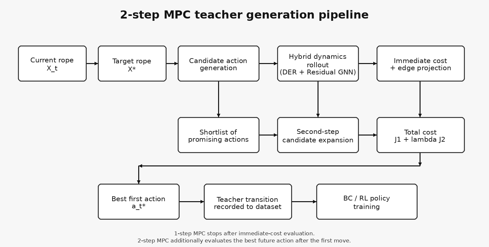
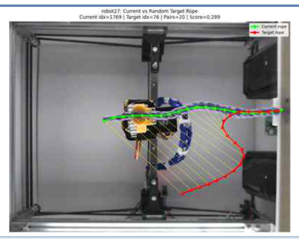
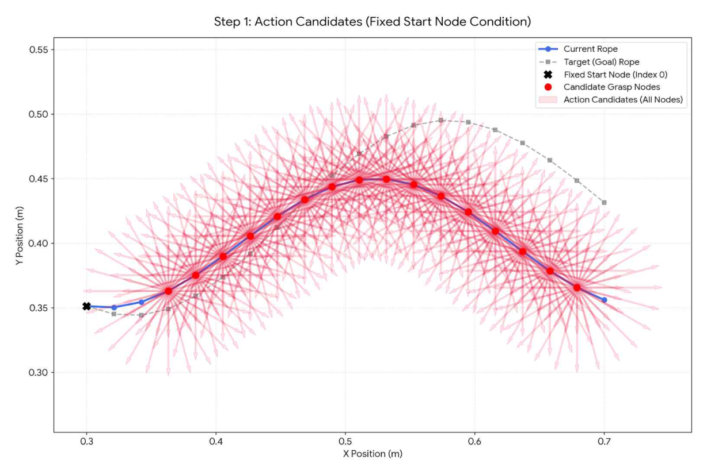
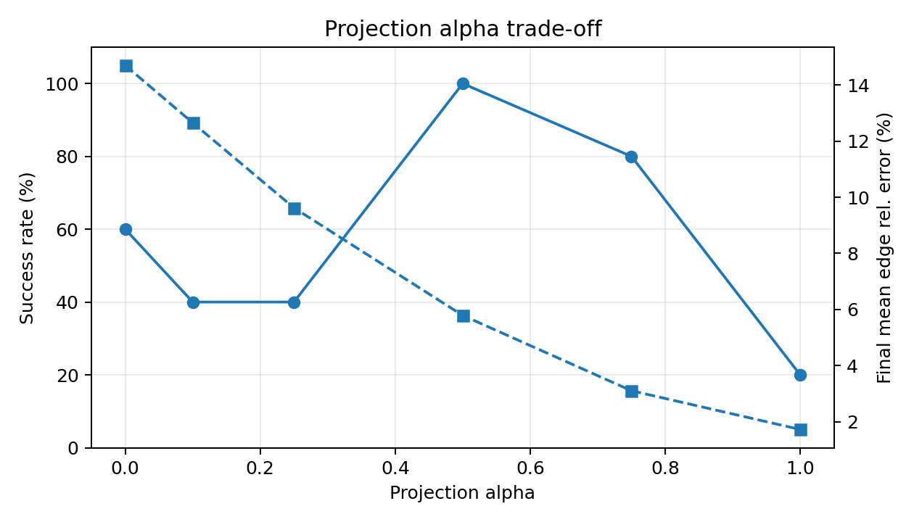
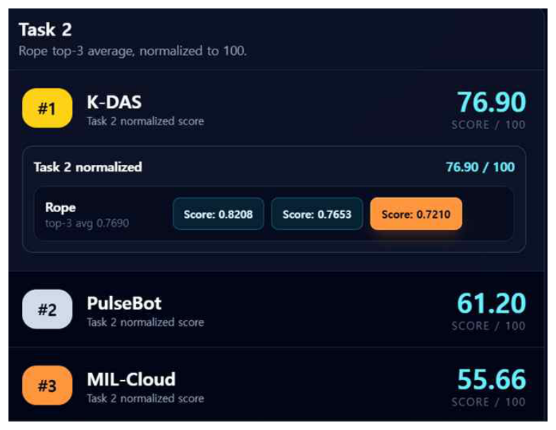
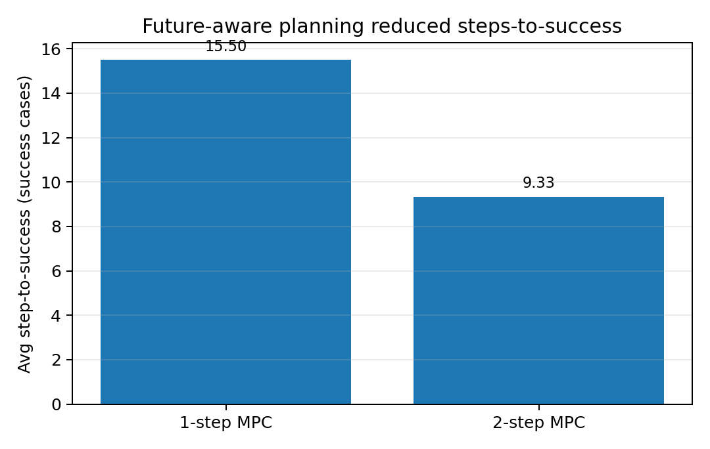

<p align="center">
  
</p>

# MPC Teacher for Rope Manipulation

**Task 2 · Linear Deformable Object Shape Control · Team K-DAS**

This module describes the MPC layer that generates **teacher actions** using the DER + Residual GNN hybrid dynamics model. It generates feasible grasp, direction, and stroke candidates from the current rope state, predicts the resulting rope shape for each candidate, and selects the action that approaches the target shape more reliably.

> **Core question**  
> Can we generate teacher actions that are not only good for the current step, but also remain stable when the next step is considered?

---

## 1. Problem Context

<p align="center">
  
</p>

<p align="center"><i>Overlay of the current and target rope shapes observed in the CloudGripper environment. MPC selects actions that reduce the difference between these two shapes.</i></p>

In Task 2, the rope with one fixed endpoint is represented using 20 ordered nodes. Because a single action affects not only the selected node but also the overall rope shape, stable control cannot be achieved simply by pulling the node with the largest current error.

The role of MPC is to:

- systematically generate feasible actions
- predict the rope state after each action using DER + Residual GNN
- compare immediate error and future cost
- record the best first action as a teacher transition

---

## 2. Why MPC?

DER and Residual GNN made it possible to predict the next rope state, but a predictive model alone cannot select an action. Rope manipulation introduced several additional challenges.

- An action may reduce the current error while making the next manipulation more difficult
- It is difficult to hand-design rules for combinations of grasp node, direction, and stroke length
- A consistent source of teacher actions is required for BC/RL training

We therefore used the hybrid dynamics model as a **candidate evaluator** and let MPC select high-quality actions.

---

## 3. Action Candidate Generation

<p align="center">
  
</p>

<p align="center"><i>Action candidate cloud generated by combining multiple directions and stroke lengths around each rope node.</i></p>

Each action is represented by three components.

$$
a=(i_{\mathrm{grasp}},\theta_{\mathrm{bin}},\ell_{\mathrm{bin}})
$$

- **grasp node index**: which node to grasp
- **direction bin**: in which direction to drag
- **stroke length bin**: how far to move

Evaluating every candidate to the same planning depth is computationally expensive. Therefore, candidates are first evaluated with a 1-step rollout, only the best candidates are retained in a shortlist, and 2-step expansion is then applied to that shortlist.

---

## 4. Transition Model: DER + Residual GNN

The rope state after a candidate action is predicted using the following hybrid model.

$$
\hat X_{t+1}=f_{\mathrm{DER+GNN}}(X_t,a_t)
$$

- DER: provides fixed-end behavior, bending, damping, and basic deformation propagation
- Residual GNN: corrects systematic prediction error between DER and the real robot

For 2-step planning, another action is applied from the first predicted state.

$$
\hat X_{t+2}=f_{\mathrm{DER+GNN}}(\hat X_{t+1},a_{t+1})
$$

MPC performance therefore depends not only on the cost function, but also on the accuracy and edge consistency of the transition model.

---

## 5. Cost and Edge Projection

MPC computes the cost from the difference between the predicted rope and the target rope. The main terms are:

$$
J=w_{\mathrm{pos}}E_{\mathrm{pos}}+w_{\mathrm{shape}}E_{\mathrm{shape}}+w_{\mathrm{edge}}E_{\mathrm{edge}}
$$

- node-wise position error
- overall shape and local-tangent difference
- edge-length and total-length consistency

Because edge drift can occur in Residual GNN predictions, **goal edge-length projection** was added inside MPC.

<p align="center">
  
</p>

<p align="center"><i>Stronger projection reduces edge error, but excessive correction can degrade shape tracking.</i></p>

| Projection alpha | Success rate | Final mean error | Final edge error |
|---:|---:|---:|---:|
| 0.00 | 60% | 5.00 mm | 14.70% |
| 0.50 | 100% | 3.50 mm | 5.79% |
| 1.00 | 20% | 8.15 mm | 1.72% |

`alpha=0.50` provided the most stable balance between success rate and edge consistency. Stronger edge projection was not always better; a practical trade-off was required between physical consistency and target-shape tracking.

---

## 6. 1-step MPC

1-step MPC evaluates the predicted error immediately after each candidate action and selects the action with the lowest cost.

$$
a_t^*=\arg\min_{a\in\mathcal A(X_t)}J_1(a)
$$

Its relatively simple structure and lower computational cost made it suitable for early teacher-data collection and the mid-term evaluation.

<p align="center">
  
</p>

<p align="center"><i>Using 1-step MPC, K-DAS achieved a normalized score of 76.90/100 and ranked 1st in the Task 2 mid-term evaluation.</i></p>

The top-3 average score was `0.7690`, with individual scores of `0.8208 / 0.7653 / 0.7210`. This confirmed that 1-step MPC alone was sufficient to provide strong baseline rope-shape control.

However, later rollouts revealed several limitations.

- Some actions appeared good immediately after execution but made the next step difficult
- Near-goal failures occurred when the system approached the target and then moved away again
- The teacher signal was not sufficiently aligned with long-term convergence for RL training

---

## 7. 2-step MPC

2-step MPC evaluates another set of candidate actions from the predicted state after the first action and considers both immediate and future cost.

$$
J_{\mathrm{total}}=0.3J_{\mathrm{now}}+0.7J_{\mathrm{future}}
$$

$$
a_t^*=\arg\min_{a_t}\left(J_1(a_t)+\lambda J_2(a_t)\right)
$$

A larger weight is assigned to future cost so that the planner prioritizes actions that remain easy to continue from, rather than actions that only reduce the current error.

As the planning horizon increases, search cost grows approximately as:

$$
1\text{-step}:O(B),\qquad 2\text{-step}:O(B^2),\qquad H\text{-step}:O(B^H)
$$

Because every candidate requires a DER rollout and GNN inference, 2-step planning provided a practical compromise between teacher quality and computational cost.

---

## 8. 1-step vs. 2-step Results

The following table compares 1-step MPC and 2-step MPC under the same evaluation seeds.

| Mode | Success rate | Avg. steps to success | Selected 1-step predicted error | Selected future predicted error | One-step cost $J_1$ | Future cost $J_{future}$ | Total cost $J_{total}$ | Final mean error | Best mean error |
|---|---:|---:|---:|---:|---:|---:|---:|---:|---:|
| **1-step MPC** | 4/5 | 15.50 | 12.057 mm | 11.568 mm | 0.063959 | 0.059454 | 0.060806 | 4.408 mm | 3.751 mm |
| **2-step MPC** | **5/5** | **9.33** | **9.929 mm** | **8.984 mm** | **0.061834** | **0.054412** | **0.058725** | **3.685 mm** | **3.516 mm** |

<p align="center">
  
</p>

2-step MPC did more than simply extend the planning horizon by one step. It produced **faster convergence and more stable teacher actions**. In particular, the success rate improved from 4/5 to 5/5, while the average number of steps to success decreased from 15.50 to 9.33.

---

## 9. Target-edge GNN in MPC

Replacing the original `exp2` GNN with the `target-edge weight500` GNN also improved the closed-loop performance of 2-step MPC.

| Metric | exp2 + 2-step MPC | target-edge w500 + 2-step MPC |
|---|---:|---:|
| Success rate | Approximately 0.8 | Approximately 0.9 |
| Final mean error | Approximately 4.51 mm | Approximately 3.57 mm |
| Best mean error | Approximately 3.81 mm | Approximately 3.57 mm |
| Near-goal failure rate | Approximately 0.2 | Approximately 0.0 |

The target-edge model was not always superior in standalone position RMSE, but its improved edge consistency produced more stable rollouts when combined with planning. This indicates that a transition model should be evaluated not only by one-step RMSE, but also by its downstream closed-loop planning performance.

---

## 10. Teacher Dataset Generation

The final teacher dataset was collected using the following configuration.

| Item | Setting |
|---|---|
| GNN model | target-edge weight500 |
| Planner | 2-step MPC |
| Stroke length bins | 0.1, 0.15, 0.2, 0.25, 0.3, 0.35, 0.4, 0.5, 0.6, 0.7, 0.8 |
| Goal edge projection | ON |
| Feasible target projection | ON |
| Candidate ranking | Store top-k candidates |
| Purpose | Teacher dataset for BC/RL retraining |

JSONL records were collected in parallel across multiple workers and then merged, resulting in more than approximately 20,000 step records. In addition to the selected action, shortlist candidates and their relative quality were stored so that the same dataset could support candidate-aware RL.

---

## 11. Why MPC Was Not the Final Runtime Policy

MPC generates high-quality actions, but repeatedly running it at every real-robot step is computationally expensive.

- Repeated rollouts over many candidates
- Increased computational cost from 2-step expansion
- Need for fast action decisions on the real robot

MPC was therefore used not as the **final real-time controller**, but as a **teacher generator**. Behavior Cloning and candidate-aware offline RL were then trained to approximate MPC decisions with much faster inference.

---

## 12. Limitations

- A 2-step horizon cannot directly plan all long-term deformation effects
- Discrete candidate bins do not search the continuous optimum directly
- Transition-model error can accumulate during planning
- Per-step correction magnitude before and after projection was not logged explicitly
- Actions that perform well in simulation or rollout do not always behave identically on real hardware

For these reasons, the final system also required a separate geometry-aware runtime-safety layer and score-hold logic.

---

## 13. Repository Structure

```text
task2/planning/mpc/
├── README.md
├── src/
│   ├── candidate_generator.py
│   ├── transition_model.py
│   ├── cost.py
│   ├── edge_projection.py
│   ├── one_step_mpc.py
│   └── two_step_mpc.py
├── configs/
├── scripts/
├── results/
```

---

> All visual assets are managed centrally in the repository-level `images/` directory.

## 14. Takeaway

K-DAS MPC served as the planning layer that connected the hybrid dynamics model to actual action selection. 1-step MPC provided strong baseline performance and ranked 1st in the mid-term evaluation, while 2-step MPC incorporated future cost and improved success rate, steps-to-success, and final error.

> **The final role of MPC was not to deploy a slow optimal controller directly, but to generate future-aware teacher actions and candidate rankings that could later be learned by BC/RL.**
