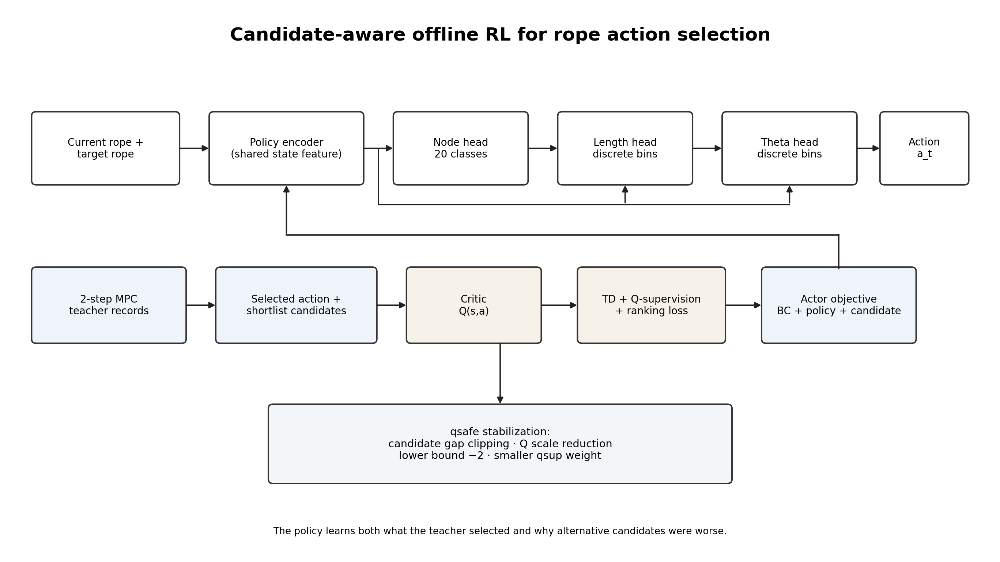
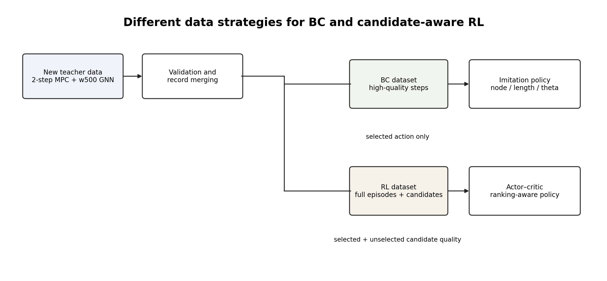
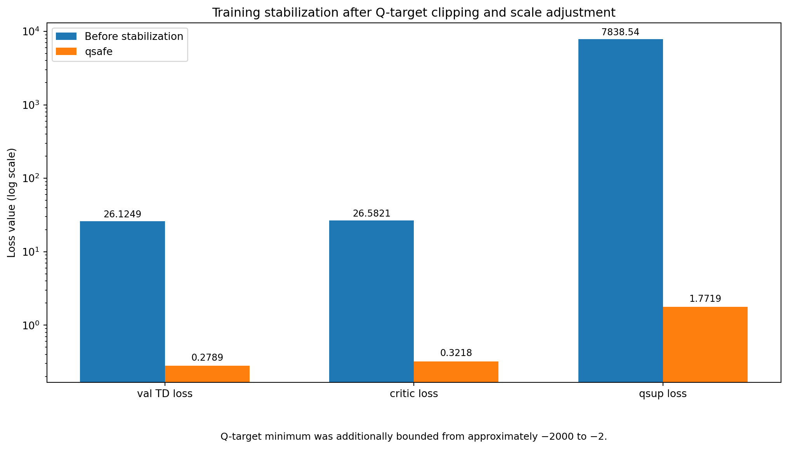
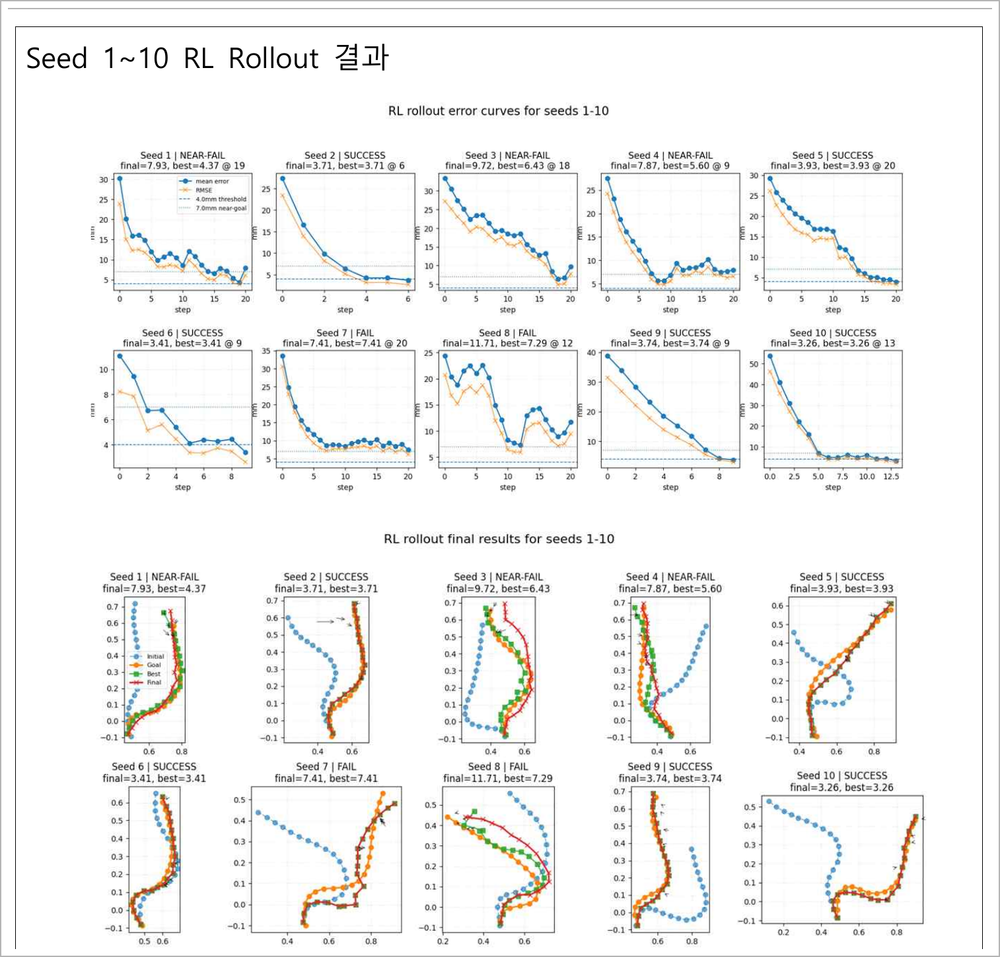
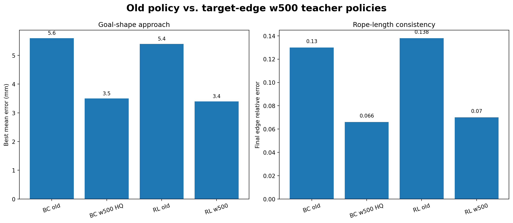
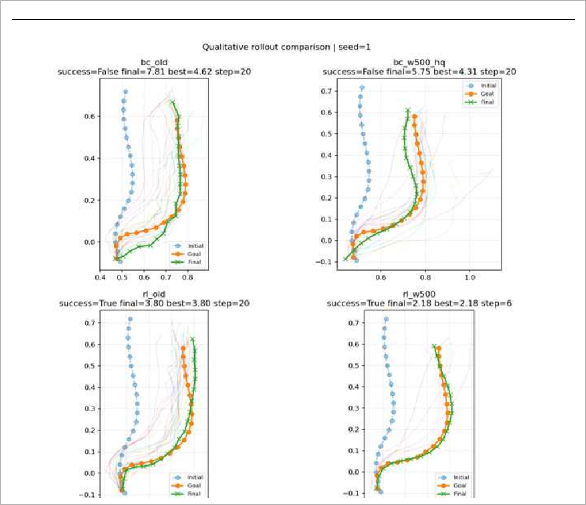
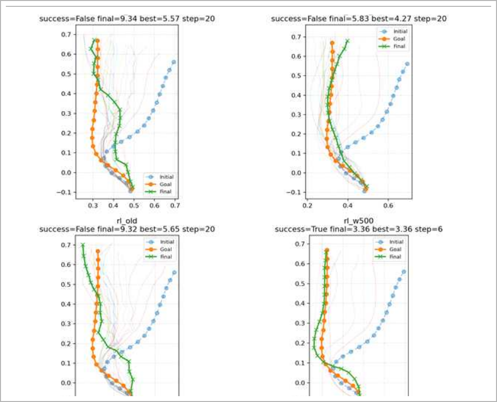

# Candidate-aware Offline RL for Rope Manipulation

**Task 2 · Linear Deformable Object Shape Control · Team K-DAS**

이 모듈은 2-step MPC가 생성한 teacher dataset을 이용해, 계산량이 큰 MPC action selection을 빠른 neural policy로 근사한다. Behavior Cloning(BC)은 teacher가 선택한 action을 직접 모방하고, candidate-aware offline RL은 한 단계 더 나아가 동일한 state에서 평가된 **selected action과 unselected shortlist candidate의 상대적 품질**까지 학습한다.

> **핵심 질문**  
> “MPC가 선택한 정답 action 하나만 복제하는 것이 아니라, 여러 후보 중 무엇이 더 좋고 무엇을 피해야 하는지도 학습할 수 있는가?”

---

## 1. Why a Learned Policy?

2-step MPC는 future cost를 고려한 고품질 action을 생성했지만, 매 step마다 다수의 candidate를 DER + Residual GNN으로 rollout해야 했다. 실제 로봇에서는 관측 이후 빠르게 action을 결정해야 하므로, MPC를 그대로 반복 실행하는 방식은 계산 효율 측면에서 제한이 있었다.

따라서 MPC는 **teacher generator**, neural network는 **fast policy**로 역할을 분리하였다.

- **MPC**: 느리지만 상대적으로 신뢰할 수 있는 action과 candidate ranking 생성
- **BC/RL policy**: 현재 rope와 target rope를 입력받아 즉시 action 출력
- **Runtime safety**: policy action을 실제 robot geometry와 servo limit에 맞게 보정

---

## 2. Position in the Full Task 2 System

```text
DER + Residual GNN transition model
              │
              ▼
       2-step MPC teacher
              │
     selected action + shortlist
              │
       ┌──────┴─────────┐
       ▼                ▼
Behavior Cloning   Candidate-aware RL
       │                │
       └──────┬─────────┘
              ▼
 Fast node / length / theta policy
              │
              ▼
 Geometry-aware runtime safety
```

관련 문서:

- Task 2 overview: [`../../README.md`](../../README.md)
- Residual GNN: [`../../dynamics/residual_gnn/README.md`](../../dynamics/residual_gnn/README.md)
- MPC teacher: [`../../planning/mpc/README.md`](../../planning/mpc/README.md)
- Runtime safety: [`../../runtime/README.md`](../../runtime/README.md)

---

## 3. Action Representation

Policy는 rope manipulation action을 세 개의 discrete component로 분해하여 예측한다.

$$
a_t=(i_{node},\ell_{bin},\theta_{bin})
$$

- **Node index**: 20개 ordered rope node 중 어느 지점을 파지할 것인가
- **Length bin**: 어느 정도의 stroke length로 drag할 것인가
- **Theta bin**: 어느 방향으로 drag할 것인가

새 teacher dataset에서는 실제 로봇에서 지나치게 작은 stroke가 반복되는 문제를 줄이기 위해 다음 length bin을 사용하였다.

```python
DEFAULT_LENGTH_BINS = (
    0.10, 0.15, 0.20, 0.25, 0.30,
    0.35, 0.40, 0.50, 0.60, 0.70, 0.80,
)
```

Continuous teacher length는 가장 가까운 discrete bin index로 변환되어 classification target으로 사용된다.

---

## 4. Teacher Dataset Construction



새 데이터는 다음 구성으로 생성되었다.

| Item | Configuration |
|---|---|
| Dynamics model | Target-edge weight500 Residual GNN |
| Planner | 2-step MPC |
| Edge projection | ON |
| Candidate records | Selected action + top-k shortlist ranking |
| Stroke length bins | 0.10–0.80 |
| Collection | Multi-worker JSONL merging |
| Scale | 약 2만 개 이상의 step record |

통합 후 malformed line, episode boundary, step count, success/final/best error와 action distribution을 검증하였다. BC와 RL은 학습 목적이 다르므로 같은 record를 동일하게 사용하지 않았다.

---

## 5. Behavior Cloning as the Supervised Baseline

BC는 teacher가 선택한 action을 정답으로 보고 node, length, theta를 모방한다.

$$
L_{BC}=L_{node}+L_{length}+L_{theta}
$$

실패 episode와 명백하게 나쁜 step까지 모두 정답으로 사용하면 actor가 불안정한 action을 학습할 수 있으므로, BC에는 **high-quality step dataset**을 사용하였다.

필터는 다음 원칙으로 구성되었다.

- 목표 근처 미세 조정 step을 포함하되, action 이후의 과도한 악화는 제외
- 일시적으로 최대 약 1 mm 악화되는 correction step은 허용
- 새로운 length-bin 범위와 일치하는 action만 사용
- 실제로 자주 필요한 endpoint/keypoint 선택을 임의로 제거하지 않도록 node balancing은 초기 학습에서 강제하지 않음

BC는 안정적인 초기 policy와 강한 supervised baseline을 제공했지만, closed-loop 중 dataset 밖 state가 누적되면 흔들릴 수 있다는 한계가 있다.

---

## 6. Why Candidate-aware RL?

MPC 내부에는 최종 selected action 하나만 존재하는 것이 아니라, 같은 state에서 평가된 여러 shortlist candidate가 존재한다. 선택되지 않은 후보 역시 **상대적으로 좋지 않았다는 정보**를 포함한다.

BC는 다음만 학습한다.

```text
state → selected action
```

Candidate-aware RL은 다음 정보를 함께 활용한다.

```text
state
selected action
unselected candidate actions
candidate predicted errors / costs
candidate ranking
next state
episode boundary / terminal success
```

따라서 이 정책은 “무엇을 했는가?”뿐 아니라 “같은 상태에서 다른 후보가 왜 덜 좋았는가?”를 critic을 통해 학습하도록 설계되었다.

---

## 7. Relative Candidate Q Target

Candidate $k$의 predicted mean error를 $m_k$, shortlist에서 가장 좋은 error를 $m^*$라고 하면 relative Q target은 다음과 같이 구성된다.

$$
q_k^{target}=-\mathrm{clip}\left(m_k-m^*,\,0,\,M\right)\,c_q
$$

- Best candidate: $m_k\approx m^*$이므로 Q target이 0에 가까움
- Worse candidate: best와의 error gap이 커질수록 더 작은 음의 Q target
- $M$: extreme gap이 target scale을 폭증시키지 않도록 제한하는 clip 범위
- $c_q$: Q target scale

이 방식은 absolute score를 그대로 학습하기보다, **동일한 state 내 candidate의 상대적 품질**을 critic supervision에 사용한다.

---

## 8. Actor–Critic Objectives

Critic은 Bellman TD와 candidate-level supervision, ranking 정보를 함께 사용한다.

$$
L_{critic}=L_{TD}+\lambda_{qsup}L_{Qsup}+\lambda_{rank}L_{rank}
$$

Actor는 teacher imitation과 critic이 높게 평가하는 action 선택을 동시에 반영한다.

$$
L_{actor}=\lambda_{BC}L_{BC}+\lambda_{RL}L_{policy}+\lambda_{cand}L_{candidate}
$$

여기서 각 항의 역할은 다음과 같다.

| Loss | Function |
|---|---|
| $L_{BC}$ | MPC teacher action을 안정적으로 모방 |
| $L_{policy}$ | Critic이 높은 값을 주는 action을 선호 |
| $L_{candidate}$ | Candidate distribution과 relative quality 반영 |
| $L_{TD}$ | Episode transition의 temporal consistency 학습 |
| $L_{Qsup}$ | MPC candidate error에서 만든 relative Q target 지도 |
| $L_{rank}$ | Candidate ordering 보존 |

---

## 9. The Initial Instability Problem

초기 candidate-aware RL에서는 val TD loss와 qsup loss가 급격히 증가하며 critic이 발산하였다. 원인은 candidate distribution 전체가 나빴기 때문이 아니라, **매우 적은 비율의 extreme error가 Q target scale을 지배한 것**이었다.

주요 통계와 clipping 적용 전후의 변화는 다음과 같다.

| Metric | Original data / logic | After clipping / qsafe |
|---|---:|---:|
| Candidate error mean | 19.2055 mm | Unchanged |
| Candidate error median | 14.4993 mm | Unchanged |
| Candidate error p95 | 43.5314 mm | Unchanged |
| Candidate error p99 | 51.6757 mm | Unchanged |
| Maximum candidate error | 12,404.6729 mm | Unchanged |
| Error > 100 mm ratio | 0.0223% | Unchanged |
| Error > 500 mm ratio | 0.0111% | Unchanged |
| Error > 1,000 mm ratio | 0.0097% | Unchanged |
| Minimum Q target | −1237.9601 | Hard lower bound: −2 |
| Q target p1 | −0.7281 | qsafe: −0.1456 |
| Q target median | −0.0456 | qsafe: −0.0091 |
| Maximum Q target | 0.0000 | 0.0000 |
| Q target < −2 ratio | 0.0752% | 0% |
| qsup divergence observed | Yes | No |

대부분의 candidate는 정상 범위였지만, 0.01%보다 작은 outlier도 squared/supervised critic loss에서는 매우 큰 gradient를 만들 수 있었다.

---

## 10. qsafe Stabilization

`qsafe`는 node 선택 비중을 조절한 별도 heuristic policy가 아니다. Candidate-aware RL의 **Q target과 critic training을 안전한 수치 범위로 제한한 안정화 configuration**이다.

적용한 핵심 조치는 다음과 같다.

| Stabilization item | Setting / role |
|---|---|
| Candidate Q target mode | Relative |
| Candidate metric gap clip | 30.0 |
| Candidate Q scale | 0.02 |
| Q target lower bound | −2.0 |
| qsup coefficient | 낮은 값으로 조정 |
| Ranking loss | 유지 |
| Actor candidate soft loss | 유지 |



학습 안정화 전후의 주요 로그를 표로 정리하면 다음과 같다.

| Item | Before stabilization | After qsafe | Summary |
|---|---|---|---|
| Validation TD loss | Rose as high as 26.1249; 23.4958 at E059 | 0.2789 at E100 | 26.1249 → 0.2789 |
| qsup loss | Batch spike of 7838.5371 | Validation 1.7719 at E100 | 7838.5371 → 1.7719 |
| Minimum Q target | Outliers around −2000 | Clipped with lower bound −2 | ≈ −2000 → −2 |
| Validation critic loss | Peak 26.5821 around E053 | 0.3218 at E100 | 26.5821 → 0.3218 |
| Best-checkpoint update | No stable best save during the unstable interval | Best updated at E098; training completed through E100 | best_epoch = 98 |
| Triple accuracy | Approximately 0.155–0.169 in unstable validation | Best validation triple accuracy 0.231 | Improved |
| Ranking loss | 0.6885 at E059; peak 0.7204 | 0.6823 at E100 | 0.6885 → 0.6823 |
| Candidate gap | 0.0810 at E059 | 0.0587 at E100 | 0.0810 → 0.0587 |

Clipping은 단순한 성능 튜닝이 아니라, 소수 outlier가 critic 전체를 발산시키는 것을 막기 위한 필수적인 numerical stabilization이었다.

---

## 11. First qsafe Rollout Evaluation

학습이 안정화된 초기 qsafe model을 seed 1–10에서 평가하였다. Success criterion은 mean node error 4 mm 이하이다.



| Metric | Result |
|---|---:|
| Success | 5 / 10 |
| Reached near-goal | 8 / 10 |
| Failure after near-goal | 3 / 10 |
| Average final mean error | 6.27 mm |
| Average best mean error | 4.91 mm |
| Average final RMSE | 5.01 mm |
| Average best RMSE | 3.96 mm |

이 결과는 policy가 목표 형상 근처까지 접근하는 능력은 확보했지만, near-goal 상태에서 다시 멀어지는 문제는 남아 있었음을 보여준다. 따라서 qsafe를 최종적인 모든 문제의 해결책으로 설명해서는 안 된다.

---

## 12. Retraining with the Target-edge w500 Teacher

이후 target-edge w500 GNN과 2-step MPC로 teacher dataset을 다시 만들고, BC는 high-quality steps로, RL은 full episode/candidate records로 재학습하였다.



| Model | Best mean error | Final edge relative error |
|---|---:|---:|
| BC old | 약 5.6 mm | 약 0.130 |
| BC w500 HQ | 약 3.5 mm | 약 0.066 |
| RL old | 약 5.4 mm | 약 0.138 |
| RL w500 | 약 3.4 mm | 약 0.070 |

새 policy의 개선은 RL objective만의 효과가 아니라, 다음 전체 pipeline 개선이 결합된 결과로 해석해야 한다.

1. Target-edge GNN으로 transition consistency 개선
2. 2-step MPC로 future-aware teacher 생성
3. BC/RL 목적에 맞는 dataset 분리
4. qsafe로 candidate Q supervision 안정화

---

## 13. Qualitative Rollout Cases

### 13.1 Seed 1



Seed 1에서는 RL w500이 6 step 만에 약 2.18 mm까지 수렴하였다. 동일한 initial/goal shape에서도 teacher와 residual model이 바뀌면 rollout 경로와 최종 형상이 달라진다는 점을 확인할 수 있다.

### 13.2 Seed 4



Seed 4에서는 기존 BC/RL이 success threshold에 도달하지 못한 반면, RL w500은 약 3.36 mm로 성공하였다. Candidate ranking을 학습한 정책이 일부 어려운 state에서 추가적인 강건성을 제공한 사례다.

---

## 14. BC and RL Are Complementary

| Category | Behavior Cloning | Candidate-aware RL |
|---|---|---|
| Main data | High-quality teacher steps | Full episode + candidate ranking |
| Main objective | Teacher action imitation | High-value action preference + candidate quality |
| Strength | Stable and efficient supervised policy | Closed-loop distribution shift와 후보 비교 반영 |
| Main risk | Dataset 밖 state에서 error accumulation | Critic/Q-target instability |
| Role in K-DAS | Strong baseline / supervised anchor | Difficult rollout에서 추가적인 robustness |

새 BC 자체도 상당히 강했다. 일부 seed에서는 BC w500 HQ가 RL보다 더 빠르거나 낮은 error를 기록할 수 있다. 따라서 RL을 BC보다 항상 우월한 모델로 설명하기보다는, **BC는 안정적인 teacher imitation, RL은 후보의 상대적 품질과 closed-loop 분포 변화를 보완하는 구조**로 설명하는 것이 정확하다.

---

## 15. Inference Flow

```python
def select_action(current_rope, target_rope):
    state_feature = policy.encode(current_rope, target_rope)

    node_logits = policy.node_head(state_feature)
    length_logits = policy.length_head(state_feature)
    theta_logits = policy.theta_head(state_feature)

    action = decode_discrete_action(
        node_logits=node_logits,
        length_logits=length_logits,
        theta_logits=theta_logits,
    )

    # The learned output is not executed blindly.
    return runtime_safety_adjust(action, current_rope, target_rope)
```

Policy는 MPC보다 빠르게 action을 출력하지만, 실제 로봇에서는 directed tangent, rotation sign, endpoint limit, geometry risk와 score hold가 추가로 적용된다.

---

## 16. Limitations

- 초기 qsafe rollout success rate는 5/10으로, policy만으로 완전한 안정성을 확보하지 못함
- 8/10 seed가 near-goal에 접근했지만 일부는 이후 다시 error가 증가함
- Repeated node selection과 near-node repetition은 qsafe에서도 완전히 해결되지 않음
- Discrete action bins 때문에 continuous optimum을 직접 표현하지 못함
- Teacher dataset과 residual dynamics domain 밖 rope/material에는 일반화가 제한될 수 있음
- Offline dataset quality와 candidate-ranking calibration에 성능이 크게 의존함
- 최종 robot performance는 policy뿐 아니라 runtime safety와 release/hold execution에 함께 의존함

---

## 17. Repository Guide

```text
task2/policy/candidate_aware_rl/
├── README.md
├── src/
│   ├── policy.py
│   ├── critic.py
│   ├── losses.py
│   ├── action_codec.py
│   └── inference.py
├── datasets/
│   └── README.md
├── configs/
│   ├── bc_w500_hq.yaml
│   └── rl_w500_qsafe.yaml
├── scripts/
│   ├── build_bc_dataset.py
│   ├── merge_episode_records.py
│   ├── train_bc.py
│   ├── train_rl.py
│   └── evaluate_rollout.py
├── models/README.md
├── results/

