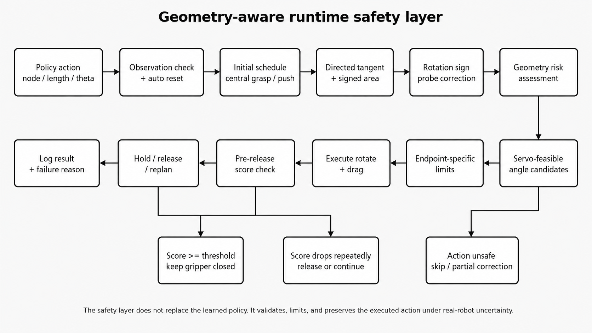
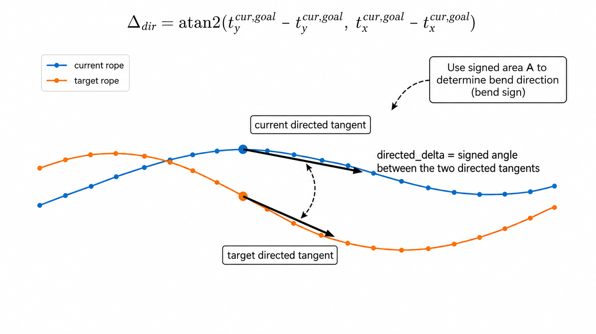
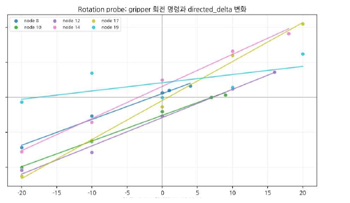
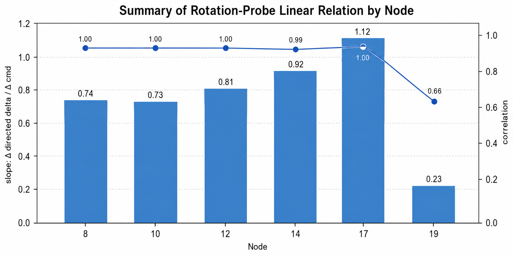
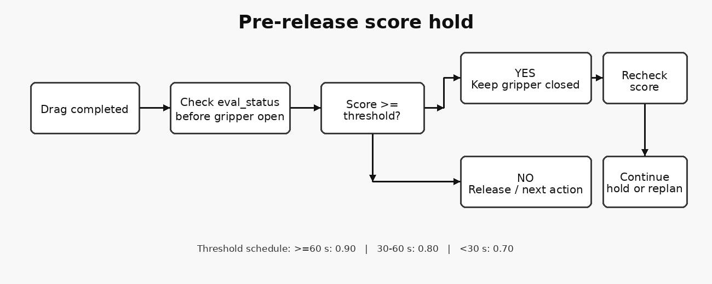
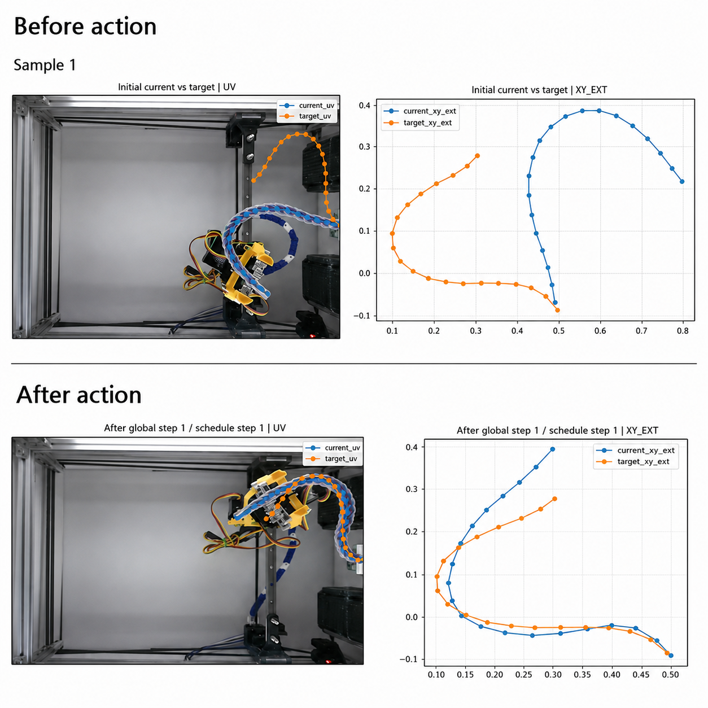
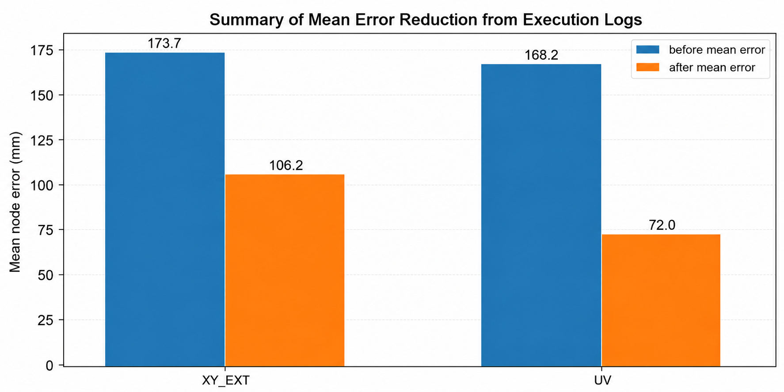

<p align="center">
  
</p>

# Runtime Safety for Real-Robot Rope Manipulation

**Task 2 · Linear Deformable Object Shape Control · Team K-DAS**

This module describes the **geometry-aware runtime safety layer** used to validate, limit, and correct actions produced by the BC/RL policy before executing them on the real CloudGripper, while also preserving high-scoring states until the final evaluation.

Runtime safety is not a separate policy that replaces the learned model. It is an execution layer that handles real-hardware uncertainty that can arise when the node, drag length, and direction selected by the policy are executed directly.

> **Core question**  
> “How can we preserve the learned policy while reducing real-robot errors caused by rotation direction, servo limits, endpoint sensitivity, and shape collapse after release?”

---

## 1. Why a Runtime Safety Layer Was Needed

Action-selection performance improved through DER, Residual GNN, the MPC teacher, and BC/RL. However, the real robot repeatedly exhibited failure modes that were absent from simulation and offline rollouts.

- Temporary rope-detection failures that produced invalid states
- Local tangent alignment opposite to the target after grasping
- Instability caused by manipulating endpoints too early in the episode
- A mismatch between `robot.rotate(angle)` and the intuitive direction of rope rotation
- A real servo absolute-angle range limited to `0°–180°`
- Less reliable rotation transfer at nodes 18–19 than in the central region
- Score loss caused by rope relaxation immediately after gripper release
- A reset bias that caused the rope to begin tilted toward a particular direction

The final system therefore evolved into the following structure.

```text
Learned policy
      │
      ▼
Geometry-aware action validation
      │
      ▼
Real-robot execution and score preservation
```

Related documentation:

- Task 2 overview: [`../README.md`](../README.md)
- MPC teacher: [`../planning/mpc/README.md`](../planning/mpc/README.md)
- Candidate-aware RL: [`../policy/candidate_aware_rl/README.md`](../policy/candidate_aware_rl/README.md)

---

## 2. Safety Layer Overview

Runtime safety performs five primary roles.

| Stage | Role | Main mechanism |
|---|---|---|
| Observation safety | Prevent action execution from an invalid state | Rope detection validation, automatic reset |
| Initial stabilization | Stabilize the overall rope configuration first | Central-node priority, target-directed initial push |
| Direction safety | Prevent local direction from being aligned in the wrong orientation | Directed tangent, signed area, rotation probe |
| Hardware safety | Limit infeasible or excessive rotations | Servo-feasible angle, geometry risk, endpoint limits |
| Score preservation | Preserve a good shape until final evaluation | Step-level hold, pre-release score hold |

---

## 3. Observation Validation and Automatic Recovery

If rope-node extraction fails or node ordering becomes invalid, all downstream geometry calculations become unreliable. Therefore, the system does not force execution when the rope observation is invalid. Instead, it performs recovery in the following sequence.

1. Validate the number and ordering of rope nodes
2. Check current and target coordinate ranges
3. Increment the consecutive detection-failure count
4. Reset the environment after a configured number of failures
5. Re-observe the state after reset and resume planning

This structure reduces the chance that temporary lighting variation or segmentation failure causes an entire run to fail.

---

## 4. Initial Stabilization Strategy

### 4.1 Central-node priority

During the first 1–2 steps, central nodes are prioritized over endpoints. Manipulating the central region first helps stabilize the rope’s overall position and orientation before applying finer endpoint corrections. In contrast, moving an endpoint too aggressively at the beginning can propagate a small local error across the entire rope.

### 4.2 Target-directed initial push

After reset, the rope was often observed to start with a directional bias rather than in a perfectly neutral configuration. To reduce this bias, a single push was applied near node 19 in the direction opposite to the target deformation.

| Target direction | Initial correction | Purpose |
|---|---|---|
| Target above | Push node 19 downward | Create room for upward deformation |
| Target below | Push node 19 upward | Prevent endpoint drift for downward targets |
| Neutral / unknown | Use fallback sign | Apply a default correction under uncertainty |

---

## 5. Node-Order-Based Directed Tangent

The rope is not simply an unordered set of points; it is an ordered linear structure. Therefore, even if the selected node is close to its target position, the global shape can still be incorrect if the local tangent is aligned in the opposite direction.

For a selected node `i`, the tangent along the increasing node-index direction is defined as:

$$
 t_i = \frac{p_{i+k}-p_{i-k}}{\|p_{i+k}-p_{i-k}\|}
$$

If the current and target rope tangents are denoted by `t_cur` and `t_goal`, the signed angle is:

$$
\Delta_{dir}=\mathrm{atan2}\left(t_{cur,x}t_{goal,y}-t_{cur,y}t_{goal,x},\ t_{cur}\cdot t_{goal}\right)
$$

`directed_delta` is therefore not a simple angle difference. It indicates **which rotational direction is required while preserving node ordering**.

<p align="center">
  
</p>

---

## 6. Signed Area and Bend Diagnosis

Three points around the selected node are used to diagnose the local bend direction.

$$
 a=p_i-p_{i-k},\qquad b=p_{i+k}-p_i
$$

$$
 A=a_xb_y-a_yb_x
$$

Comparing the signs of the current and target signed areas indicates whether the local bend is oriented in the same direction.

| Diagnosis | Meaning | Caution |
|---|---|---|
| `bend_same_sign = True` | Current and target bends have the same orientation | Does not guarantee that the selected action is safe |
| `False` | Current and target bends have opposite orientations | May be a candidate for direction correction |
| `None` | Signed area is close to zero | Reliability is lower near endpoints |

Signed area is used only as an auxiliary diagnostic. Final safety decisions also consider directed delta, selected rotation, overshoot, reversal, and endpoint status.

---

## 7. Rotation Probe and Command Sign Correction

Initially, we assumed that the selected rotation and directed delta should have the same sign for a correct rotation. However, a rotation-only probe on robot27 showed that `robot.rotate(+δ)` generally increased directed delta rather than reducing it.

The desired command sign for driving directed delta toward zero was therefore interpreted as:

$$
\mathrm{sgn}\left(\Delta_{cmd,desired}\right)\approx-\mathrm{sgn}\left(\Delta_{dir}\right)
$$

This result was not applied as a global sign reversal to every action. Partial direction correction was used only when the selected action conflicted with the measured sign convention.

<p align="center">
  
</p>

For nodes 8–17, the correlation between rotation command and directed-delta change was greater than 0.995. In contrast, node 19 showed a lower correlation of 0.663.

<p align="center">
  
</p>

| Node | Slope | Correlation | Interpretation |
|---:|---:|---:|---|
| 8 | +0.739 | 0.995 | Rotation command is reflected consistently in local-direction change |
| 10 | +0.733 | 0.997 | Strong linear consistency |
| 12 | +0.808 | 0.996 | Strong linear consistency |
| 14 | +0.918 | 0.995 | Strong linear consistency |
| 17 | +1.115 | 0.997 | Near endpoint but still relatively consistent |
| 19 | +0.235 | 0.663 | Rotation transfer is unstable due to endpoint behavior |

---

## 8. Geometry Risk Control

Geometry risk is not the final task score. It is an auxiliary diagnostic that estimates the **likelihood that the selected rotation conflicts with the local rope geometry**.

The following factors are evaluated.

| Risk factor | Check | Control response |
|---|---|---|
| Direction sign consistency | Does the selected delta agree with `-sign(directed_delta)`? | Apply correction or increase risk if inconsistent |
| Magnitude risk | Is the rotation excessively large? | Attenuate rotation using a risk scale |
| Overshoot risk | Does the rotation exceed the required correction? | Promote risk to HIGH / VERY_HIGH |
| Direction reversal | Is directed delta near ±150°? | Treat as a local orientation reversal |
| Endpoint risk | Is signed-area reliability low at nodes 18–19? | Apply endpoint-specific limits |

As risk increases, the runtime layer may:

- keep the original action
- attenuate rotation magnitude
- apply limited partial correction
- choose an alternative servo target
- skip rotation entirely

A HIGH geometry risk does not necessarily imply that the action will fail. If the translational component is sufficiently beneficial, the overall node error can still decrease even under a HIGH-risk rotation. Therefore, geometry risk is used as a **diagnostic signal for conservative execution**, not as a binary failure label.

---

## 9. Servo-Feasible Angle Selection

The CloudGripper servo operates within an absolute-angle range of `0°–180°`. Therefore, a simple angle difference that assumes 360° wraparound can produce infeasible or unnecessarily large rotations.

Considering the axis equivalence of the target local tangent, the following candidates are evaluated.

```text
goal
goal + 180°
goal - 180°
```

For each candidate, the system checks:

1. Whether the servo target lies within `0°–180°`
2. Whether the delta from the current angle is within the maximum allowed rotation
3. Whether the resulting geometry risk is acceptable

If no feasible candidate exists or the maximum delta is exceeded, after-grasp rotation is skipped. This reduces abnormal large rotations near the 0/180 boundary, such as `current=168.11°`, `goal=11.31°`.

---

## 10. Endpoint-Specific Correction

Endpoints strongly affect the overall rope shape, but contact-force and tension transfer are less stable than in the central region. Because node 19 showed low correlation in the rotation probe, the same correction policy used for central nodes was not applied directly to the endpoint.

Endpoint-specific settings include:

- Maximum rotation delta
- Direction-correction ratio
- Geometry-risk scale
- Reduced confidence in signed-area diagnosis

Endpoint correction is therefore not prohibited. Instead, **necessary corrections are allowed but constrained more conservatively than in the central region**.

---

## 11. Score Hold and Pre-Release Hold

For Task 2, the final score at the end of the time limit can matter more than the maximum score observed during the run. Continuing to execute actions after reaching a high score is therefore not always beneficial.

### 11.1 Time-dependent hold threshold

| Remaining time | Hold threshold | Purpose |
|---:|---:|---|
| 60 s or more | 0.90 | Hold early only at sufficiently high scores |
| 30–60 s | 0.80 | Reduce unnecessary late-stage actions |
| Less than 30 s | 0.70 | Prevent score loss immediately before termination |

### 11.2 Pre-release score hold

Original execution:

```text
grasp → rotate → drag → gripper open → observe
```

Modified execution:

```text
grasp → rotate → drag
      → check eval_status before opening gripper
      → if score ≥ threshold, keep gripper closed
      → re-check whether score is preserved
      → if stable, hold; if score drops, release / replan
```

<p align="center">
  
</p>

The purpose of this strategy is to prevent score loss caused by the rope snapping back or relaxing at the moment of release, even when the drag itself produced a good shape.

---

## 12. Real-Robot Execution Example

The example below shows the current rope moving closer to the target shape during real execution. The runtime safety layer does not generate a new policy action; rather, it adjusts the direction and execution conditions so that the selected action is transferred more reliably to the real hardware.

<p align="center">
  
</p>

---

## 13. Quantitative Runtime Results

<p align="center">
  
</p>

The available real-robot logs were analyzed as follows.

| Log set | Valid actions | Improved actions | Improvement ratio | Mean error before | Mean error after | Mean reduction |
|---|---:|---:|---:|---:|---:|---:|
| All analyzable logs | 18 | 14 | 77.8% | 173.69 mm | 106.23 mm | 67.46 mm |
| Robot11 improved logs | 11 | 10 | 90.9% | 168.18 mm | 72.00 mm | 96.18 mm |

These results indicate that the executed actions generally moved the rope toward the target shape. However, the logs alone cannot separate the individual contributions of the policy and runtime safety. Such attribution would require an ON/OFF ablation of the safety layer under the same policy.

---

## 14. Execution Pseudocode

```python
def execute_with_runtime_safety(current, target, policy_action, remaining_time):
    if not valid_rope_observation(current):
        return recover_or_reset()

    action = apply_initial_schedule(policy_action, current, target)

    directed_delta = compute_directed_tangent_error(current, target, action.node)
    bend_sign = compute_signed_area_diagnosis(current, target, action.node)

    desired_sign = -sign(directed_delta)
    risk = evaluate_geometry_risk(
        selected_delta=action.rotation,
        desired_sign=desired_sign,
        directed_delta=directed_delta,
        bend_sign=bend_sign,
        endpoint=is_endpoint(action.node),
    )

    action = choose_servo_feasible_angle(action, risk)
    action = apply_endpoint_limits(action)

    robot.grasp(action.node)
    robot.rotate(action.rotation)
    robot.drag(action.target)

    score = read_eval_status()
    threshold = hold_threshold(remaining_time)

    if score >= threshold:
        keep_gripper_closed()
        if score_is_stable():
            return HOLD

    robot.gripper_open()
    log_transition_and_reason()
    return CONTINUE
```

---

## 15. Limitations

### 15.1 Rotation and drag effects are not fully separated

The rotation probe was conducted using rotation-only experiments. In actual actions, rotate and drag are executed sequentially, so it remains difficult to isolate which operation caused a change in the local tangent.

### 15.2 Endpoint correction remains uncertain

Because node 19 shows relatively low correlation, over-reliance on endpoint rotation can lead to unstable deformation.

### 15.3 Initial push contact is not guaranteed

The effectiveness of the initial push depends on the gripper open/close state, z-height, and workspace position.

### 15.4 Hold threshold requires further ablation

The score may temporarily increase during hold and then decrease again, so the threshold and release condition should be compared more systematically.

### 15.5 Failure samples are sparse

Low-frequency failure modes require continued collection of reason-specific JSONL/CSV logs for more reliable classification.

---

## 16. Recommended Repository Structure

```text
runtime_safety/
├─ README.md
├─ execution/
│  ├─ observation_guard.py
│  ├─ action_executor.py
│  └─ recovery.py
├─ geometry/
│  ├─ directed_tangent.py
│  ├─ signed_area.py
│  ├─ rotation_probe.py
│  └─ geometry_risk.py
├─ constraints/
│  ├─ servo_feasible_angle.py
│  ├─ endpoint_limits.py
│  └─ workspace_guard.py
├─ score_hold/
│  ├─ hold_policy.py
│  └─ pre_release_hold.py
├─ configs/
│  ├─ runtime_safety.yaml
│  └─ robot_overrides.yaml
├─ logs/
│  └─ README.md
```

Robot-specific sign conventions and endpoint limits should be separated from the general runtime logic and managed in `robot_overrides.yaml`.

---

> All visual assets are managed centrally in the repository-level `images/` directory.

## 17. Takeaway

K-DAS Runtime Safety is not simply a set of thresholds added on top of the learned policy. It is a **real-robot execution stabilization layer** that combines node-order-aware directed tangents, measured rotation probes, servo-feasible angles, geometry risk, endpoint-specific limits, initial push, and pre-release score hold.

> **The policy proposes a good action; runtime safety turns that action into a form that can be executed and preserved reliably on the real hardware.**
